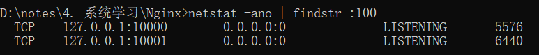

### 查看nginx状态

nginx -t

### 端口占用

Windows下启动nginx报错：`bind() to 0.0.0.0:**xxx** failed (10013: An attempt was made to access a socket`

其中 **xxx** 就是被占用的 `端口号` ，只需要执行如下命令：
```
netstat -ano | findstr :[端口号]
```
例如：

最后一列就是对应进程的 `pid` ，得到后执行如下命令查看进程信息：
```
tasklist | findstr [pid]
```

确认该进程无需继续保留后，将其杀死即可：
```
taskkill /pid [pid] -f
```

### nginx配置同一台服务器上的不同应用

1. 用二级域名区分：需要结合nginx配置，利用server_name来区分。server_name是client向服务器发送请求时带上的，用来代表自己的网址。要么使用购买了的域名，要么也可以在本地设置host。
   
```
server {  
    listen 80  
    server_name food.dog.com  
    ...  
}  
server {  
    listen 80  
    server_name play.dog.com  
}
```

2. 用端口区分：也需要结合nginx进行配置，配置多个server，分别listen不同的端口
   
```
server {  
  listen 80  
	...  
}  
server {  
	listen 8080  
    ...  
}
```


3. 用url区分：建议设置publicPath，然后配置nginx进行区分
```
module.exports = defineConfig({  
    publicPath: "/test"  
    ...  
})

server {  
    ...  
    location /test {  
    ...  
    }  
}  
```
