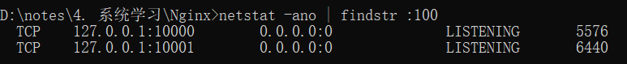

### 查看nginx状态

nginx -t

### 端口占用

Windows下启动nginx报：bind() to 0.0.0.0:**xxx** failed (10013: An attempt was made to access a socket xxx端口就是被占用的端口。 例如 

只需要 netstat -ano | findstr :xxx 例如

然后找到对应的pid号，上图的是2556，然后 tasklist|findstr "2556" 

就是这个进程在占用着端口

### nginx配置同一台服务器上的不同应用

1. 用二级域名区分：需要结合nginx配置，利用server_name来区分。server_name是client向服务器发送请求时带上的，用来代表自己的网址。要么使用购买了的域名，要么也可以在本地设置host。
   

server {  
    listen 80  
    server_name food.dog.com  
    ...  
}  
server {  
    listen 80  
    server_name play.dog.com  
}

2. 用端口区分：也需要结合nginx进行配置，配置多个server，分别listen不同的端口
   

server {  
  listen 80  
    ...  
}  
server {  
    listen 8080  
    ...  
}

3. 用url区分：建议设置publicPath，然后配置nginx进行区分（详见
   

[前端-打包-@vue/cli-publicPath、assetDir、baseURL](https://www.yuque.com/u33336635/bbknrr/dwrb385v9nxhw4l8?view=doc_embed)）

module.exports = defineConfig({  
    publicPath: "/test"  
    ...  
})

server {  
    ...  
    location /test {  
    ...  
    }  
}  
    

### 打包-@vue/cli-publicPath、assetDir、baseURL

1. **背景**
   

**@vue/cli**搭建的项目中，有**publicPath、assetDir**

module.exports = defineConfig({  
  publicPath: './',  // 重点...  
  assetsDir: '',    // 重点...  
  ...  
})

而axios.create()的参数里，有**baseURL**

const service = axios.create({  
  // axios中请求配置有baseURL选项，表示请求URL公共部分  
  baseURL: process.env.VUE_APP_BASE_API, // 重点...  
  timeout: 10000  
})

这三者的作用是什么？

---

1. **baseURL**
   

**解释** baseURL会变成你的**axios请求前缀**。 **示例** 将前端打包后，假设baseURL设置为"/prod-api"，则axios请求会变成：  **nginx配置** nginx如下配置（line 3-5)，就可以匹配"/prod-api"开头的请求，并且代理到后端服务端口。

server {  
    ...  
  location /prod-api {   
    proxy_pass http://127.0.0.1:9999/;    
    }  
    ...  
}

---

2. **publicPath**
   

解释 publicPath会变成**请求各类静态资源时的前缀。** **示例-1** publicPath设置为"**./**"，打包后的index.html： 

 

**示例-2** publicPath设置为"**/**"，打包后的index.html：

  

示例-3 publicPath设置为"**/test**"，打包后的index.html：

  

nginx配置建议-1 如果希望用户访问网站时，**不需要**输入额外的路径。例如，访问[http://www.dog.com](http://www.dog.com/)，就能访问到主页面。那publicPath设为**""、"./"、"/"**都可以，然后nginx配置如下：

server {  
    ...  
  location / {   
    前端文件路径  
    }  
    ...  
}

nginx配置建议-2 如果希望用户访问网站时，**需要**输入额外的路径。例如，访问[http://www.dog.com/test](http://www.dog.com/test)，那publicPath就可以设为**"/test"**，然后nginx配置如下：

server {  
	...  
  location /test {   
  	前端文件路径  
	}  
	...  
}

**反面教材** 注意，一般publicPath设置，**不建议设置类似"test"这样不带斜杠的值（除了""和"./"这两种特殊情况）**。 因为不带斜杠时，代表的是**相对路径**，无法被nginx匹配。 例如，如果设置publicPath为"test"，然后nginx配置如下

server {  
	...  
  location /test {   
  	alias /www  
	}  
	...  
}

如果将打包后的文件部署到8.130.68.29的/www目录下，并且用户访问 [http://8.130.68.29/test](http://8.130.68.29/test) ，就会出现如下情况，和本意不符： 

---

3. **assetDir**
   

assetDir的值，会变成**index.html请求各类静态资源时的前缀。但是不能以"/"开头。** 示例 publicPath设为"/test"，assetDir设为"static"，打包后index.html如下：

  

并且，打包后文件存放位置如下；

  

可以看到，css、js和fronts等静态资源文件都放在static文件夹下了。

---

**publicPath和assetDir** **共同点：**

- 二者的主要影响，都是在index.html的静态资源文件路径前添加前缀，此外，如果设置了assetDir，打包时还会将静态资源文件放入assetDir下。
  

**作用区别：**

- publicPath主要是为了控制用户访问网站主页面时是否需要添加额外的路径，例如网站主页设置为[http://www.dog.com/test](http://www.dog.com/test)，就可以设置publicPath为"/test"（当然还要配置对应的nginx文件）
  
- assetDir主要是为了便于将静态资源文件存放在指定路径下，从用户角度来看没有不同。
  

**写法区别：**

- publicPath，一般以"/"开头，例如"test"（除了""和"./"这两种特殊情况）
  
- assetDir，不允许以"/"开头，一般是"static"或"asset"等
  

---

**其他**

1. 本文针对@vue/cli脚手架（旧版本叫vue-cli），其他脚手架还没研究。
   
2. 关于nginx配置里的root和alias的区别在这里，建议不熟悉的同学阅读一下：[Nginx配置中root和alias分不清？本文３分钟帮你解惑！](https://zhuanlan.zhihu.com/p/579768206)