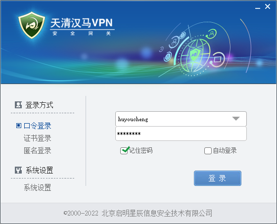
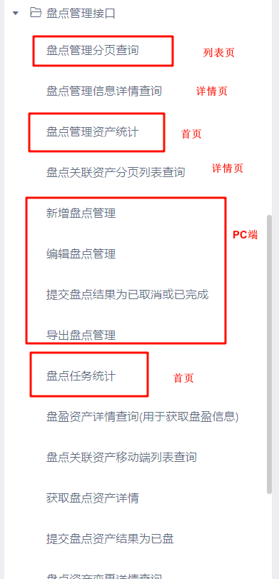
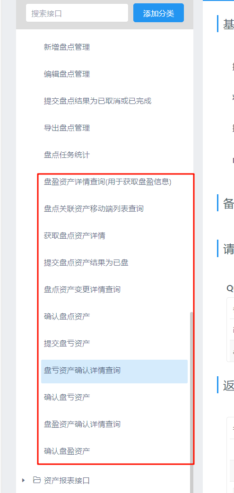

## ToDesk

连接号：987305229

MM：Dg@123456

SP：Chen@19920516


## 测试环境

### 系统ZM

jieyang

Jlh7*y#wX.#7


admin

Jlh7*y#wX.#7


normal

Proxy@2025

### 测试系统地址

#### PC端

http://10.2.161.226/code-empower-admin/#/

#### 移动端

http://10.2.161.226/code-empower-portal/#/

### 服务器信息

#### 堡垒机信息

https://jm.dg.com/ui/#/workbench/home（数广堡垒机）

#### 服务器IP

10.2.161.226

#### 服务器常用命令

配置文件

```
vim /data/software/nginx/conf/conf.d/codeEmpower.conf
```

启动

```
systemctl start nginx
```

重启

```
nginx -s reload
```


#### 前端文件路径

##### PC端

```
cd /data/apps/sites/code-empower/admin/code-empower-admin
```

##### 移动端

```
cd /data/apps/sites/code-empower/portal/[看下表最后一列的打包后文件夹命名规则]
```

分支、入口、路由、文件夹对应关系：

| 分支名                        | 对应业务应用名称（即粤政易中显示的入口名称） | 对应页面路径（即nginx配置中的location）  | 打包后文件夹命名规则（即nginx静态资源目录下对应应用文件夹的名字） |
| ----------------------------- | -------------------------------------------- | ---------------------------------------- | ------------------------------------------------------------ |
| release_20240929_main         | 固定资产管理                                 | code-empower-portal/                     | code-empower-portal                                          |
|                               | 扫码识别资产                                 |                                          |                                                              |
| release_20240929_asset        | 全部资产                                     | code-empower-portal/asset-manage         | code-empower-portal-asset                                    |
| release_20240929_asset_use    | 我使用的资产                                 | code-empower-portal/asset-manage/iUse    | code-empower-portal-asset-use                                |
| release_20240929_asset_admin  | 我管理的资产                                 | code-empower-portal/asset-manage/iAdmin  | code-empower-portal-asset-admin                              |
| release_20240929_asset_create | 我创建的资产                                 | code-empower-portal/asset-manage/iCreate | code-empower-portal-asset-create                             |
| release_20240929_transfer     | 资产转移                                     | code-empower-portal/asset-transfer       | code-empower-portal-transfer                                 |
| release_20240929_waste        | 资产报废                                     | code-empower-portal/asset-waste          | code-empower-portal-waset（此处勘误，应该为waste）           |
| release_20240929_repair       | 资产维护                                     | code-empower-portal/asset-repair         | code-empower-portal-repair                                   |
| release_20240929_inventory    | 资产盘点                                     | code-empower-portal/asset-inventory      | code-empower-portal-inventory                                |

#### Nginx配置

```
server {
    listen       80;
    server_name  localhost;
    
    # 接口
    location /code-empower/admin/apis/ {
    	proxy_pass http://localhost:9888/code-empower/admin/apis/;
    }
    
    # 管理端
    location /code-empower-admin/ {
        alias /data/apps/sites/code-empower/admin/code-empower-admin/;
        index index.html index.htm;
    }
    
    # 移动端（拆分应用）
    location /code-empower-portal/ {
        alias /data/apps/sites/code-empower/portal/code-empower-portal/;
        index index.html index.htm;
    }
    location /code-empower-portal/asset-manage/ {
        alias /data/apps/sites/code-empower/portal/code-empower-portal-asset/;
        index index.html index.htm;
    }
    location /code-empower-portal/asset-manage/iUse/ {
        alias /data/apps/sites/code-empower/portal/code-empower-portal-asset-use/;
        index index.html index.htm;
    }
    location /code-empower-portal/asset-manage/iAdmin/ {
        alias /data/apps/sites/code-empower/portal/code-empower-portal-asset-admin/;
        index index.html index.htm;
    }
    location /code-empower-portal/asset-manage/iCreate/ {
        alias /data/apps/sites/code-empower/portal/code-empower-portal-asset-create/;
        index index.html index.htm;
    }
    location /code-empower-portal/asset-transfer/ {
        alias /data/apps/sites/code-empower/portal/code-empower-portal-transfer/;
        index index.html index.htm;
    }
    location /code-empower-portal/asset-waste/ {
        alias /data/apps/sites/code-empower/portal/code-empower-portal-waset/;
        index index.html index.htm;
    }
    location /code-empower-portal/asset-repair/ {
        alias /data/apps/sites/code-empower/portal/code-empower-portal-repair/;
        index index.html index.htm;
    }
    location /code-empower-portal/asset-inventory/ {
        alias /data/apps/sites/code-empower/portal/code-empower-portal-inventory/;
        index index.html index.htm;
    }
}
```

### 


## 生产环境

### 生产ZM

admin

EMPOWER@2025abc!@#


jieyang

EMPOWER@2025abc!@#


normal

Proxy@2024

### VPN信息



V5VPN客户端，第一次要进行“网络配置”（IP:61.145.61.4 端口：48224）

用户名：huyoucheng

密码：hyc518HYC518~~!!

### 堡垒机信息

#### 堡垒机地址

https://19.191.194.9

#### 堡垒机（2025.4）

huyoucheng

~~YWtg2@24zs*8~~

131284@Cheng

### 前端文件路径

#### PC端

```
cd /data/webApp/code-empower/web/code-empower-admin
```

#### 移动端

```
cd /data/webApp/code-empower/web/portal
```

```
rm -rf code-empower-portal code-empower-portal.zip && mv /code-empower-portal.zip  ./ && unzip code-empower-portal.zip
```


### 生产系统地址

#### PC端

http://19.191.192.191/code-empower-admin/#/

#### 移动端

政务外网：

http://19.191.192.191/code-empower-portal/#/

互联网：

http://61.145.61.61:8092/code-empower-portal/#/


## 移动端粤政易

### 预发布信息

> 您好:
>
> ​    预发布环境已实施，相关信息如下：
>
> 1、应用参数
>
> 应用名称：赋码管理平台
>
> Agentid：1004369
>
> Secret：RrRm4t_ZbgKRtGYojlDKYh07jwi3dR7QYLAL1XRjN1M
>
> CorpID：wld341060039
>
> 2、API接口参数：
>
> paasid： yzy_demo
>
> Token： WjKat55cv6PrJtpCHld0trrHsv1mbCqL
>
> API接口地址（政务外网调用需策略开通后使用）：http://19.15.0.128:8080；互联网（https://xtbg.digitalgd.com.cn）
>
> 粤政易API接口：/ebus/yzyapi/cgi-bin/
>
> 第三方应用获取信息接口：/ebus/applicationsyn/
>
> 3、粤政易客户端预发布环境登录测试
>
> 3.1、测试账号：19999924123 初始密码：~~eSx9GMQ0~~ uid：wyc6z3f0j28o3xz2pfwigv
>
> 3.2、粤政易客户端登录步骤如下：
>
> a.从粤政易官网或手机应用商店下载客户端；
>
> b.手机端app：在登录首页的“设置”-“更多选项”-“服务器设置”，修改组织机构域为“szgdyfb”后，用测试环境账号密码登录；
>
> c.电脑端app：右下角-设置-"组织机构域"修改为“szgdyfb”后，用测试账号密码登录；
>
> d.若登录正式环境，需重新退出并设置组织机构域为“gdzf”后正式账号登录。


### 预发布ZM（7.9）

19999924123

XML1pZVV


### 网址

http://61.145.61.61:8092/code-empower-portal/#/


## 用户权限

- 宽松策略：列表中的用户为当前用户时，允许开放的按钮
  - 用户管理：重置密码
  - 用户详情：编辑密码

- 严格策略：仅超级管理员可以开放的按钮
  - 用户管理：新增用户、删除用户
  - 用户详情：修改用户名、用户账号、邮箱、手机号、行政区划、组织机构、角色、启用状态）


## 仓库地址

群组地址：[揭阳一网统管 · GitLab (dg.com)](https://gitlab.dg.com/dsywb/ds_develop/hangyeyewuxian/jieyang_ywtg)

管理端（PC）公共组件：[地市服务事业部 / 地市开发群组 / 行业业务线 / 揭阳一网统管 / code-empower-front-base · GitLab (dg.com)](https://gitlab.dg.com/dsywb/ds_develop/hangyeyewuxian/jieyang_ywtg/code-empower-front-base)

管理端（PC）业务代码：[地市服务事业部 / 地市开发群组 / 行业业务线 / 揭阳一网统管 / code-empower-front · GitLab (dg.com)](https://gitlab.dg.com/dsywb/ds_develop/hangyeyewuxian/jieyang_ywtg/code-empower-front)

门户端（移动）：[地市服务事业部 / 地市开发群组 / 行业业务线 / 揭阳一网统管 / code-empower-front-portal · GitLab (dg.com)](https://gitlab.dg.com/dsywb/ds_develop/hangyeyewuxian/jieyang_ywtg/code-empower-front-portal)


## 前端安装

### 管理端

下载nvs或者nvm工具。如果是nvm，可以配置nvm的镜像源如下

```
node_mirror: https://npmmirror.com/mirrors/node/
npm_mirror: https://npmmirror.com/mirrors/npm/
```

使用nvs或nvm切换node版本为10

```
nvs use v10
或者
nvm use 10
```

建议把npm镜像设置一下，常用的就是淘宝镜像和公司镜像，二选一：

```
npm config set registry https://registry.npmmirror.com
或者
npm config set registry=http://npm.mirrors.dg.com
```

设置一下这个：

```
npm config set strict-ssl false
```

**在node v10的环境下**，下载lerna工具，注意指定版本为3.22.1，太新的会有问题

```
npm install lerna@3.22.1 -g
```

拉取公共组件

```
https://gitlab.dg.com/dsywb/ds_develop/hangyeyewuxian/jieyang_ywtg/code-empower-front-base
```

到公共组件的packages文件夹下，拉取业务代码

```
https://gitlab.dg.com/dsywb/ds_develop/hangyeyewuxian/jieyang_ywtg/code-empower-front
```

到公共组件里，lerna一下

```
lerna bootstrap --force-local
```

（每次在项目内npm install之后，软链会掉，都要再执行一次本步骤）

```
lerna link --force-local
```


然后运行

```
npm run local（本地后端）
或者
npm run dev（线上后端）
```

（打包）

```
npm run pack.dev
```


### 如果依赖有问题

卸载code-empower-front和code-empower-front-base的所有node_modules

在code-empower-front-base下运行lerna bootstrap --force-local


### 门户端

拉取项目

```
https://gitlab.dg.com/dsywb/ds_develop/hangyeyewuxian/jieyang_ywtg/code-empower-front-portal
```

安装依赖

```
pnpm install
```

启动

```
pnpm run dev
```

## 接口文档地址

[YApi-高效、易用、功能强大的可视化接口管理平台 (dg.com)](http://yapi.dg.com:3000/group/5517)

## 打包命令

### 移动端

```
pnpm build:prod
```

### PC端

```
npm run pack
```

## 参考项目

https://gitlab.dg.com/dsywb/ds_develop/xnjd/dgzcjs/frontend/kpy-h5


## 粤政易接入

```
# 粤政易配置
app.corp-id=wld341060039
app.agent-id=1003132
app.corp-secret=4wZrVx_2KWz3vqMmP_x-HD8ZE9mPu_OiZzD5S2pmRWY

# api网关的配置
# //注意结尾不要加/
app.host=https://xtbg.digitalgd.com.cn
app.pass-id=yzy_demo
app.pass-token=WjKat55cv6PrJtpCHld0trrHsv1mbCqL
```


## 逻辑梳理





### 盘盈

移动-新增盘盈

PC-盘盈资产详情查询(用于获取盘盈信息)（跳到类似资产编辑的页面，将盘盈信息填入（如果是资产登记入库，就只要移动端））

PC-确认盘盈资产


之后可以通过`PC-盘盈资产确认详情查询`查看确认盘盈时提交的内容

### 盘亏

移动-提交盘亏资产

移动-确认盘亏资产


之后可以通过`PC-盘亏资产确认详情查询`查看确认盘盈时提交的内容

### 盘点

移动-提交盘点资产结果为已盘

PC-确认盘点资产


之后可以通过`PC-盘点资产变更详情查询`查看确认盘盈时提交的内容