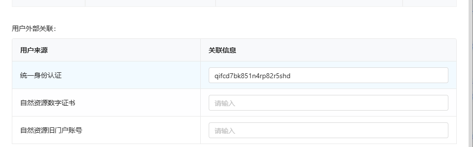
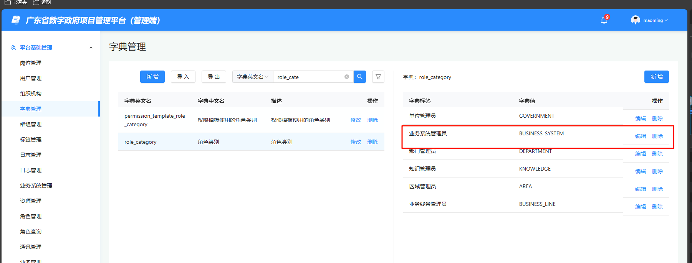

## node版本

实测 14 可以

## 生产环境

### 业务系统地址

管理端：

https://pmo.mmzwfw.cn/am-admin/

http://19.155.220.129/pmo/am-admin/

业务端：

https://pmo.mmzwfw.cn/admin-web/

http://19.155.220.129/pmo/admin-web/

移动端：

http://120.241.74.152:10080/pmp-prov-yzy/（作废）

https://pmo.mmzwfw.cn/pmp-prov-yzy/（作废）

https://ydpmo.mmzwfw.cn:9789/pmp-prov-yzy/


maoming

PMO@2025123dl


### VPN

https://vpn.maoming.gov.cn

```
E00038
kS8LEjL!kS8LEjL!

E00041
T5YEQ!@Wlw

E00044
geAn!5tG@@@
```

### 运维堡垒机

https://10.181.13.213/

v_pangyue

PMO@2025123dl

### 运维服务器

root

NSjme2v@4w

### 业务端更新步骤

直接将前端dist文件夹内的文件，打包成dist.zip，（dist.zip解压后就是css、html等文件，无需在外部包一层dist文件夹）

cd /data/apps/sites/base-pms-web/rdp/mm-pmo-web

ls

rm -rf /data/apps/sites/base-pms-web/rdp/mm-pmo-web/*

上传dist.zip到该目录

unzip dist.zip

cd /data/apps/sites/base-pms-web && docker rm -f pmp-web && ./run.sh

### 移动端更新步骤

cd /data/apps/sites/base-pms-web/rdp/admin-yzy-fe

上传dist.zip（解压前需要包一层dist文件夹）

```bash
rm -rf html.bak && mv html html.bak && unzip dist.zip && mv dist html && rm -rf dist.zip
```

cd /data/apps/sites/base-pms-web && docker rm -f pmp-web && ./run.sh


可能要在管理端-用户管理里配置这个，这个就是粤政易的uid




### 后端启动

生产：cd /data/apps/webapps/admin/

预发布：/data/apps/sites/admin

docker load -i  (根据需要调整)

vim run.sh（更改docker镜像后缀，根据上面的名称调整）

docker rm -f  pmp-admin && ./run.sh

docker logs -f pmp-admin


| 私网ip        | 管理ip       | 弹性ip（注意：此处后续按需调整，不用一对一） | dnat政务外网地址(实际使用标橙） |
| ------------- | ------------ | -------------------------------------------- | ------------------------------- |
| 172.26.0.2    | 10.191.0.2   | 10.181.7.2                                   | 19.155.220.129                  |
| 172.26.0.3    | 10.191.0.3   | 10.181.7.3                                   | 19.155.220.130                  |
| 172.26.0.4    | 10.191.0.4   | 10.181.7.4                                   | 19.155.220.131                  |
| 172.26.0.5    | 10.191.0.5   | 10.181.7.5                                   | 19.155.220.132                  |
| 172.26.0.6    | 10.191.0.6   | 10.181.7.6                                   | 19.155.220.133                  |
| 172.26.0.7    | 10.191.0.7   | 10.181.7.7                                   | 19.155.220.134                  |
| 172.26.0.8    | 10.191.0.8   | 10.181.7.8                                   | 19.155.220.135                  |
| 172.26.0.9    | 10.191.0.9   | 10.181.7.9                                   | 19.155.220.136                  |
| 172.26.0.10   | 10.191.0.10  | 10.181.7.10                                  | 19.155.220.137                  |
| 172.26.0.11   | 10.191.0.12  | 10.181.7.11                                  | 19.155.220.138                  |
| 172.26.0.12   | 10.191.0.13  | 10.181.7.12                                  | 19.155.220.139                  |
| 172.26.0.13   | 10.191.0.14  | 10.181.7.13                                  | 19.155.220.140                  |
| 172.26.0.14   | 10.191.0.15  | 10.181.7.14                                  | 19.155.220.141                  |
| 172.26.0.15   | 10.191.0.16  | 10.181.7.15                                  | 19.155.220.142                  |
| 172.26.0.16   | 10.191.0.17  | 10.181.7.16                                  | 19.155.220.143                  |
| 172.26.129.50 | 10.191.65.50 | 10.181.27.46                                 |                                 |

19.155.220.129    pms-web,admin-web	cd /data/apps/webapps/ 找对应服务，docker rm -f 对应服务，然后找到run.sh启动即可
19.155.220.130    业务服务：admin	cd /data/apps/webapps/ 找对应服务，docker rm -f 对应服务，然后找到run.sh启动即可
19.155.220.131    基础服务：usrc,uaa,docc,msgc	cd /data/apps/webapps/ 找对应服务，docker rm -f 对应服务，然后找到run.sh启动即可
19.155.220.132    基础服务：flowc,abic,abic-admin，cd /data/apps/webapps/ 找对应服务，docker rm -f 对应服务，然后找到run.sh启动即可
19.155.220.133    redis 6379 8xS@Zgs#B6，直接systemctl启动redis即可
19.155.220.134    mysql 3306，root/@gagi98gag161，一般开机自启

172.26.0.6、172.26.0.7：eureka服务。找到run.sh启动即可


### 进入容器

docker exec -it pmp-web /bin/bash

退出：exit


### 运维VPN

《信创云VPN&堡垒机使用指引》


连着政务VPN时，使用地址：19.155.220.4

v_pangyue

#4@Vj9yFFeC5N55z

### 运维服务器地址


### run.sh

cd /data/apps/sites/base-pms-web/

vim run.sh

```bash
docker run \
  --net=host \
  -d \
  -v /etc/localtime:/etc/localtime \
  -v /data/apps/sites/base-pms-web/rdp/admin-fe/html:/usr/share/nginx/admin-fe/html \
  -v /data/apps/sites/base-pms-web/rdp/admin-yzy-fe/html:/etc/nginx/html/usr/share/nginx/html-mobile \
  -v /data/apps/sites/base-pms-web/rdp/admin-yzy-fe/html:/usr/share/nginx/html-mobile \
  -v /data/apps/sites/base-pms-web/rdp/mm-pmo-web:/usr/share/nginx/mm-pmo-web \
  -v /data/apps/sites/base-pms-web/nginx/conf/nginx.conf:/etc/nginx/nginx.conf \
  -v /data/apps/sites/base-pms-web/nginx/log:/var/log/nginx \
  -v /data/apps/sites/base-pms-web/nginx/ssl:/usr/share/nginx/ssl \
  -p 80:80 \
  --name pmp-web \
  nginx:latest
```

### Nginx

vim /data/apps/sites/base-pms-web/nginx/conf/nginx.conf

```nginx
#user  nobody;
worker_processes  1;

#error_log  logs/error.log;
#error_log  logs/error.log  notice;
#error_log  logs/error.log  info;

#pid        logs/nginx.pid;


events {
    worker_connections  1024;
}


http {
    include       mime.types;
    default_type  application/octet-stream;
    sendfile        on;
    keepalive_timeout  65;
    gzip on;
    gzip_min_length 1k;
    #gzip_buffers 4 16k;
    #gzip_http_version 1.0;
    gzip_comp_level 2;
    gzip_types text/plain application/javascript application/x-javascript text/css application/xml text/javascript application/x-httpd-php image/jpeg image/gif image/png;
    gzip_vary on;
    gzip_disable \"MSIE [1-6]\\.\";
  client_max_body_size 1024m;

  #自定义变量 $connection_upgrade
    map $http_upgrade $connection_upgrade {
        default          keep-alive;  #默认为keep-alive 可以支持 一般http请求
        'websocket'      upgrade;     #如果为websocket 则为 upgrade 可升级的。
    }
    server {
      listen 443 ssl;
      server_name pmo.mmzwfw.cn;
      ssl_certificate  /usr/share/nginx/ssl/_.mmzwfw.cn_bundle.crt;
      ssl_certificate_key   /usr/share/nginx/ssl/_.mmzwfw.key;
      ssl_session_timeout 5m;
      ssl_protocols TLSv1 TLSv1.1 TLSv1.2;
      ssl_ciphers HIGH:!NULL:!aNULL:!MD5;          
      ssl_prefer_server_ciphers on;
 
      location / {
        add_header Content-Security-Policy "upgrade-insecure-requests;connect-src *";
        proxy_pass http://pmo.mmzwfw.cn;
      }
    }

    server {
        listen       80;
        server_name  pmo.mmzwfw.cn;

        charset utf-8;
        #access_log  logs/host.access.log  main;
        
        #######################项目管理平台路由
         location /admin-web/ {
             alias /usr/share/nginx/mm-pmo-web/;
            index  index.html index.htm;
            try_files $uri $uri/ /admin-web/index.html;
         }

         location /pmp-prov-yzy/ {
             alias /usr/share/nginx/html-mobile/;
            index  index.html index.htm;
            # try_files $uri $uri/ /pmo-prov-yzy/index.html;
            try_files $uri $uri/ /usr/share/nginx/html-mobile/index.html;
         }


         location  /admin/ {
            proxy_pass http://172.26.0.3:9001/admin/;
         }

         location /pmp-prov-yzy/admin/ {
            proxy_pass http://172.26.0.3:9001/admin/;
         }

       ########################应用中台路由


        location /pmo/am-admin/ {
             alias /usr/share/nginx/admin-fe/html/;
            index  index.html index.htm;
            try_files $uri $uri/ /pmo/am-admin/index.html;
        }

        location /am-admin/ {
             alias /usr/share/nginx/admin-fe/html/;
            index  index.html index.htm;
            try_files $uri $uri/ /pmo/am-admin/index.html;
        }
       
        location  /pmo/am-admin/am/usrc/ {
            proxy_pass http://172.26.0.4:8001/usrc/;
        }
      

     
        location  /pmo/am-admin/am/uaa/ {
            proxy_pass http://172.26.0.4:8002/uaa/;
        }

        
        location /pmo/am-admin/am/msgc/ {
            proxy_pass http://172.26.0.4:8004/msgc/;
        }

        location /pmo/am-admin/am/docc/ {
            proxy_pass http://172.26.0.4:8003/docc/;
        }

        

        location /pmo/am-admin/am/bpm/ {
            proxy_pass http://172.26.0.5:8005/flowc/;
        }

        location /pmo/am-admin/am/abic-admin/ {
            proxy_pass http://172.26.0.5:8007/abic-admin/;
        }


        location /usrc/ {
            proxy_pass http://172.26.0.4:8001/usrc/;
        }

        location  /uaa/ {
            proxy_pass http://172.26.0.4:8002/uaa/;
        }


        location /msgc/ {
            proxy_pass http://172.26.0.4:8004/msgc/;
        }

        location /docc/ {
            proxy_pass http://172.26.0.4:8003/docc/;
        }

        location /flowc/ {
            proxy_pass http://172.26.0.5:8005/flowc/;
        }

        location /bpm/ {
            proxy_pass http://172.26.0.5:8005/flowc/;
        }

        location /abic-admin/ {
            proxy_pass http://172.26.0.5:8007/abic-admin/;
        } 

        location /am-admin/am/usrc/ {
            proxy_pass http://172.26.0.4:8001/usrc/;
        }

        location  /am-admin/am/uaa/ {
            proxy_pass http://172.26.0.4:8002/uaa/;
        }


        location /am-admin/am/msgc/ {
            proxy_pass http://172.26.0.4:8004/msgc/;
        }

        location /am-admin/am/docc/ {
            proxy_pass http://172.26.0.4:8003/docc/;
        }

        location /am-admin/am/flowc/ {
            proxy_pass http://172.26.0.5:8005/flowc/;
        }

        location /am-admin/am/abic-admin/ {
            proxy_pass http://172.26.0.5:8007/abic-admin/;
        } 
        
        location /am-admin/am/bpm/ {
            proxy_pass http://172.26.0.5:8005/flowc/;
        }
        location /kkview/ {
            proxy_pass http://127.0.0.1:8012/kkview/;
            proxy_set_header Host $host;
            proxy_set_header X-Forwarded-Host $host;
            proxy_set_header X-Forwarded-For $proxy_add_x_forwarded_for;
        }
    }
}
```


## 预发布环境

### 业务系统

管理端：

http://19.155.220.135/am-admin/

业务端：

http://19.155.220.135/admin-web/

移动端：

http://19.155.220.135/pmp-prov-yzy/

### run.sh

```
docker run \
  --net=host \
  -d \
  -v /etc/localtime:/etc/localtime \
  -v /data/apps/sites/base-pms-web/rdp/admin-fe/html:/usr/share/nginx/admin-fe/html \
  -v /data/apps/sites/base-pms-web/rdp/admin-yzy-fe/html:/usr/share/nginx/html-mobile \
  -v /data/apps/sites/base-pms-web/rdp/admin-yzy-fe/html:/etc/nginx/html/usr/share/nginx/html-mobile \
  -v /data/apps/sites/base-pms-web/rdp/mm-pmo-web:/usr/share/nginx/mm-pmo-web \
  -v /data/apps/sites/base-pms-web/nginx/conf/nginx.conf:/etc/nginx/nginx.conf \
  -v /data/apps/sites/base-pms-web/nginx/log:/var/log/nginx \
  -p 80:80 \
  --name pmp-web \
  nginx:latest
```

### Nginx

```nginx
#user  nobody;
worker_processes  1;

#error_log  logs/error.log;
#error_log  logs/error.log  notice;
#error_log  logs/error.log  info;

#pid        logs/nginx.pid;


events {
    worker_connections  1024;
}


http {
    include       mime.types;
    default_type  application/octet-stream;
    sendfile        on;
    keepalive_timeout  65;
    gzip on;
    gzip_min_length 1k;
    #gzip_buffers 4 16k;
    #gzip_http_version 1.0;
    gzip_comp_level 2;
    gzip_types text/plain application/javascript application/x-javascript text/css application/xml text/javascript application/x-httpd-php image/jpeg image/gif image/png;
    gzip_vary on;
    gzip_disable \"MSIE [1-6]\\.\";
  client_max_body_size 1024m;

  #自定义变量 $connection_upgrade
    map $http_upgrade $connection_upgrade {
        default          keep-alive;  #默认为keep-alive 可以支持 一般http请求
        'websocket'      upgrade;     #如果为websocket 则为 upgrade 可升级的。
    }
    server {
        listen       80;
        server_name  127.0.0.1;

        charset utf-8;
        #access_log  logs/host.access.log  main;
        
        #######################项目管理平台路由
         location /admin-web/ {
             alias /usr/share/nginx/mm-pmo-web/;
            index  index.html index.htm;
            try_files $uri $uri/ /admin-web/index.html;
         }

         location /pmp-prov-yzy/ {
             alias /usr/share/nginx/html-mobile/;
            index  index.html index.htm;
            try_files $uri $uri/ /usr/share/nginx/html-mobile/index.html;
         }

         location  /admin/ {
            proxy_pass http://172.26.0.8:9001/admin/;
         }

        location /pmp-prov-yzy/admin/ {
        proxy_pass http://172.26.0.8:9001/admin/;
        }

       ########################应用中台路由


        location /pmo/am-admin/ {
             alias /usr/share/nginx/admin-fe/html/;
            index  index.html index.htm;
            try_files $uri $uri/ /pmo/am-admin/index.html;
        }

        location /am-admin/ {
             alias /usr/share/nginx/admin-fe/html/;
            index  index.html index.htm;
            try_files $uri $uri/ /pmo/am-admin/index.html;
        }
       
        location  /pmo/am-admin/am/usrc/ {
            proxy_pass http://172.26.0.9:8001/usrc/;
        }
      

     
        location  /pmo/am-admin/am/uaa/ {
            proxy_pass http://172.26.0.9:8002/uaa/;
        }

        
        location /pmo/am-admin/am/msgc/ {
            proxy_pass http://172.26.0.9:8004/msgc/;
        }

        location /pmo/am-admin/am/docc/ {
            proxy_pass http://172.26.0.9:8003/docc/;
        }

        

        location /pmo/am-admin/am/bpm/ {
            proxy_pass http://172.26.0.10:8005/flowc/;
        }

        location /pmo/am-admin/am/abic-admin/ {
            proxy_pass http://172.26.0.10:8007/abic-admin/;
        }


        location /usrc/ {
            proxy_pass http://172.26.0.9:8001/usrc/;
        }

        location  /uaa/ {
            proxy_pass http://172.26.0.9:8002/uaa/;
        }


        location /msgc/ {
            proxy_pass http://172.26.0.9:8004/msgc/;
        }

        location /docc/ {
            proxy_pass http://172.26.0.9:8003/docc/;
        }

        location /flowc/ {
            proxy_pass http://172.26.0.10:8005/flowc/;
        }

        location /bpm/ {
            proxy_pass http://172.26.0.10:8005/flowc/;
        }

        location /abic-admin/ {
            proxy_pass http://172.26.0.10:8007/abic-admin/;
        } 

        location /am-admin/am/usrc/ {
            proxy_pass http://172.26.0.9:8001/usrc/;
        }

        location  /am-admin/am/uaa/ {
            proxy_pass http://172.26.0.9:8002/uaa/;
        }


        location /am-admin/am/msgc/ {
            proxy_pass http://172.26.0.9:8004/msgc/;
        }

        location /am-admin/am/docc/ {
            proxy_pass http://172.26.0.9:8003/docc/;
        }

        location /am-admin/am/flowc/ {
            proxy_pass http://172.26.0.10:8005/flowc/;
        }

        location /am-admin/am/abic-admin/ {
            proxy_pass http://172.26.0.10:8007/abic-admin/;
        } 
        
        location /am-admin/am/bpm/ {
            proxy_pass http://172.26.0.10:8005/flowc/;
        }
        location /kkview/ {
            proxy_pass http://172.26.0.2:8012/kkview/;
            proxy_set_header Host $host;
            proxy_set_header X-Forwarded-Host $host;
            proxy_set_header X-Forwarded-For $proxy_add_x_forwarded_for;
        }
    }

}
```


| 账号    | 密码      |      |
| ------- | --------- | ---- |
| maoming | gd@123456 |      |
| admin   | gd@123456 | 超管 |
|         |           |      |
|         |           |      |

业务端：http://172.16.48.61/admin-web/login

管理端：http://172.16.48.61/am-admin/login


## 应用中台前端手册


### 管理端代码（tsp载体）

[地市服务事业部 / 地市开发群组 / 行业业务线 / 地市版PMO / 业务中台 / am-admin-web · GitLab](https://gitlab.dg.com/dsywb/ds_develop/hangyeyewuxian/ds_pmo/yewuzhongtai/am-admin-web)

### tsp-pages

[地市服务事业部 / 地市开发群组 / 行业业务线 / 地市版PMO / 业务中台 / am-web-comps · GitLab](https://gitlab.dg.com/dsywb/ds_develop/hangyeyewuxian/ds_pmo/yewuzhongtai/am-web-comps)


## 单位变动后需要执行

http://10.2.161.226:90/admin/orgSync/area
http://10.2.161.226:90/admin/orgSync/unit

依次执行即可，如果单位有变动是要重新执行unit的


## 安装

```
// git放在项目外面的
// .gitignore里没有配置dist

// node < v18
nvs
nvs use v16

npm config set registry=http://npm.mirrors.dg.com
npm config set strict-ssl false

# 安装依赖
yarn install | npm install
# 启动项目
yarn serve | npm run serve
# 打包
yarn build | npm run build
# 压缩图片
yarn tinify | npm run tinify


如果install失败，就试试下面的命令再install：
yarn config set ignore-engines true
 
```


## 插件和配置

eslint vetur stylelint prettier

```
{
  "editor.tabSize": 2,
  "editor.formatOnSave": true,
  "[javascript]": {
    "editor.defaultFormatter": "dbaeumer.vscode-eslint"
  },
  "[typescript]": {
    "editor.defaultFormatter": "dbaeumer.vscode-eslint"
  },
  "[html]": {
    "editor.defaultFormatter": "vscode.html-language-features"
  },
  "[jsonc]": {
    "editor.defaultFormatter": "esbenp.prettier-vscode"
  },
  "[json]": {
    "editor.defaultFormatter": "esbenp.prettier-vscode"
  },
  "vetur.completion.autoImport": false,
  "vetur.format.defaultFormatter.js": "none",
  "vetur.format.defaultFormatter.ts": "none",
  "vetur.format.defaultFormatter.html": "none",
  "editor.codeActionsOnSave": {
    "source.fixAll.eslint": "always",
    "source.fixAll.stylelint": "always"
  },
  "eslint.validate": ["javascript", "typescript", "vue"],
  "stylelint.validate": ["css", "less", "postcss", "vue"],
  "cSpell.words": [
    "abic",
    "digitalgd",
    "docc",
    "easycom",
    "flowc",
    "msgc",
    "usrc"
  ]
}
```

## 配置权限申请




## 应用中台角色

| 政数局局长 | zsj-director   | 省级及以下          | 广东省     | 不配置 | 韶关PMO项目管理平台 |                     |      | 关联用户复制查看编辑删除 |                          |
| ---------- | -------------- | ------------------- | ---------- | ------ | ------------------- | ------------------- | ---- | ------------------------ | ------------------------ |
|            | 政数局副局长   | zsj-deputy-director | 省级及以下 | 广东省 | 不配置              | 韶关PMO项目管理平台 |      |                          | 关联用户复制查看编辑删除 |
|            | 政数局领导     | zsj-leader          | 省级及以下 | 广东省 | 不配置              | 韶关PMO项目管理平台 |      |                          | 关联用户复制查看编辑删除 |
|            | 政数局科室领导 | zsj-dept-leader     | 省级及以下 | 广东省 | 不配置              | 韶关PMO项目管理平台 |      |                          | 关联用户复制查看编辑删除 |

## 应用中台入库流程

### 0613 XML

修复入库初审一路退回到申请后没有可选下一步问题

```
<?xml version=\"1.0\" encoding=\"UTF-8\"?>\n<definitions xmlns=\"http://www.omg.org/spec/BPMN/20100524/MODEL\" xmlns:xsi=\"http://www.w3.org/2001/XMLSchema-instance\" xmlns:flowable=\"http://flowable.org/bpmn\" xmlns:bpmndi=\"http://www.omg.org/spec/BPMN/20100524/DI\" xmlns:omgdc=\"http://www.omg.org/spec/DD/20100524/DC\" xmlns:omgdi=\"http://www.omg.org/spec/DD/20100524/DI\" xmlns:dgaxoa=\"http://digitalgd.com.cn/bpmn\" xmlns:bioc=\"http://bpmn.io/schema/bpmn/biocolor/1.0\" xmlns:activiti=\"http://activiti.org/bpmn\" xmlns:xsd=\"http://www.w3.org/2001/XMLSchema\" targetNamespace=\"http://www.flowable.org/processdef\">\n  <process id=\"PROJECT_LIBRARY_DS_MAOMING\" name=\"地市储备库入库流程（茂名）副本\" isExecutable=\"true\">\n    <startEvent id=\"StartEvent_1y45yut\" name=\"开始\" />\n    <userTask id=\"Activity_0xkdiht\" name=\"入库申请\" flowable:assignee=\"${Activity_0xkdiht_assignee}\" />\n    <sequenceFlow id=\"Flow_036zkbj\" sourceRef=\"StartEvent_1y45yut\" targetRef=\"Activity_0xkdiht\" />\n    <endEvent id=\"Event_1h6b9yi\" name=\"结束\" />\n    <exclusiveGateway id=\"Gateway_1r4oskz\" name=\"网关25\" />\n    <userTask id=\"Activity_13i4n9k\" name=\"市领导批复（申报单位代传）\" flowable:assignee=\"${Activity_13i4n9k_assignee}\" />\n    <userTask id=\"Activity_1yl58b4\" name=\"入库审核\" flowable:assignee=\"${Activity_1yl58b4_assignee}\" />\n    <sequenceFlow id=\"Flow_19p9gcp\" name=\"入库申请时项目建设预算总金额 大于400万元\" sourceRef=\"Gateway_1r4oskz\" targetRef=\"Activity_13i4n9k\">\n      <conditionExpression xsi:type=\"tFormalExpression\"><![CDATA[${cityReply==1}]]></conditionExpression>\n    </sequenceFlow>\n    <sequenceFlow id=\"Flow_0hgswct\" name=\"入库申请时项目建设预算总金额 小于等于400万元\" sourceRef=\"Gateway_1r4oskz\" targetRef=\"Activity_1yl58b4\">\n      <conditionExpression xsi:type=\"tFormalExpression\"><![CDATA[${cityReply==2}]]></conditionExpression>\n    </sequenceFlow>\n    <sequenceFlow id=\"Flow_0rq1kdq\" name=\"连线6\" sourceRef=\"Activity_13i4n9k\" targetRef=\"Activity_1yl58b4\" />\n    <exclusiveGateway id=\"Gateway_0zqro6z\" name=\"网关2\">\n      <outgoing>Flow_1g0b0x9</outgoing>\n    </exclusiveGateway>\n    <userTask id=\"Activity_01u4c19\" name=\"入库派工\" flowable:assignee=\"${Activity_01u4c19_assignee}\" />\n    <userTask id=\"Activity_0drehby\" name=\"入库初审\" flowable:assignee=\"${assignee}\">\n      <extensionElements>\n        <dgaxoa:candidatorRules />\n        <dgaxoa:widgets>\n          <dgaxoa:widget type=\"document_manage_widget\" title=\"文档管理组件\" visible=\"false\" editable=\"false\" displayName=\"文档\" sortOrder=\"0\" id=\"test0\" />\n          <dgaxoa:widget type=\"form\" title=\"表单组件\" visible=\"false\" editable=\"false\" displayName=\"表单\" sortOrder=\"3\" id=\"test1\" />\n          <dgaxoa:widget type=\"opinion_list\" title=\"意见组件\" visible=\"false\" editable=\"false\" displayName=\"意见\" sortOrder=\"1\" id=\"test2\" />\n          <dgaxoa:widget type=\"opinion_edit\" title=\"意见编辑\" visible=\"false\" editable=\"false\" displayName=\"意见编辑\" sortOrder=\"2\" id=\"test3\" />\n          <dgaxoa:widget type=\"flow_log\" title=\"流程日志组件\" visible=\"false\" editable=\"false\" displayName=\"流程日志\" sortOrder=\"4\" id=\"test4\" />\n        </dgaxoa:widgets>\n        <dgaxoa:buttons>\n          <dgaxoa:button type=\"withdraw\" text=\"撤回\" visible=\"false\" id=\"test0\" />\n          <dgaxoa:button type=\"agree\" text=\"同意\" visible=\"false\" id=\"test1\" />\n          <dgaxoa:button type=\"refuse\" text=\"拒绝\" visible=\"false\" id=\"test2\" />\n          <dgaxoa:button type=\"addsign\" text=\"加签\" visible=\"false\" id=\"test3\" />\n          <dgaxoa:button type=\"back\" text=\"退回\" visible=\"false\" id=\"test4\" />\n          <dgaxoa:button type=\"jump\" text=\"跳转\" visible=\"false\" id=\"test5\" />\n          <dgaxoa:button type=\"transfer\" text=\"转办\" visible=\"false\" id=\"test6\" />\n        </dgaxoa:buttons>\n      </extensionElements>\n      <multiInstanceLoopCharacteristics flowable:collection=\"assigneeList_Activity_0drehby\" flowable:elementVariable=\"assignee\">\n        <completionCondition>${nrOfCompletedInstances/nrOfInstances >= 1}</completionCondition>\n      </multiInstanceLoopCharacteristics>\n    </userTask>\n    <userTask id=\"Activity_0ycsbsp\" name=\"入库初审意见汇总\" flowable:assignee=\"${Activity_0ycsbsp_assignee}\">\n      <incoming>Flow_1g0b0x9</incoming>\n    </userTask>\n    <sequenceFlow id=\"Flow_1gj4xrg\" name=\"审批制且未经过入库初审\" sourceRef=\"Gateway_0zqro6z\" targetRef=\"Activity_01u4c19\">\n      <conditionExpression xsi:type=\"tFormalExpression\"><![CDATA[${ apprMode==0&&turnNoApply==1&&firstReviewPass==0}]]></conditionExpression>\n    </sequenceFlow>\n    <sequenceFlow id=\"Flow_1qmtle1\" sourceRef=\"Activity_01u4c19\" targetRef=\"Activity_0drehby\" />\n    <exclusiveGateway id=\"Gateway_1x443cy\" name=\"网关1\" />\n    <userTask id=\"Activity_0pnk78y\" name=\"科室领导审核\" flowable:assignee=\"${Activity_0pnk78y_assignee}\" />\n    <userTask id=\"Activity_1okcqjm\" name=\"政数局副局长初审\" flowable:assignee=\"${assignee}\">\n      <extensionElements>\n        <dgaxoa:candidatorRules />\n        <dgaxoa:widgets>\n          <dgaxoa:widget type=\"document_manage_widget\" title=\"文档管理组件\" visible=\"false\" editable=\"false\" displayName=\"文档\" sortOrder=\"0\" id=\"test0\" />\n          <dgaxoa:widget type=\"form\" title=\"表单组件\" visible=\"false\" editable=\"false\" displayName=\"表单\" sortOrder=\"3\" id=\"test1\" />\n          <dgaxoa:widget type=\"opinion_list\" title=\"意见组件\" visible=\"false\" editable=\"false\" displayName=\"意见\" sortOrder=\"1\" id=\"test2\" />\n          <dgaxoa:widget type=\"opinion_edit\" title=\"意见编辑\" visible=\"false\" editable=\"false\" displayName=\"意见编辑\" sortOrder=\"2\" id=\"test3\" />\n          <dgaxoa:widget type=\"flow_log\" title=\"流程日志组件\" visible=\"false\" editable=\"false\" displayName=\"流程日志\" sortOrder=\"4\" id=\"test4\" />\n        </dgaxoa:widgets>\n        <dgaxoa:buttons>\n          <dgaxoa:button type=\"withdraw\" text=\"撤回\" visible=\"false\" id=\"test0\" />\n          <dgaxoa:button type=\"agree\" text=\"同意\" visible=\"false\" id=\"test1\" />\n          <dgaxoa:button type=\"refuse\" text=\"拒绝\" visible=\"false\" id=\"test2\" />\n          <dgaxoa:button type=\"addsign\" text=\"加签\" visible=\"false\" id=\"test3\" />\n          <dgaxoa:button type=\"back\" text=\"退回\" visible=\"false\" id=\"test4\" />\n          <dgaxoa:button type=\"jump\" text=\"跳转\" visible=\"false\" id=\"test5\" />\n          <dgaxoa:button type=\"transfer\" text=\"转办\" visible=\"false\" id=\"test6\" />\n        </dgaxoa:buttons>\n      </extensionElements>\n      <outgoing>Flow_1471z65</outgoing>\n      <multiInstanceLoopCharacteristics activiti:collection=\"assigneeList_Activity_1okcqjm\" activiti:elementVariable=\"assignee\">\n        <extensionElements>\n          <dgaxoa:mode name=\"并行模式\">1</dgaxoa:mode>\n          <dgaxoa:completeCond name=\"完成条件\" type=\"1\">1</dgaxoa:completeCond>\n        </extensionElements>\n        <completionCondition xsi:type=\"tFormalExpression\">${nrOfCompletedInstances/nrOfInstances >= 1}</completionCondition>\n      </multiInstanceLoopCharacteristics>\n    </userTask>\n    <sequenceFlow id=\"Flow_1wuuggf\" name=\"轮次等于1\" sourceRef=\"Gateway_1x443cy\" targetRef=\"Activity_0ycsbsp\">\n      <conditionExpression xsi:type=\"tFormalExpression\"><![CDATA[${turnNo==1}]]></conditionExpression>\n    </sequenceFlow>\n    <sequenceFlow id=\"Flow_1pz5w7z\" name=\"连线9\" sourceRef=\"Activity_0pnk78y\" targetRef=\"Activity_1okcqjm\" />\n    <userTask id=\"Activity_1hymgkl\" name=\"概算审核（申请单位代传）\" flowable:assignee=\"${Activity_1hymgkl_assignee}\" />\n    <sequenceFlow id=\"Flow_1ntmc0x\" sourceRef=\"Activity_1hymgkl\" targetRef=\"Gateway_1r4oskz\" />\n    <exclusiveGateway id=\"Gateway_1cv3atm\" name=\"网关8\" />\n    <sequenceFlow id=\"Flow_08clqk1\" name=\"入库初审意见确认通过\" sourceRef=\"Gateway_1cv3atm\" targetRef=\"Activity_1hymgkl\">\n      <conditionExpression xsi:type=\"tFormalExpression\"><![CDATA[${confirmPass==1}]]></conditionExpression>\n    </sequenceFlow>\n    <sequenceFlow id=\"Flow_0tw0hu0\" name=\"轮次大于1且入库初审意见全部通过\" sourceRef=\"Gateway_1x443cy\" targetRef=\"Activity_0ycsbsp\">\n      <conditionExpression xsi:type=\"tFormalExpression\"><![CDATA[${turnNo>1&&passAll==1}]]></conditionExpression>\n    </sequenceFlow>\n    <sequenceFlow id=\"Flow_07c8odx\" name=\"入库初审意见确认不通过\" sourceRef=\"Gateway_1cv3atm\" targetRef=\"Activity_0xkdiht\">\n      <conditionExpression xsi:type=\"tFormalExpression\"><![CDATA[${confirmPass==2}]]></conditionExpression>\n    </sequenceFlow>\n    <userTask id=\"Activity_003ur95\" name=\"科室领导确认\" flowable:assignee=\"${Activity_003ur95_assignee}\" />\n    <sequenceFlow id=\"Flow_1my1wt2\" sourceRef=\"Activity_1yl58b4\" targetRef=\"Activity_003ur95\" />\n    <userTask id=\"Activity_18t67er\" name=\"政数局副局长审核\" flowable:assignee=\"${assignee}\">\n      <extensionElements>\n        <dgaxoa:candidatorRules />\n        <dgaxoa:widgets>\n          <dgaxoa:widget type=\"document_manage_widget\" title=\"文档管理组件\" visible=\"false\" editable=\"false\" displayName=\"文档\" sortOrder=\"0\" id=\"test0\" />\n          <dgaxoa:widget type=\"form\" title=\"表单组件\" visible=\"false\" editable=\"false\" displayName=\"表单\" sortOrder=\"3\" id=\"test1\" />\n          <dgaxoa:widget type=\"opinion_list\" title=\"意见组件\" visible=\"false\" editable=\"false\" displayName=\"意见\" sortOrder=\"1\" id=\"test2\" />\n          <dgaxoa:widget type=\"opinion_edit\" title=\"意见编辑\" visible=\"false\" editable=\"false\" displayName=\"意见编辑\" sortOrder=\"2\" id=\"test3\" />\n          <dgaxoa:widget type=\"flow_log\" title=\"流程日志组件\" visible=\"false\" editable=\"false\" displayName=\"流程日志\" sortOrder=\"4\" id=\"test4\" />\n        </dgaxoa:widgets>\n        <dgaxoa:buttons>\n          <dgaxoa:button type=\"withdraw\" text=\"撤回\" visible=\"false\" id=\"test0\" />\n          <dgaxoa:button type=\"agree\" text=\"同意\" visible=\"false\" id=\"test1\" />\n          <dgaxoa:button type=\"refuse\" text=\"拒绝\" visible=\"false\" id=\"test2\" />\n          <dgaxoa:button type=\"addsign\" text=\"加签\" visible=\"false\" id=\"test3\" />\n          <dgaxoa:button type=\"back\" text=\"退回\" visible=\"false\" id=\"test4\" />\n          <dgaxoa:button type=\"jump\" text=\"跳转\" visible=\"false\" id=\"test5\" />\n          <dgaxoa:button type=\"transfer\" text=\"转办\" visible=\"false\" id=\"test6\" />\n        </dgaxoa:buttons>\n      </extensionElements>\n      <multiInstanceLoopCharacteristics flowable:collection=\"assigneeList_Activity_18t67er\" flowable:elementVariable=\"assignee\">\n        <completionCondition>${nrOfCompletedInstances/nrOfInstances >= 1}</completionCondition>\n      </multiInstanceLoopCharacteristics>\n    </userTask>\n    <userTask id=\"Activity_0eq7z6f\" name=\"政数局局长审核\" flowable:assignee=\"${Activity_0eq7z6f_assignee}\" />\n    <sequenceFlow id=\"Flow_1wxf1by\" sourceRef=\"Activity_003ur95\" targetRef=\"Activity_18t67er\" />\n    <sequenceFlow id=\"Flow_03lksed\" sourceRef=\"Activity_18t67er\" targetRef=\"Activity_0eq7z6f\" />\n    <sequenceFlow id=\"Flow_0vwkk6n\" name=\"连线1\" sourceRef=\"Activity_0eq7z6f\" targetRef=\"Activity_1qulrs5\" />\n    <sequenceFlow id=\"Flow_1rh9v9o\" name=\"审批制且已经过入库初审且入库初审并未完全通过\" sourceRef=\"Gateway_0zqro6z\" targetRef=\"Activity_0drehby\">\n      <conditionExpression xsi:type=\"tFormalExpression\"><![CDATA[${apprMode==0&&turnNoApply>1&&firstReviewPass==0}]]></conditionExpression>\n    </sequenceFlow>\n    <sequenceFlow id=\"Flow_1etq8c7\" sourceRef=\"Activity_0drehby\" targetRef=\"Gateway_1x443cy\" />\n    <sequenceFlow id=\"Flow_033mun7\" name=\"轮次大于1且入库初审意见未全部通过\" sourceRef=\"Gateway_1x443cy\" targetRef=\"Activity_0xkdiht\">\n      <conditionExpression xsi:type=\"tFormalExpression\"><![CDATA[${turnNo>1&&passAll==0}]]></conditionExpression>\n    </sequenceFlow>\n    <userTask id=\"Activity_03bnlqm\" name=\"入库初审意见确认\" flowable:assignee=\"${Activity_03bnlqm_assignee}\">\n      <incoming>Flow_1x74ha0</incoming>\n    </userTask>\n    <userTask id=\"Activity_1qulrs5\" name=\"入库批复\" flowable:assignee=\"${Activity_1qulrs5_assignee}\" />\n    <sequenceFlow id=\"Flow_09qrgkb\" sourceRef=\"Activity_1qulrs5\" targetRef=\"Event_1h6b9yi\" />\n    <userTask id=\"Activity_1nb3ili\" name=\"PMC人员审核\" flowable:assignee=\"${Activity_1nb3ili_assignee}\" />\n    <exclusiveGateway id=\"Gateway_1lrqng8\" name=\"网关6\" />\n    <sequenceFlow id=\"Flow_180qo62\" sourceRef=\"Activity_0xkdiht\" targetRef=\"Gateway_1lrqng8\" />\n    <sequenceFlow id=\"Flow_1u1ii74\" name=\"PMC审核未通过\" sourceRef=\"Gateway_1lrqng8\" targetRef=\"Activity_1nb3ili\">\n      <conditionExpression xsi:type=\"tFormalExpression\"><![CDATA[${pmcPass==2}]]></conditionExpression>\n    </sequenceFlow>\n    <exclusiveGateway id=\"Gateway_0sq4d9n\" name=\"网关10\">\n      <incoming>Flow_06h0ugh</incoming>\n    </exclusiveGateway>\n    <sequenceFlow id=\"Flow_19b1fjb\" name=\"审批制\" sourceRef=\"Gateway_0sq4d9n\" targetRef=\"Gateway_0zqro6z\">\n      <conditionExpression xsi:type=\"tFormalExpression\"><![CDATA[${apprMode==0}]]></conditionExpression>\n    </sequenceFlow>\n    <userTask id=\"Activity_0498sq7\" name=\"备案制审核\" flowable:assignee=\"${Activity_0498sq7_assignee}\" />\n    <sequenceFlow id=\"Flow_0q9ibzo\" name=\"备案制审核不通过\" sourceRef=\"Gateway_1j7d1bl\" targetRef=\"Activity_0xkdiht\">\n      <conditionExpression xsi:type=\"tFormalExpression\"><![CDATA[${baPass==2}]]></conditionExpression>\n    </sequenceFlow>\n    <sequenceFlow id=\"Flow_0u0lvev\" name=\"备案制\" sourceRef=\"Gateway_0sq4d9n\" targetRef=\"Activity_0498sq7\">\n      <conditionExpression xsi:type=\"tFormalExpression\"><![CDATA[${apprMode==1}]]></conditionExpression>\n    </sequenceFlow>\n    <exclusiveGateway id=\"Gateway_1j7d1bl\" name=\"网关16\" />\n    <sequenceFlow id=\"Flow_0nyfqgc\" sourceRef=\"Activity_0498sq7\" targetRef=\"Gateway_1j7d1bl\" />\n    <sequenceFlow id=\"Flow_1im5qom\" name=\"备案制审核通过\" sourceRef=\"Gateway_1j7d1bl\" targetRef=\"Event_1h6b9yi\">\n      <conditionExpression xsi:type=\"tFormalExpression\"><![CDATA[${baPass==1}]]></conditionExpression>\n    </sequenceFlow>\n    <exclusiveGateway id=\"Gateway_1m245p2\" name=\"网关29\" />\n    <sequenceFlow id=\"Flow_1wxj7qv\" sourceRef=\"Activity_0ycsbsp\" targetRef=\"Gateway_1m245p2\" />\n    <sequenceFlow id=\"Flow_0f6x68c\" name=\"入库初审意见汇总通过\" sourceRef=\"Gateway_1m245p2\" targetRef=\"Activity_0pnk78y\">\n      <conditionExpression xsi:type=\"tFormalExpression\"><![CDATA[${summaryPass==1}]]></conditionExpression>\n    </sequenceFlow>\n    <sequenceFlow id=\"Flow_113ipa4\" name=\"入库初审意见汇总不通过\" sourceRef=\"Gateway_1m245p2\" targetRef=\"Activity_0xkdiht\">\n      <conditionExpression xsi:type=\"tFormalExpression\"><![CDATA[${summaryPass==2}]]></conditionExpression>\n    </sequenceFlow>\n    <sequenceFlow id=\"Flow_0l9b713\" sourceRef=\"Activity_03bnlqm\" targetRef=\"Gateway_1cv3atm\" />\n    <exclusiveGateway id=\"Gateway_135k3wj\" name=\"网关3\" />\n    <sequenceFlow id=\"Flow_1ggc7gq\" name=\"连线3\" sourceRef=\"Activity_1nb3ili\" targetRef=\"Gateway_135k3wj\" />\n    <sequenceFlow id=\"Flow_0yxb4pw\" name=\"PMC审核通过\" sourceRef=\"Gateway_135k3wj\" targetRef=\"Gateway_0sq4d9n\">\n      <conditionExpression xsi:type=\"tFormalExpression\"><![CDATA[${pmcPass==1}]]></conditionExpression>\n    </sequenceFlow>\n    <sequenceFlow id=\"Flow_1r52gve\" name=\"PMC审核未通过\" sourceRef=\"Gateway_135k3wj\" targetRef=\"Activity_0xkdiht\">\n      <conditionExpression xsi:type=\"tFormalExpression\"><![CDATA[${pmcPass==2}]]></conditionExpression>\n    </sequenceFlow>\n    <sequenceFlow id=\"Flow_06h0ugh\" name=\"PMC审核已通过\" sourceRef=\"Gateway_1lrqng8\" targetRef=\"Gateway_0sq4d9n\">\n      <conditionExpression xsi:type=\"tFormalExpression\"><![CDATA[${pmcPass==1}]]></conditionExpression>\n    </sequenceFlow>\n    <sequenceFlow id=\"Flow_1g0b0x9\" name=\"轮次大于1且入库初审意见全部通过\" sourceRef=\"Gateway_0zqro6z\" targetRef=\"Activity_0ycsbsp\">\n      <conditionExpression xsi:type=\"tFormalExpression\"><![CDATA[${firstReviewPass==1}]]></conditionExpression>\n    </sequenceFlow>\n    <userTask id=\"Activity_0ynswrp\" name=\"政数局局长初审\" flowable:assignee=\"${Activity_0ynswrp_assignee}\">\n      <incoming>Flow_1471z65</incoming>\n      <outgoing>Flow_1x74ha0</outgoing>\n    </userTask>\n    <sequenceFlow id=\"Flow_1471z65\" sourceRef=\"Activity_1okcqjm\" targetRef=\"Activity_0ynswrp\" />\n    <sequenceFlow id=\"Flow_1x74ha0\" sourceRef=\"Activity_0ynswrp\" targetRef=\"Activity_03bnlqm\" />\n  </process>\n  <bpmndi:BPMNDiagram id=\"BPMNDiagram_PROJECT_LIBRARY_DS_MAOMING_COPY\">\n    <bpmndi:BPMNPlane id=\"BPMNPlane_PROJECT_LIBRARY_DS_MAOMING_COPY\" bpmnElement=\"PROJECT_LIBRARY_DS_MAOMING\">\n      <bpmndi:BPMNEdge id=\"Flow_1x74ha0_di\" bpmnElement=\"Flow_1x74ha0\" bioc:stroke=\"#2A8BFD\">\n        <omgdi:waypoint x=\"1250\" y=\"-90\" />\n        <omgdi:waypoint x=\"1250\" y=\"-12\" />\n      </bpmndi:BPMNEdge>\n      <bpmndi:BPMNEdge id=\"Flow_1471z65_di\" bpmnElement=\"Flow_1471z65\" bioc:stroke=\"#2A8BFD\">\n        <omgdi:waypoint x=\"1090\" y=\"-130\" />\n        <omgdi:waypoint x=\"1200\" y=\"-130\" />\n      </bpmndi:BPMNEdge>\n      <bpmndi:BPMNEdge id=\"Flow_1g0b0x9_di\" bpmnElement=\"Flow_1g0b0x9\" bioc:stroke=\"#2A8BFD\">\n        <omgdi:waypoint x=\"110\" y=\"53\" />\n        <omgdi:waypoint x=\"110\" y=\"200\" />\n        <omgdi:waypoint x=\"710\" y=\"200\" />\n        <omgdi:waypoint x=\"710\" y=\"68\" />\n        <bpmndi:BPMNLabel>\n          <omgdc:Bounds x=\"342\" y=\"150\" width=\"77\" height=\"40\" />\n        </bpmndi:BPMNLabel>\n      </bpmndi:BPMNEdge>\n      <bpmndi:BPMNEdge id=\"BPMNEdge_Flow_06h0ugh\" bpmnElement=\"Flow_06h0ugh\">\n        <omgdi:waypoint x=\"-560\" y=\"3\" />\n        <omgdi:waypoint x=\"-560\" y=\"-80\" />\n        <omgdi:waypoint x=\"-50\" y=\"-80\" />\n        <omgdi:waypoint x=\"-50\" y=\"23\" />\n        <bpmndi:BPMNLabel>\n          <omgdc:Bounds x=\"-345\" y=\"-98\" width=\"81\" height=\"14\" />\n        </bpmndi:BPMNLabel>\n      </bpmndi:BPMNEdge>\n      <bpmndi:BPMNEdge id=\"BPMNEdge_Flow_1r52gve\" bpmnElement=\"Flow_1r52gve\">\n        <omgdi:waypoint x=\"-220\" y=\"53\" />\n        <omgdi:waypoint x=\"-220\" y=\"150\" />\n        <omgdi:waypoint x=\"-670\" y=\"150\" />\n        <omgdi:waypoint x=\"-670\" y=\"68\" />\n        <bpmndi:BPMNLabel>\n          <omgdc:Bounds x=\"-485\" y=\"132\" width=\"81\" height=\"14\" />\n        </bpmndi:BPMNLabel>\n      </bpmndi:BPMNEdge>\n      <bpmndi:BPMNEdge id=\"BPMNEdge_Flow_0yxb4pw\" bpmnElement=\"Flow_0yxb4pw\">\n        <omgdi:waypoint x=\"-195\" y=\"28\" />\n        <omgdi:waypoint x=\"-55\" y=\"28\" />\n        <bpmndi:BPMNLabel>\n          <omgdc:Bounds x=\"-160\" y=\"10\" width=\"70\" height=\"14\" />\n        </bpmndi:BPMNLabel>\n      </bpmndi:BPMNEdge>\n      <bpmndi:BPMNEdge id=\"BPMNEdge_Flow_1ggc7gq\" bpmnElement=\"Flow_1ggc7gq\">\n        <omgdi:waypoint x=\"-320\" y=\"28\" />\n        <omgdi:waypoint x=\"-245\" y=\"28\" />\n        <bpmndi:BPMNLabel>\n          <omgdc:Bounds x=\"-296\" y=\"10\" width=\"28\" height=\"14\" />\n        </bpmndi:BPMNLabel>\n      </bpmndi:BPMNEdge>\n      <bpmndi:BPMNEdge id=\"BPMNEdge_Flow_0l9b713\" bpmnElement=\"Flow_0l9b713\">\n        <omgdi:waypoint x=\"1300\" y=\"28\" />\n        <omgdi:waypoint x=\"1375\" y=\"28\" />\n      </bpmndi:BPMNEdge>\n      <bpmndi:BPMNEdge id=\"BPMNEdge_Flow_113ipa4\" bpmnElement=\"Flow_113ipa4\">\n        <omgdi:waypoint x=\"820\" y=\"3\" />\n        <omgdi:waypoint x=\"820\" y=\"-240\" />\n        <omgdi:waypoint x=\"-710\" y=\"-240\" />\n        <omgdi:waypoint x=\"-710\" y=\"-12\" />\n        <bpmndi:BPMNLabel>\n          <omgdc:Bounds x=\"731\" y=\"-104\" width=\"77\" height=\"27\" />\n        </bpmndi:BPMNLabel>\n      </bpmndi:BPMNEdge>\n      <bpmndi:BPMNEdge id=\"BPMNEdge_Flow_0f6x68c\" bpmnElement=\"Flow_0f6x68c\">\n        <omgdi:waypoint x=\"845\" y=\"28\" />\n        <omgdi:waypoint x=\"990\" y=\"28\" />\n        <bpmndi:BPMNLabel>\n          <omgdc:Bounds x=\"880\" y=\"3\" width=\"77\" height=\"27\" />\n        </bpmndi:BPMNLabel>\n      </bpmndi:BPMNEdge>\n      <bpmndi:BPMNEdge id=\"BPMNEdge_Flow_1wxj7qv\" bpmnElement=\"Flow_1wxj7qv\">\n        <omgdi:waypoint x=\"760\" y=\"28\" />\n        <omgdi:waypoint x=\"795\" y=\"28\" />\n      </bpmndi:BPMNEdge>\n      <bpmndi:BPMNEdge id=\"BPMNEdge_Flow_1im5qom\" bpmnElement=\"Flow_1im5qom\">\n        <omgdi:waypoint x=\"-30\" y=\"325\" />\n        <omgdi:waypoint x=\"-30\" y=\"370\" />\n        <omgdi:waypoint x=\"2770\" y=\"370\" />\n        <omgdi:waypoint x=\"2770\" y=\"46\" />\n        <bpmndi:BPMNLabel>\n          <omgdc:Bounds x=\"202\" y=\"353\" width=\"77\" height=\"14\" />\n        </bpmndi:BPMNLabel>\n      </bpmndi:BPMNEdge>\n      <bpmndi:BPMNEdge id=\"BPMNEdge_Flow_0nyfqgc\" bpmnElement=\"Flow_0nyfqgc\">\n        <omgdi:waypoint x=\"-30\" y=\"220\" />\n        <omgdi:waypoint x=\"-30\" y=\"275\" />\n      </bpmndi:BPMNEdge>\n      <bpmndi:BPMNEdge id=\"BPMNEdge_Flow_0u0lvev\" bpmnElement=\"Flow_0u0lvev\">\n        <omgdi:waypoint x=\"-30\" y=\"53\" />\n        <omgdi:waypoint x=\"-30\" y=\"140\" />\n        <bpmndi:BPMNLabel>\n          <omgdc:Bounds x=\"-16\" y=\"93\" width=\"32\" height=\"14\" />\n        </bpmndi:BPMNLabel>\n      </bpmndi:BPMNEdge>\n      <bpmndi:BPMNEdge id=\"BPMNEdge_Flow_0q9ibzo\" bpmnElement=\"Flow_0q9ibzo\">\n        <omgdi:waypoint x=\"-30\" y=\"325\" />\n        <omgdi:waypoint x=\"-30\" y=\"370\" />\n        <omgdi:waypoint x=\"-710\" y=\"370\" />\n        <omgdi:waypoint x=\"-710\" y=\"68\" />\n        <bpmndi:BPMNLabel>\n          <omgdc:Bounds x=\"-449\" y=\"353\" width=\"88\" height=\"14\" />\n        </bpmndi:BPMNLabel>\n      </bpmndi:BPMNEdge>\n      <bpmndi:BPMNEdge id=\"BPMNEdge_Flow_19b1fjb\" bpmnElement=\"Flow_19b1fjb\">\n        <omgdi:waypoint x=\"-5\" y=\"28\" />\n        <omgdi:waypoint x=\"85\" y=\"28\" />\n        <bpmndi:BPMNLabel>\n          <omgdc:Bounds x=\"7\" y=\"10\" width=\"33\" height=\"14\" />\n        </bpmndi:BPMNLabel>\n      </bpmndi:BPMNEdge>\n      <bpmndi:BPMNEdge id=\"BPMNEdge_Flow_1u1ii74\" bpmnElement=\"Flow_1u1ii74\">\n        <omgdi:waypoint x=\"-535\" y=\"28\" />\n        <omgdi:waypoint x=\"-420\" y=\"28\" />\n        <bpmndi:BPMNLabel>\n          <omgdc:Bounds x=\"-518\" y=\"10\" width=\"81\" height=\"14\" />\n        </bpmndi:BPMNLabel>\n      </bpmndi:BPMNEdge>\n      <bpmndi:BPMNEdge id=\"BPMNEdge_Flow_180qo62\" bpmnElement=\"Flow_180qo62\">\n        <omgdi:waypoint x=\"-660\" y=\"28\" />\n        <omgdi:waypoint x=\"-585\" y=\"28\" />\n      </bpmndi:BPMNEdge>\n      <bpmndi:BPMNEdge id=\"BPMNEdge_Flow_09qrgkb\" bpmnElement=\"Flow_09qrgkb\">\n        <omgdi:waypoint x=\"2670\" y=\"28\" />\n        <omgdi:waypoint x=\"2752\" y=\"28\" />\n      </bpmndi:BPMNEdge>\n      <bpmndi:BPMNEdge id=\"BPMNEdge_Flow_033mun7\" bpmnElement=\"Flow_033mun7\">\n        <omgdi:waypoint x=\"550\" y=\"3\" />\n        <omgdi:waypoint x=\"550\" y=\"-170\" />\n        <omgdi:waypoint x=\"-680\" y=\"-170\" />\n        <omgdi:waypoint x=\"-680\" y=\"-12\" />\n        <bpmndi:BPMNLabel>\n          <omgdc:Bounds x=\"-126\" y=\"-210\" width=\"78\" height=\"40\" />\n        </bpmndi:BPMNLabel>\n      </bpmndi:BPMNEdge>\n      <bpmndi:BPMNEdge id=\"BPMNEdge_Flow_1etq8c7\" bpmnElement=\"Flow_1etq8c7\">\n        <omgdi:waypoint x=\"490\" y=\"28\" />\n        <omgdi:waypoint x=\"525\" y=\"28\" />\n      </bpmndi:BPMNEdge>\n      <bpmndi:BPMNEdge id=\"BPMNEdge_Flow_1rh9v9o\" bpmnElement=\"Flow_1rh9v9o\">\n        <omgdi:waypoint x=\"110\" y=\"3\" />\n        <omgdi:waypoint x=\"110\" y=\"-80\" />\n        <omgdi:waypoint x=\"440\" y=\"-80\" />\n        <omgdi:waypoint x=\"440\" y=\"-12\" />\n        <bpmndi:BPMNLabel>\n          <omgdc:Bounds x=\"216\" y=\"-131\" width=\"88\" height=\"40\" />\n        </bpmndi:BPMNLabel>\n      </bpmndi:BPMNEdge>\n      <bpmndi:BPMNEdge id=\"BPMNEdge_Flow_0vwkk6n\" bpmnElement=\"Flow_0vwkk6n\">\n        <omgdi:waypoint x=\"2490\" y=\"28\" />\n        <omgdi:waypoint x=\"2570\" y=\"28\" />\n        <bpmndi:BPMNLabel>\n          <omgdc:Bounds x=\"2516\" y=\"10\" width=\"28\" height=\"14\" />\n        </bpmndi:BPMNLabel>\n      </bpmndi:BPMNEdge>\n      <bpmndi:BPMNEdge id=\"BPMNEdge_Flow_03lksed\" bpmnElement=\"Flow_03lksed\">\n        <omgdi:waypoint x=\"2340\" y=\"28\" />\n        <omgdi:waypoint x=\"2390\" y=\"28\" />\n      </bpmndi:BPMNEdge>\n      <bpmndi:BPMNEdge id=\"BPMNEdge_Flow_1wxf1by\" bpmnElement=\"Flow_1wxf1by\">\n        <omgdi:waypoint x=\"2190\" y=\"28\" />\n        <omgdi:waypoint x=\"2240\" y=\"28\" />\n      </bpmndi:BPMNEdge>\n      <bpmndi:BPMNEdge id=\"BPMNEdge_Flow_1my1wt2\" bpmnElement=\"Flow_1my1wt2\">\n        <omgdi:waypoint x=\"1940\" y=\"28\" />\n        <omgdi:waypoint x=\"2090\" y=\"28\" />\n      </bpmndi:BPMNEdge>\n      <bpmndi:BPMNEdge id=\"BPMNEdge_Flow_07c8odx\" bpmnElement=\"Flow_07c8odx\">\n        <omgdi:waypoint x=\"1400\" y=\"3\" />\n        <omgdi:waypoint x=\"1400\" y=\"-290\" />\n        <omgdi:waypoint x=\"-740\" y=\"-290\" />\n        <omgdi:waypoint x=\"-740\" y=\"-12\" />\n        <bpmndi:BPMNLabel>\n          <omgdc:Bounds x=\"1402\" y=\"-125\" width=\"76\" height=\"27\" />\n        </bpmndi:BPMNLabel>\n      </bpmndi:BPMNEdge>\n      <bpmndi:BPMNEdge id=\"BPMNEdge_Flow_0tw0hu0\" bpmnElement=\"Flow_0tw0hu0\">\n        <omgdi:waypoint x=\"550\" y=\"53\" />\n        <omgdi:waypoint x=\"550\" y=\"130\" />\n        <omgdi:waypoint x=\"710\" y=\"130\" />\n        <omgdi:waypoint x=\"710\" y=\"68\" />\n        <bpmndi:BPMNLabel>\n          <omgdc:Bounds x=\"559\" y=\"80\" width=\"78\" height=\"40\" />\n        </bpmndi:BPMNLabel>\n      </bpmndi:BPMNEdge>\n      <bpmndi:BPMNEdge id=\"BPMNEdge_Flow_08clqk1\" bpmnElement=\"Flow_08clqk1\">\n        <omgdi:waypoint x=\"1425\" y=\"28\" />\n        <omgdi:waypoint x=\"1500\" y=\"28\" />\n        <bpmndi:BPMNLabel>\n          <omgdc:Bounds x=\"1419\" y=\"-4\" width=\"76\" height=\"27\" />\n        </bpmndi:BPMNLabel>\n      </bpmndi:BPMNEdge>\n      <bpmndi:BPMNEdge id=\"BPMNEdge_Flow_1ntmc0x\" bpmnElement=\"Flow_1ntmc0x\">\n        <omgdi:waypoint x=\"1600\" y=\"28\" />\n        <omgdi:waypoint x=\"1625\" y=\"28\" />\n      </bpmndi:BPMNEdge>\n      <bpmndi:BPMNEdge id=\"BPMNEdge_Flow_1pz5w7z\" bpmnElement=\"Flow_1pz5w7z\">\n        <omgdi:waypoint x=\"1040\" y=\"-12\" />\n        <omgdi:waypoint x=\"1040\" y=\"-90\" />\n        <bpmndi:BPMNLabel>\n          <omgdc:Bounds x=\"1015\" y=\"-38\" width=\"28\" height=\"14\" />\n        </bpmndi:BPMNLabel>\n      </bpmndi:BPMNEdge>\n      <bpmndi:BPMNEdge id=\"BPMNEdge_Flow_1wuuggf\" bpmnElement=\"Flow_1wuuggf\">\n        <omgdi:waypoint x=\"575\" y=\"28\" />\n        <omgdi:waypoint x=\"660\" y=\"28\" />\n        <bpmndi:BPMNLabel>\n          <omgdc:Bounds x=\"574\" y=\"10\" width=\"50\" height=\"14\" />\n        </bpmndi:BPMNLabel>\n      </bpmndi:BPMNEdge>\n      <bpmndi:BPMNEdge id=\"BPMNEdge_Flow_1qmtle1\" bpmnElement=\"Flow_1qmtle1\">\n        <omgdi:waypoint x=\"340\" y=\"28\" />\n        <omgdi:waypoint x=\"390\" y=\"28\" />\n      </bpmndi:BPMNEdge>\n      <bpmndi:BPMNEdge id=\"BPMNEdge_Flow_1gj4xrg\" bpmnElement=\"Flow_1gj4xrg\">\n        <omgdi:waypoint x=\"135\" y=\"28\" />\n        <omgdi:waypoint x=\"240\" y=\"28\" />\n        <bpmndi:BPMNLabel>\n          <omgdc:Bounds x=\"147\" y=\"-4\" width=\"78\" height=\"27\" />\n        </bpmndi:BPMNLabel>\n      </bpmndi:BPMNEdge>\n      <bpmndi:BPMNEdge id=\"BPMNEdge_Flow_0rq1kdq\" bpmnElement=\"Flow_0rq1kdq\">\n        <omgdi:waypoint x=\"1820\" y=\"-100\" />\n        <omgdi:waypoint x=\"1890\" y=\"-100\" />\n        <omgdi:waypoint x=\"1890\" y=\"-12\" />\n        <bpmndi:BPMNLabel>\n          <omgdc:Bounds x=\"1841\" y=\"-118\" width=\"28\" height=\"14\" />\n        </bpmndi:BPMNLabel>\n      </bpmndi:BPMNEdge>\n      <bpmndi:BPMNEdge id=\"BPMNEdge_Flow_0hgswct\" bpmnElement=\"Flow_0hgswct\">\n        <omgdi:waypoint x=\"1675\" y=\"28\" />\n        <omgdi:waypoint x=\"1840\" y=\"28\" />\n        <bpmndi:BPMNLabel>\n          <omgdc:Bounds x=\"1705\" y=\"-20\" width=\"88\" height=\"40\" />\n        </bpmndi:BPMNLabel>\n      </bpmndi:BPMNEdge>\n      <bpmndi:BPMNEdge id=\"BPMNEdge_Flow_19p9gcp\" bpmnElement=\"Flow_19p9gcp\">\n        <omgdi:waypoint x=\"1650\" y=\"3\" />\n        <omgdi:waypoint x=\"1650\" y=\"-100\" />\n        <omgdi:waypoint x=\"1720\" y=\"-100\" />\n        <bpmndi:BPMNLabel>\n          <omgdc:Bounds x=\"1556\" y=\"-90\" width=\"88\" height=\"40\" />\n        </bpmndi:BPMNLabel>\n      </bpmndi:BPMNEdge>\n      <bpmndi:BPMNEdge id=\"BPMNEdge_Flow_036zkbj\" bpmnElement=\"Flow_036zkbj\">\n        <omgdi:waypoint x=\"-842\" y=\"28\" />\n        <omgdi:waypoint x=\"-760\" y=\"28\" />\n      </bpmndi:BPMNEdge>\n      <bpmndi:BPMNShape id=\"BPMNShape_StartEvent_1y45yut\" bpmnElement=\"StartEvent_1y45yut\">\n        <omgdc:Bounds x=\"-878\" y=\"10\" width=\"36\" height=\"36\" />\n      </bpmndi:BPMNShape>\n      <bpmndi:BPMNShape id=\"BPMNShape_Activity_0xkdiht\" bpmnElement=\"Activity_0xkdiht\">\n        <omgdc:Bounds x=\"-760\" y=\"-12\" width=\"100\" height=\"80\" />\n      </bpmndi:BPMNShape>\n      <bpmndi:BPMNShape id=\"BPMNShape_Event_1h6b9yi\" bpmnElement=\"Event_1h6b9yi\">\n        <omgdc:Bounds x=\"2752\" y=\"10\" width=\"36\" height=\"36\" />\n      </bpmndi:BPMNShape>\n      <bpmndi:BPMNShape id=\"BPMNShape_Gateway_1r4oskz\" bpmnElement=\"Gateway_1r4oskz\" isMarkerVisible=\"true\">\n        <omgdc:Bounds x=\"1625\" y=\"3\" width=\"50\" height=\"50\" />\n      </bpmndi:BPMNShape>\n      <bpmndi:BPMNShape id=\"BPMNShape_Activity_13i4n9k\" bpmnElement=\"Activity_13i4n9k\">\n        <omgdc:Bounds x=\"1720\" y=\"-140\" width=\"100\" height=\"80\" />\n      </bpmndi:BPMNShape>\n      <bpmndi:BPMNShape id=\"BPMNShape_Activity_1yl58b4\" bpmnElement=\"Activity_1yl58b4\">\n        <omgdc:Bounds x=\"1840\" y=\"-12\" width=\"100\" height=\"80\" />\n      </bpmndi:BPMNShape>\n      <bpmndi:BPMNShape id=\"BPMNShape_Gateway_0zqro6z\" bpmnElement=\"Gateway_0zqro6z\" isMarkerVisible=\"true\">\n        <omgdc:Bounds x=\"85\" y=\"3\" width=\"50\" height=\"50\" />\n        <bpmndi:BPMNLabel>\n          <omgdc:Bounds x=\"96\" y=\"53\" width=\"29\" height=\"14\" />\n        </bpmndi:BPMNLabel>\n      </bpmndi:BPMNShape>\n      <bpmndi:BPMNShape id=\"BPMNShape_Activity_01u4c19\" bpmnElement=\"Activity_01u4c19\">\n        <omgdc:Bounds x=\"240\" y=\"-12\" width=\"100\" height=\"80\" />\n      </bpmndi:BPMNShape>\n      <bpmndi:BPMNShape id=\"BPMNShape_Activity_0drehby\" bpmnElement=\"Activity_0drehby\">\n        <omgdc:Bounds x=\"390\" y=\"-12\" width=\"100\" height=\"80\" />\n      </bpmndi:BPMNShape>\n      <bpmndi:BPMNShape id=\"BPMNShape_Activity_0ycsbsp\" bpmnElement=\"Activity_0ycsbsp\">\n        <omgdc:Bounds x=\"660\" y=\"-12\" width=\"100\" height=\"80\" />\n      </bpmndi:BPMNShape>\n      <bpmndi:BPMNShape id=\"BPMNShape_Gateway_1x443cy\" bpmnElement=\"Gateway_1x443cy\" isMarkerVisible=\"true\">\n        <omgdc:Bounds x=\"525\" y=\"3\" width=\"50\" height=\"50\" />\n      </bpmndi:BPMNShape>\n      <bpmndi:BPMNShape id=\"BPMNShape_Activity_0pnk78y\" bpmnElement=\"Activity_0pnk78y\">\n        <omgdc:Bounds x=\"990\" y=\"-12\" width=\"100\" height=\"80\" />\n      </bpmndi:BPMNShape>\n      <bpmndi:BPMNShape id=\"BPMNShape_Activity_1okcqjm\" bpmnElement=\"Activity_1okcqjm\">\n        <omgdc:Bounds x=\"990\" y=\"-170\" width=\"100\" height=\"80\" />\n      </bpmndi:BPMNShape>\n      <bpmndi:BPMNShape id=\"BPMNShape_Activity_1hymgkl\" bpmnElement=\"Activity_1hymgkl\">\n        <omgdc:Bounds x=\"1500\" y=\"-12\" width=\"100\" height=\"80\" />\n      </bpmndi:BPMNShape>\n      <bpmndi:BPMNShape id=\"BPMNShape_Gateway_1cv3atm\" bpmnElement=\"Gateway_1cv3atm\" isMarkerVisible=\"true\">\n        <omgdc:Bounds x=\"1375\" y=\"3\" width=\"50\" height=\"50\" />\n      </bpmndi:BPMNShape>\n      <bpmndi:BPMNShape id=\"BPMNShape_Activity_003ur95\" bpmnElement=\"Activity_003ur95\">\n        <omgdc:Bounds x=\"2090\" y=\"-12\" width=\"100\" height=\"80\" />\n      </bpmndi:BPMNShape>\n      <bpmndi:BPMNShape id=\"BPMNShape_Activity_18t67er\" bpmnElement=\"Activity_18t67er\">\n        <omgdc:Bounds x=\"2240\" y=\"-12\" width=\"100\" height=\"80\" />\n      </bpmndi:BPMNShape>\n      <bpmndi:BPMNShape id=\"BPMNShape_Activity_0eq7z6f\" bpmnElement=\"Activity_0eq7z6f\">\n        <omgdc:Bounds x=\"2390\" y=\"-12\" width=\"100\" height=\"80\" />\n      </bpmndi:BPMNShape>\n      <bpmndi:BPMNShape id=\"BPMNShape_Activity_03bnlqm\" bpmnElement=\"Activity_03bnlqm\">\n        <omgdc:Bounds x=\"1200\" y=\"-12\" width=\"100\" height=\"80\" />\n      </bpmndi:BPMNShape>\n      <bpmndi:BPMNShape id=\"BPMNShape_Activity_1qulrs5\" bpmnElement=\"Activity_1qulrs5\">\n        <omgdc:Bounds x=\"2570\" y=\"-12\" width=\"100\" height=\"80\" />\n      </bpmndi:BPMNShape>\n      <bpmndi:BPMNShape id=\"BPMNShape_Activity_1nb3ili\" bpmnElement=\"Activity_1nb3ili\">\n        <omgdc:Bounds x=\"-420\" y=\"-12\" width=\"100\" height=\"80\" />\n      </bpmndi:BPMNShape>\n      <bpmndi:BPMNShape id=\"BPMNShape_Gateway_1lrqng8\" bpmnElement=\"Gateway_1lrqng8\" isMarkerVisible=\"true\">\n        <omgdc:Bounds x=\"-585\" y=\"3\" width=\"50\" height=\"50\" />\n      </bpmndi:BPMNShape>\n      <bpmndi:BPMNShape id=\"BPMNShape_Gateway_0sq4d9n\" bpmnElement=\"Gateway_0sq4d9n\" isMarkerVisible=\"true\">\n        <omgdc:Bounds x=\"-55\" y=\"3\" width=\"50\" height=\"50\" />\n        <bpmndi:BPMNLabel>\n          <omgdc:Bounds x=\"-48\" y=\"-21\" width=\"35\" height=\"14\" />\n        </bpmndi:BPMNLabel>\n      </bpmndi:BPMNShape>\n      <bpmndi:BPMNShape id=\"BPMNShape_Activity_0498sq7\" bpmnElement=\"Activity_0498sq7\">\n        <omgdc:Bounds x=\"-80\" y=\"140\" width=\"100\" height=\"80\" />\n      </bpmndi:BPMNShape>\n      <bpmndi:BPMNShape id=\"BPMNShape_Gateway_1j7d1bl\" bpmnElement=\"Gateway_1j7d1bl\" isMarkerVisible=\"true\">\n        <omgdc:Bounds x=\"-55\" y=\"275\" width=\"50\" height=\"50\" />\n      </bpmndi:BPMNShape>\n      <bpmndi:BPMNShape id=\"BPMNShape_Gateway_1m245p2\" bpmnElement=\"Gateway_1m245p2\" isMarkerVisible=\"true\">\n        <omgdc:Bounds x=\"795\" y=\"3\" width=\"50\" height=\"50\" />\n      </bpmndi:BPMNShape>\n      <bpmndi:BPMNShape id=\"BPMNShape_Gateway_135k3wj\" bpmnElement=\"Gateway_135k3wj\" isMarkerVisible=\"true\">\n        <omgdc:Bounds x=\"-245\" y=\"3\" width=\"50\" height=\"50\" />\n      </bpmndi:BPMNShape>\n      <bpmndi:BPMNShape id=\"Activity_0ynswrp_di\" bpmnElement=\"Activity_0ynswrp\">\n        <omgdc:Bounds x=\"1200\" y=\"-170\" width=\"100\" height=\"80\" />\n      </bpmndi:BPMNShape>\n    </bpmndi:BPMNPlane>\n  </bpmndi:BPMNDiagram>\n</definitions>\n
```


## 应用中台立项流程

### 0613 XML

```
<?xml version=\"1.0\" encoding=\"UTF-8\"?>\n<definitions xmlns=\"http://www.omg.org/spec/BPMN/20100524/MODEL\" xmlns:xsi=\"http://www.w3.org/2001/XMLSchema-instance\" xmlns:flowable=\"http://flowable.org/bpmn\" xmlns:bpmndi=\"http://www.omg.org/spec/BPMN/20100524/DI\" xmlns:omgdc=\"http://www.omg.org/spec/DD/20100524/DC\" xmlns:omgdi=\"http://www.omg.org/spec/DD/20100524/DI\" xmlns:bioc=\"http://bpmn.io/schema/bpmn/biocolor/1.0\" xmlns:dgaxoa=\"http://digitalgd.com.cn/bpmn\" xmlns:activiti=\"http://activiti.org/bpmn\" xmlns:xsd=\"http://www.w3.org/2001/XMLSchema\" targetNamespace=\"http://www.flowable.org/processdef\">\n  <process id=\"PROJECT_APPLY_DS_MAOMING\" name=\"地市立项申请（茂名）副本\" isExecutable=\"true\">\n    <startEvent id=\"StartEvent_1y45yut\" name=\"开始\" />\n    <userTask id=\"Activity_0h37ue3\" name=\"立项申请\" flowable:assignee=\"${Activity_0h37ue3_assignee}\">\n      <extensionElements>\n        <dgaxoa:candidatorRules />\n        <dgaxoa:widgets>\n          <dgaxoa:widget type=\"document_manage_widget\" title=\"文档管理组件\" visible=\"false\" editable=\"false\" displayName=\"文档\" sortOrder=\"0\" id=\"test0\" />\n          <dgaxoa:widget type=\"form\" title=\"表单组件\" visible=\"false\" editable=\"false\" displayName=\"表单\" sortOrder=\"3\" id=\"test1\" />\n          <dgaxoa:widget type=\"opinion_list\" title=\"意见组件\" visible=\"false\" editable=\"false\" displayName=\"意见\" sortOrder=\"1\" id=\"test2\" />\n          <dgaxoa:widget type=\"opinion_edit\" title=\"意见编辑\" visible=\"false\" editable=\"false\" displayName=\"意见编辑\" sortOrder=\"2\" id=\"test3\" />\n          <dgaxoa:widget type=\"flow_log\" title=\"流程日志组件\" visible=\"false\" editable=\"false\" displayName=\"流程日志\" sortOrder=\"4\" id=\"test4\" />\n        </dgaxoa:widgets>\n        <dgaxoa:buttons>\n          <dgaxoa:button type=\"withdraw\" text=\"撤回\" visible=\"false\" id=\"test0\" />\n          <dgaxoa:button type=\"agree\" text=\"同意\" visible=\"false\" id=\"test1\" />\n          <dgaxoa:button type=\"refuse\" text=\"拒绝\" visible=\"false\" id=\"test2\" />\n          <dgaxoa:button type=\"addsign\" text=\"加签\" visible=\"false\" id=\"test3\" />\n          <dgaxoa:button type=\"back\" text=\"退回\" visible=\"false\" id=\"test4\" />\n          <dgaxoa:button type=\"jump\" text=\"跳转\" visible=\"false\" id=\"test5\" />\n          <dgaxoa:button type=\"transfer\" text=\"转办\" visible=\"false\" id=\"test6\" />\n        </dgaxoa:buttons>\n      </extensionElements>\n      <incoming>Flow_0uo35eu</incoming>\n      <incoming>Flow_1dje30a</incoming>\n      <outgoing>Flow_0fsr8yd</outgoing>\n    </userTask>\n    <sequenceFlow id=\"Flow_0tr5i5t\" name=\"连线1\" sourceRef=\"StartEvent_1y45yut\" targetRef=\"Activity_0h37ue3\" />\n    <userTask id=\"Activity_0drtf9x\" name=\"立项派工\" flowable:assignee=\"${Activity_0drtf9x_assignee}\" />\n    <userTask id=\"Activity_1hinzdf\" name=\"立项初审\" flowable:assignee=\"${assignee}\">\n      <extensionElements>\n        <dgaxoa:candidatorRules />\n        <dgaxoa:widgets>\n          <dgaxoa:widget type=\"document_manage_widget\" title=\"文档管理组件\" visible=\"false\" editable=\"false\" displayName=\"文档\" sortOrder=\"0\" id=\"test0\" />\n          <dgaxoa:widget type=\"form\" title=\"表单组件\" visible=\"false\" editable=\"false\" displayName=\"表单\" sortOrder=\"3\" id=\"test1\" />\n          <dgaxoa:widget type=\"opinion_list\" title=\"意见组件\" visible=\"false\" editable=\"false\" displayName=\"意见\" sortOrder=\"1\" id=\"test2\" />\n          <dgaxoa:widget type=\"opinion_edit\" title=\"意见编辑\" visible=\"false\" editable=\"false\" displayName=\"意见编辑\" sortOrder=\"2\" id=\"test3\" />\n          <dgaxoa:widget type=\"flow_log\" title=\"流程日志组件\" visible=\"false\" editable=\"false\" displayName=\"流程日志\" sortOrder=\"4\" id=\"test4\" />\n        </dgaxoa:widgets>\n        <dgaxoa:buttons>\n          <dgaxoa:button type=\"withdraw\" text=\"撤回\" visible=\"false\" id=\"test0\" />\n          <dgaxoa:button type=\"agree\" text=\"同意\" visible=\"false\" id=\"test1\" />\n          <dgaxoa:button type=\"refuse\" text=\"拒绝\" visible=\"false\" id=\"test2\" />\n          <dgaxoa:button type=\"addsign\" text=\"加签\" visible=\"false\" id=\"test3\" />\n          <dgaxoa:button type=\"back\" text=\"退回\" visible=\"false\" id=\"test4\" />\n          <dgaxoa:button type=\"jump\" text=\"跳转\" visible=\"false\" id=\"test5\" />\n          <dgaxoa:button type=\"transfer\" text=\"转办\" visible=\"false\" id=\"test6\" />\n        </dgaxoa:buttons>\n      </extensionElements>\n      <multiInstanceLoopCharacteristics flowable:collection=\"assigneeList_Activity_1hinzdf\" flowable:elementVariable=\"assignee\">\n        <completionCondition>${nrOfCompletedInstances/nrOfInstances >= 1}</completionCondition>\n      </multiInstanceLoopCharacteristics>\n    </userTask>\n    <userTask id=\"Activity_09nl7jt\" name=\"立项初审意见汇总\" flowable:assignee=\"${Activity_09nl7jt_assignee}\">\n      <incoming>Flow_18qr5cx</incoming>\n      <outgoing>Flow_1sclh53</outgoing>\n    </userTask>\n    <userTask id=\"Activity_1j1n3i2\" name=\"政府审核（申请单位代传）\" flowable:assignee=\"${Activity_1j1n3i2_assignee}\" />\n    <userTask id=\"Activity_0pauusp\" name=\"专家评审（政数局）\" flowable:assignee=\"${Activity_0pauusp_assignee}\" />\n    <sequenceFlow id=\"Flow_05sjoqa\" name=\"审批制，且项目金额&#60;1000万\" sourceRef=\"Gateway_0ut5d4j\" targetRef=\"Activity_0pauusp\">\n      <conditionExpression xsi:type=\"tFormalExpression\"><![CDATA[${zhuanjia&&apprMode==0}]]></conditionExpression>\n    </sequenceFlow>\n    <userTask id=\"Activity_1g3gr6s\" name=\"事前绩效评估（申请单位代传）\" flowable:assignee=\"${Activity_1g3gr6s_assignee}\" />\n    <sequenceFlow id=\"Flow_0nv3l38\" name=\"审批制，且项目金额 &#62;= 1000万\" sourceRef=\"Gateway_0ut5d4j\" targetRef=\"Activity_1g3gr6s\">\n      <conditionExpression xsi:type=\"tFormalExpression\"><![CDATA[${jixiao&&apprMode==0}]]></conditionExpression>\n    </sequenceFlow>\n    <userTask id=\"Activity_0qwcwh0\" name=\"组织研究（申请单位代传）\" flowable:assignee=\"${Activity_0qwcwh0_assignee}\">\n      <incoming>Flow_1pqixp9</incoming>\n      <incoming>Flow_167ezz1</incoming>\n    </userTask>\n    <inclusiveGateway id=\"Gateway_0ut5d4j\" name=\"网关1\">\n      <incoming>Flow_0epmbqs</incoming>\n    </inclusiveGateway>\n    <sequenceFlow id=\"Flow_04fpd1b\" name=\"连线29\" sourceRef=\"Activity_0drtf9x\" targetRef=\"Activity_1hinzdf\" />\n    <userTask id=\"Activity_1plnp2e\" name=\"密码局意见审核（申请单位代传）\" flowable:assignee=\"${Activity_1plnp2e_assignee}\" />\n    <sequenceFlow id=\"Flow_0kx7dgt\" name=\"不论备案制和审批制，都需要\" sourceRef=\"Gateway_0ut5d4j\" targetRef=\"Activity_1plnp2e\">\n      <conditionExpression xsi:type=\"tFormalExpression\"><![CDATA[${mima}]]></conditionExpression>\n    </sequenceFlow>\n    <inclusiveGateway id=\"Gateway_0w2b771\" name=\"网关11\">\n      <incoming>Flow_16z9lt0</incoming>\n      <incoming>Flow_1x747gb</incoming>\n      <outgoing>Flow_18qr5cx</outgoing>\n    </inclusiveGateway>\n    <sequenceFlow id=\"Flow_1ooghrc\" sourceRef=\"Activity_1plnp2e\" targetRef=\"Gateway_0w2b771\" />\n    <sequenceFlow id=\"Flow_1uc7wia\" sourceRef=\"Activity_0pauusp\" targetRef=\"Gateway_0w2b771\" />\n    <sequenceFlow id=\"Flow_1skep6y\" name=\"连线33\" sourceRef=\"Activity_1g3gr6s\" targetRef=\"Gateway_0w2b771\" />\n    <exclusiveGateway id=\"Gateway_0tb0dmc\" name=\"网关6\">\n      <incoming>Flow_12aq30i</incoming>\n      <incoming>Flow_04ypgtu</incoming>\n      <outgoing>Flow_1j1ail0</outgoing>\n    </exclusiveGateway>\n    <sequenceFlow id=\"Flow_1f9nuz2\" name=\"未经过立项初审\" sourceRef=\"Gateway_0tb0dmc\" targetRef=\"Activity_0drtf9x\">\n      <conditionExpression xsi:type=\"tFormalExpression\"><![CDATA[${turnNoApply==1}]]></conditionExpression>\n    </sequenceFlow>\n    <sequenceFlow id=\"Flow_12aq30i\" name=\"无条件走（不论审批制和备案制）\" sourceRef=\"Gateway_0ut5d4j\" targetRef=\"Gateway_0tb0dmc\">\n      <conditionExpression xsi:type=\"tFormalExpression\"><![CDATA[${lixiang}]]></conditionExpression>\n    </sequenceFlow>\n    <sequenceFlow id=\"Flow_1wbn5ey\" name=\"审批制且已经过立项初审\" sourceRef=\"Gateway_0tb0dmc\" targetRef=\"Activity_1hinzdf\">\n      <conditionExpression xsi:type=\"tFormalExpression\"><![CDATA[${turnNoApply==2&&firstReviewPass==0}]]></conditionExpression>\n    </sequenceFlow>\n    <userTask id=\"Activity_02advam\" name=\"科室领导审核\" flowable:assignee=\"${Activity_02advam_assignee}\">\n      <incoming>Flow_1heh5v7</incoming>\n      <outgoing>Flow_0ya51lw</outgoing>\n    </userTask>\n    <userTask id=\"Activity_0hryap2\" name=\"政数局副局长初审（审批制）\" flowable:assignee=\"${assignee}\">\n      <extensionElements>\n        <dgaxoa:candidatorRules />\n        <dgaxoa:widgets>\n          <dgaxoa:widget type=\"document_manage_widget\" title=\"文档管理组件\" visible=\"false\" editable=\"false\" displayName=\"文档\" sortOrder=\"0\" id=\"test0\" />\n          <dgaxoa:widget type=\"form\" title=\"表单组件\" visible=\"false\" editable=\"false\" displayName=\"表单\" sortOrder=\"3\" id=\"test1\" />\n          <dgaxoa:widget type=\"opinion_list\" title=\"意见组件\" visible=\"false\" editable=\"false\" displayName=\"意见\" sortOrder=\"1\" id=\"test2\" />\n          <dgaxoa:widget type=\"opinion_edit\" title=\"意见编辑\" visible=\"false\" editable=\"false\" displayName=\"意见编辑\" sortOrder=\"2\" id=\"test3\" />\n          <dgaxoa:widget type=\"flow_log\" title=\"流程日志组件\" visible=\"false\" editable=\"false\" displayName=\"流程日志\" sortOrder=\"4\" id=\"test4\" />\n        </dgaxoa:widgets>\n        <dgaxoa:buttons>\n          <dgaxoa:button type=\"withdraw\" text=\"撤回\" visible=\"false\" id=\"test0\" />\n          <dgaxoa:button type=\"agree\" text=\"同意\" visible=\"false\" id=\"test1\" />\n          <dgaxoa:button type=\"refuse\" text=\"拒绝\" visible=\"false\" id=\"test2\" />\n          <dgaxoa:button type=\"addsign\" text=\"加签\" visible=\"false\" id=\"test3\" />\n          <dgaxoa:button type=\"back\" text=\"退回\" visible=\"false\" id=\"test4\" />\n          <dgaxoa:button type=\"jump\" text=\"跳转\" visible=\"false\" id=\"test5\" />\n          <dgaxoa:button type=\"transfer\" text=\"转办\" visible=\"false\" id=\"test6\" />\n        </dgaxoa:buttons>\n      </extensionElements>\n      <incoming>Flow_0hyn9r8</incoming>\n      <outgoing>Flow_1izio09</outgoing>\n      <multiInstanceLoopCharacteristics activiti:collection=\"assigneeList_Activity_0hryap2\" activiti:elementVariable=\"assignee\">\n        <extensionElements>\n          <dgaxoa:mode name=\"并行模式\">1</dgaxoa:mode>\n          <dgaxoa:completeCond name=\"完成条件\" type=\"1\">1</dgaxoa:completeCond>\n        </extensionElements>\n        <completionCondition xsi:type=\"tFormalExpression\">${nrOfCompletedInstances/nrOfInstances >= 1}</completionCondition>\n      </multiInstanceLoopCharacteristics>\n    </userTask>\n    <exclusiveGateway id=\"Gateway_03bkslx\" name=\"网关7\">\n      <incoming>Flow_0q7q131</incoming>\n    </exclusiveGateway>\n    <userTask id=\"Activity_15d4wfg\" name=\"造价审核/资金审核（申请单位代传）\" flowable:assignee=\"${Activity_15d4wfg_assignee}\" />\n    <sequenceFlow id=\"Flow_0w6aoxd\" name=\"审批制\" sourceRef=\"Gateway_03bkslx\" targetRef=\"Activity_15d4wfg\">\n      <conditionExpression xsi:type=\"tFormalExpression\"><![CDATA[${apprMode==0}]]></conditionExpression>\n    </sequenceFlow>\n    <sequenceFlow id=\"Flow_10hj3f4\" name=\"连线1\" sourceRef=\"Activity_15d4wfg\" targetRef=\"Gateway_1kogs8c\" />\n    <sequenceFlow id=\"Flow_1nj0mjb\" sourceRef=\"Activity_0qwcwh0\" targetRef=\"Activity_1j1n3i2\" />\n    <userTask id=\"Activity_1n46bhn\" name=\"立项材料汇总\" flowable:assignee=\"${Activity_1n46bhn_assignee}\">\n      <incoming>Flow_0p53fbs</incoming>\n    </userTask>\n    <sequenceFlow id=\"Flow_0zrwmgd\" sourceRef=\"Activity_1j1n3i2\" targetRef=\"Activity_1n46bhn\" />\n    <exclusiveGateway id=\"Gateway_1uc4y09\" name=\"网关17\" />\n    <sequenceFlow id=\"Flow_0q3tk0p\" sourceRef=\"Activity_1n46bhn\" targetRef=\"Gateway_1uc4y09\" />\n    <userTask id=\"Activity_0vo9wv3\" name=\"申请单位补充材料\" flowable:assignee=\"${Activity_0vo9wv3_assignee}\">\n      <outgoing>Flow_0p53fbs</outgoing>\n    </userTask>\n    <sequenceFlow id=\"Flow_1eu6csf\" name=\"需要补充材料\" sourceRef=\"Gateway_1uc4y09\" targetRef=\"Activity_0vo9wv3\">\n      <conditionExpression xsi:type=\"tFormalExpression\"><![CDATA[${needAddMaterial==1}]]></conditionExpression>\n    </sequenceFlow>\n    <userTask id=\"Activity_1tcjp61\" name=\"科室领导确认\" flowable:assignee=\"${Activity_1tcjp61_assignee}\" />\n    <sequenceFlow id=\"Flow_0gxfxw0\" name=\"不需要补充材料\" sourceRef=\"Gateway_1uc4y09\" targetRef=\"Activity_1tcjp61\">\n      <conditionExpression xsi:type=\"tFormalExpression\"><![CDATA[${needAddMaterial==0}]]></conditionExpression>\n    </sequenceFlow>\n    <userTask id=\"Activity_0c5ymbk\" name=\"政数局副局长审核（审批制）\" flowable:assignee=\"${assignee}\">\n      <extensionElements>\n        <dgaxoa:candidatorRules />\n        <dgaxoa:widgets>\n          <dgaxoa:widget type=\"document_manage_widget\" title=\"文档管理组件\" visible=\"false\" editable=\"false\" displayName=\"文档\" sortOrder=\"0\" id=\"test0\" />\n          <dgaxoa:widget type=\"form\" title=\"表单组件\" visible=\"false\" editable=\"false\" displayName=\"表单\" sortOrder=\"3\" id=\"test1\" />\n          <dgaxoa:widget type=\"opinion_list\" title=\"意见组件\" visible=\"false\" editable=\"false\" displayName=\"意见\" sortOrder=\"1\" id=\"test2\" />\n          <dgaxoa:widget type=\"opinion_edit\" title=\"意见编辑\" visible=\"false\" editable=\"false\" displayName=\"意见编辑\" sortOrder=\"2\" id=\"test3\" />\n          <dgaxoa:widget type=\"flow_log\" title=\"流程日志组件\" visible=\"false\" editable=\"false\" displayName=\"流程日志\" sortOrder=\"4\" id=\"test4\" />\n        </dgaxoa:widgets>\n        <dgaxoa:buttons>\n          <dgaxoa:button type=\"withdraw\" text=\"撤回\" visible=\"false\" id=\"test0\" />\n          <dgaxoa:button type=\"agree\" text=\"同意\" visible=\"false\" id=\"test1\" />\n          <dgaxoa:button type=\"refuse\" text=\"拒绝\" visible=\"false\" id=\"test2\" />\n          <dgaxoa:button type=\"addsign\" text=\"加签\" visible=\"false\" id=\"test3\" />\n          <dgaxoa:button type=\"back\" text=\"退回\" visible=\"false\" id=\"test4\" />\n          <dgaxoa:button type=\"jump\" text=\"跳转\" visible=\"false\" id=\"test5\" />\n          <dgaxoa:button type=\"transfer\" text=\"转办\" visible=\"false\" id=\"test6\" />\n        </dgaxoa:buttons>\n      </extensionElements>\n      <multiInstanceLoopCharacteristics activiti:collection=\"assigneeList_Activity_0c5ymbk\" activiti:elementVariable=\"assignee\">\n        <extensionElements>\n          <dgaxoa:mode name=\"并行模式\">1</dgaxoa:mode>\n          <dgaxoa:completeCond name=\"完成条件\" type=\"1\">1</dgaxoa:completeCond>\n        </extensionElements>\n        <completionCondition xsi:type=\"tFormalExpression\">${nrOfCompletedInstances/nrOfInstances >= 1}</completionCondition>\n      </multiInstanceLoopCharacteristics>\n    </userTask>\n    <userTask id=\"Activity_1rduw3o\" name=\"政数局局长审核\" flowable:assignee=\"${Activity_1rduw3o_assignee}\" />\n    <sequenceFlow id=\"Flow_0pkyhs7\" sourceRef=\"Activity_1tcjp61\" targetRef=\"Activity_0c5ymbk\" />\n    <sequenceFlow id=\"Flow_1dzha1v\" sourceRef=\"Activity_0c5ymbk\" targetRef=\"Activity_1rduw3o\" />\n    <userTask id=\"Activity_05nv0mt\" name=\"立项批复\" flowable:assignee=\"${Activity_05nv0mt_assignee}\">\n      <incoming>Flow_0tz0fqj</incoming>\n    </userTask>\n    <sequenceFlow id=\"Flow_1qaeaw4\" sourceRef=\"Activity_1rduw3o\" targetRef=\"Activity_05nv0mt\" />\n    <endEvent id=\"Event_0tgbgq8\" name=\"结束\" />\n    <sequenceFlow id=\"Flow_0sj273j\" sourceRef=\"Activity_05nv0mt\" targetRef=\"Event_0tgbgq8\" />\n    <sequenceFlow id=\"Flow_0tz0fqj\" name=\"备案制\" sourceRef=\"Gateway_03bkslx\" targetRef=\"Activity_05nv0mt\">\n      <conditionExpression xsi:type=\"tFormalExpression\"><![CDATA[${apprMode==1}]]></conditionExpression>\n    </sequenceFlow>\n    <exclusiveGateway id=\"Gateway_0hh8yza\" name=\"网关6\">\n      <incoming>Flow_1j1ail0</incoming>\n    </exclusiveGateway>\n    <sequenceFlow id=\"Flow_13bxgjh\" name=\"连线9\" sourceRef=\"Activity_1hinzdf\" targetRef=\"Gateway_0hh8yza\" />\n    <sequenceFlow id=\"Flow_1x747gb\" name=\"轮次等于1\" sourceRef=\"Gateway_0hh8yza\" targetRef=\"Gateway_0w2b771\">\n      <conditionExpression xsi:type=\"tFormalExpression\"><![CDATA[${turnNo==1}]]></conditionExpression>\n    </sequenceFlow>\n    <sequenceFlow id=\"Flow_16z9lt0\" name=\"轮次大于1且入库初审意见全部通过\" sourceRef=\"Gateway_0hh8yza\" targetRef=\"Gateway_0w2b771\">\n      <conditionExpression xsi:type=\"tFormalExpression\"><![CDATA[${turnNo>1&&passAll==1}]]></conditionExpression>\n    </sequenceFlow>\n    <sequenceFlow id=\"Flow_1dzq0ft\" name=\"轮次大于1且入库初审意见未全部通过\" sourceRef=\"Gateway_0hh8yza\" targetRef=\"Activity_0h37ue3\">\n      <conditionExpression xsi:type=\"tFormalExpression\"><![CDATA[${turnNo>1&&passAll==0}]]></conditionExpression>\n    </sequenceFlow>\n    <userTask id=\"Activity_1yif99r\" name=\"立项初审意见确认\" flowable:assignee=\"${Activity_1yif99r_assignee}\">\n      <incoming>Flow_1pw7stt</incoming>\n      <outgoing>Flow_1989le1</outgoing>\n    </userTask>\n    <sequenceFlow id=\"Flow_18qr5cx\" sourceRef=\"Gateway_0w2b771\" targetRef=\"Activity_09nl7jt\" />\n    <exclusiveGateway id=\"Gateway_1m2ohu4\" name=\"网关8\">\n      <incoming>Flow_1989le1</incoming>\n      <outgoing>Flow_0q7q131</outgoing>\n      <outgoing>Flow_1dje30a</outgoing>\n    </exclusiveGateway>\n    <exclusiveGateway id=\"Gateway_184qp4t\" name=\"网关15\">\n      <incoming>Flow_1sclh53</incoming>\n      <outgoing>Flow_1heh5v7</outgoing>\n      <outgoing>Flow_0uo35eu</outgoing>\n    </exclusiveGateway>\n    <sequenceFlow id=\"Flow_1sclh53\" sourceRef=\"Activity_09nl7jt\" targetRef=\"Gateway_184qp4t\" />\n    <sequenceFlow id=\"Flow_1heh5v7\" name=\"立项初审意见汇总通过\" sourceRef=\"Gateway_184qp4t\" targetRef=\"Activity_02advam\">\n      <conditionExpression xsi:type=\"tFormalExpression\"><![CDATA[${summaryPass==1}]]></conditionExpression>\n    </sequenceFlow>\n    <sequenceFlow id=\"Flow_0uo35eu\" name=\"立项初审意见汇总不通过\" sourceRef=\"Gateway_184qp4t\" targetRef=\"Activity_0h37ue3\">\n      <conditionExpression xsi:type=\"tFormalExpression\"><![CDATA[${summaryPass==2}]]></conditionExpression>\n    </sequenceFlow>\n    <sequenceFlow id=\"Flow_1989le1\" sourceRef=\"Activity_1yif99r\" targetRef=\"Gateway_1m2ohu4\" />\n    <sequenceFlow id=\"Flow_0q7q131\" name=\"立项初审意见确认通过\" sourceRef=\"Gateway_1m2ohu4\" targetRef=\"Gateway_03bkslx\">\n      <conditionExpression xsi:type=\"tFormalExpression\"><![CDATA[${confirmPass==1}]]></conditionExpression>\n    </sequenceFlow>\n    <sequenceFlow id=\"Flow_1dje30a\" name=\"立项初审意见确认不通过\" sourceRef=\"Gateway_1m2ohu4\" targetRef=\"Activity_0h37ue3\">\n      <conditionExpression xsi:type=\"tFormalExpression\"><![CDATA[${confirmPass==2}]]></conditionExpression>\n    </sequenceFlow>\n    <exclusiveGateway id=\"Gateway_1tn0eyr\" name=\"网关2\">\n      <incoming>Flow_0ya51lw</incoming>\n      <outgoing>Flow_0hyn9r8</outgoing>\n      <outgoing>Flow_06tfdwc</outgoing>\n    </exclusiveGateway>\n    <sequenceFlow id=\"Flow_0ya51lw\" sourceRef=\"Activity_02advam\" targetRef=\"Gateway_1tn0eyr\" />\n    <sequenceFlow id=\"Flow_0hyn9r8\" name=\"审批制\" sourceRef=\"Gateway_1tn0eyr\" targetRef=\"Activity_0hryap2\">\n      <conditionExpression xsi:type=\"tFormalExpression\"><![CDATA[${apprMode==0}]]></conditionExpression>\n    </sequenceFlow>\n    <userTask id=\"Activity_162nany\" name=\"政数局副局长审核（备案制）\" flowable:assignee=\"${assignee}\">\n      <extensionElements>\n        <dgaxoa:candidatorRules />\n        <dgaxoa:widgets>\n          <dgaxoa:widget type=\"document_manage_widget\" title=\"文档管理组件\" visible=\"false\" editable=\"false\" displayName=\"文档\" sortOrder=\"0\" id=\"test0\" />\n          <dgaxoa:widget type=\"form\" title=\"表单组件\" visible=\"false\" editable=\"false\" displayName=\"表单\" sortOrder=\"3\" id=\"test1\" />\n          <dgaxoa:widget type=\"opinion_list\" title=\"意见组件\" visible=\"false\" editable=\"false\" displayName=\"意见\" sortOrder=\"1\" id=\"test2\" />\n          <dgaxoa:widget type=\"opinion_edit\" title=\"意见编辑\" visible=\"false\" editable=\"false\" displayName=\"意见编辑\" sortOrder=\"2\" id=\"test3\" />\n          <dgaxoa:widget type=\"flow_log\" title=\"流程日志组件\" visible=\"false\" editable=\"false\" displayName=\"流程日志\" sortOrder=\"4\" id=\"test4\" />\n        </dgaxoa:widgets>\n        <dgaxoa:buttons>\n          <dgaxoa:button type=\"withdraw\" text=\"撤回\" visible=\"false\" id=\"test0\" />\n          <dgaxoa:button type=\"agree\" text=\"同意\" visible=\"false\" id=\"test1\" />\n          <dgaxoa:button type=\"refuse\" text=\"拒绝\" visible=\"false\" id=\"test2\" />\n          <dgaxoa:button type=\"addsign\" text=\"加签\" visible=\"false\" id=\"test3\" />\n          <dgaxoa:button type=\"back\" text=\"退回\" visible=\"false\" id=\"test4\" />\n          <dgaxoa:button type=\"jump\" text=\"跳转\" visible=\"false\" id=\"test5\" />\n          <dgaxoa:button type=\"transfer\" text=\"转办\" visible=\"false\" id=\"test6\" />\n        </dgaxoa:buttons>\n      </extensionElements>\n      <incoming>Flow_06tfdwc</incoming>\n      <outgoing>Flow_0s8fcqy</outgoing>\n      <multiInstanceLoopCharacteristics activiti:collection=\"assigneeList_Activity_162nany\" activiti:elementVariable=\"assignee\">\n        <extensionElements>\n          <dgaxoa:mode name=\"并行模式\">1</dgaxoa:mode>\n          <dgaxoa:completeCond name=\"完成条件\" type=\"1\">1</dgaxoa:completeCond>\n        </extensionElements>\n        <completionCondition xsi:type=\"tFormalExpression\">${nrOfCompletedInstances/nrOfInstances >= 1}</completionCondition>\n      </multiInstanceLoopCharacteristics>\n    </userTask>\n    <sequenceFlow id=\"Flow_0s8fcqy\" name=\"连线5\" sourceRef=\"Activity_162nany\" targetRef=\"Activity_19ytdg4\" />\n    <sequenceFlow id=\"Flow_06tfdwc\" name=\"备案制&#10;（初审无意见需要科室领导选择，支持两个领导确认；初审有意见，是一个领导李局）\" sourceRef=\"Gateway_1tn0eyr\" targetRef=\"Activity_162nany\">\n      <conditionExpression xsi:type=\"tFormalExpression\"><![CDATA[${apprMode==1}]]></conditionExpression>\n    </sequenceFlow>\n    <sequenceFlow id=\"Flow_0p53fbs\" sourceRef=\"Activity_0vo9wv3\" targetRef=\"Activity_1n46bhn\" />\n    <exclusiveGateway id=\"Gateway_1kogs8c\" name=\"网关4\">\n      <incoming>Flow_10hj3f4</incoming>\n      <outgoing>Flow_11oqyzq</outgoing>\n      <outgoing>Flow_1pqixp9</outgoing>\n    </exclusiveGateway>\n    <userTask id=\"Activity_16vdve0\" name=\"部门现场踏勘（申请单位代传）\" flowable:assignee=\"${Activity_16vdve0_assignee}\">\n      <incoming>Flow_11oqyzq</incoming>\n      <outgoing>Flow_167ezz1</outgoing>\n    </userTask>\n    <sequenceFlow id=\"Flow_11oqyzq\" name=\"审批制，且项目金额 &#62;= 1000万\" sourceRef=\"Gateway_1kogs8c\" targetRef=\"Activity_16vdve0\">\n      <conditionExpression xsi:type=\"tFormalExpression\"><![CDATA[${taKan==1}]]></conditionExpression>\n    </sequenceFlow>\n    <sequenceFlow id=\"Flow_1pqixp9\" name=\"项目金额&#60;-1000万\" sourceRef=\"Gateway_1kogs8c\" targetRef=\"Activity_0qwcwh0\">\n      <conditionExpression xsi:type=\"tFormalExpression\"><![CDATA[${taKan==2}]]></conditionExpression>\n    </sequenceFlow>\n    <sequenceFlow id=\"Flow_167ezz1\" sourceRef=\"Activity_16vdve0\" targetRef=\"Activity_0qwcwh0\" />\n    <sequenceFlow id=\"Flow_1j1ail0\" name=\"轮次大于1且立项初审意见全部通过\" sourceRef=\"Gateway_0tb0dmc\" targetRef=\"Gateway_0hh8yza\">\n      <conditionExpression xsi:type=\"tFormalExpression\"><![CDATA[${firstReviewPass==1}]]></conditionExpression>\n    </sequenceFlow>\n    <exclusiveGateway id=\"Gateway_1ibwjrj\" name=\"网关1\">\n      <incoming>Flow_0fsr8yd</incoming>\n      <outgoing>Flow_0epmbqs</outgoing>\n      <outgoing>Flow_04ypgtu</outgoing>\n    </exclusiveGateway>\n    <sequenceFlow id=\"Flow_0fsr8yd\" name=\"连线1\" sourceRef=\"Activity_0h37ue3\" targetRef=\"Gateway_1ibwjrj\" />\n    <sequenceFlow id=\"Flow_0epmbqs\" name=\"轮次为1\" sourceRef=\"Gateway_1ibwjrj\" targetRef=\"Gateway_0ut5d4j\">\n      <conditionExpression xsi:type=\"tFormalExpression\"><![CDATA[${turnNo==1}]]></conditionExpression>\n    </sequenceFlow>\n    <sequenceFlow id=\"Flow_04ypgtu\" name=\"轮次大于1\" sourceRef=\"Gateway_1ibwjrj\" targetRef=\"Gateway_0tb0dmc\">\n      <conditionExpression xsi:type=\"tFormalExpression\"><![CDATA[${turnNo>1}]]></conditionExpression>\n    </sequenceFlow>\n    <userTask id=\"Activity_19ytdg4\" name=\"政数局局长初审\" flowable:assignee=\"${Activity_19ytdg4_assignee}\">\n      <incoming>Flow_1izio09</incoming>\n      <incoming>Flow_0s8fcqy</incoming>\n      <outgoing>Flow_1pw7stt</outgoing>\n    </userTask>\n    <sequenceFlow id=\"Flow_1izio09\" sourceRef=\"Activity_0hryap2\" targetRef=\"Activity_19ytdg4\" />\n    <sequenceFlow id=\"Flow_1pw7stt\" sourceRef=\"Activity_19ytdg4\" targetRef=\"Activity_1yif99r\" />\n  </process>\n  <bpmndi:BPMNDiagram id=\"BPMNDiagram_PROJECT_APPLY_DS_MAOMING\">\n    <bpmndi:BPMNPlane id=\"BPMNPlane_PROJECT_APPLY_DS_MAOMING\" bpmnElement=\"PROJECT_APPLY_DS_MAOMING\">\n      <bpmndi:BPMNEdge id=\"Flow_1pw7stt_di\" bpmnElement=\"Flow_1pw7stt\" bioc:stroke=\"#2A8BFD\">\n        <omgdi:waypoint x=\"1440\" y=\"600\" />\n        <omgdi:waypoint x=\"1440\" y=\"460\" />\n        <omgdi:waypoint x=\"1510\" y=\"460\" />\n      </bpmndi:BPMNEdge>\n      <bpmndi:BPMNEdge id=\"Flow_1izio09_di\" bpmnElement=\"Flow_1izio09\" bioc:stroke=\"#2A8BFD\">\n        <omgdi:waypoint x=\"1300\" y=\"640\" />\n        <omgdi:waypoint x=\"1390\" y=\"640\" />\n      </bpmndi:BPMNEdge>\n      <bpmndi:BPMNEdge id=\"Flow_04ypgtu_di\" bpmnElement=\"Flow_04ypgtu\" bioc:stroke=\"#2A8BFD\">\n        <omgdi:waypoint x=\"-540\" y=\"665\" />\n        <omgdi:waypoint x=\"-540\" y=\"1160\" />\n        <omgdi:waypoint x=\"-65\" y=\"1160\" />\n        <bpmndi:BPMNLabel>\n          <omgdc:Bounds x=\"-549\" y=\"910\" width=\"50\" height=\"14\" />\n        </bpmndi:BPMNLabel>\n      </bpmndi:BPMNEdge>\n      <bpmndi:BPMNEdge id=\"Flow_0epmbqs_di\" bpmnElement=\"Flow_0epmbqs\" bioc:stroke=\"#2A8BFD\">\n        <omgdi:waypoint x=\"-515\" y=\"640\" />\n        <omgdi:waypoint x=\"-365\" y=\"640\" />\n        <bpmndi:BPMNLabel>\n          <omgdc:Bounds x=\"-459\" y=\"622\" width=\"39\" height=\"14\" />\n        </bpmndi:BPMNLabel>\n      </bpmndi:BPMNEdge>\n      <bpmndi:BPMNEdge id=\"Flow_0fsr8yd_di\" bpmnElement=\"Flow_0fsr8yd\" bioc:stroke=\"#2A8BFD\">\n        <omgdi:waypoint x=\"-640\" y=\"640\" />\n        <omgdi:waypoint x=\"-565\" y=\"640\" />\n        <bpmndi:BPMNLabel>\n          <omgdc:Bounds x=\"-616\" y=\"622\" width=\"28\" height=\"14\" />\n        </bpmndi:BPMNLabel>\n      </bpmndi:BPMNEdge>\n      <bpmndi:BPMNEdge id=\"Flow_1j1ail0_di\" bpmnElement=\"Flow_1j1ail0\" bioc:stroke=\"#2A8BFD\">\n        <omgdi:waypoint x=\"-40\" y=\"1185\" />\n        <omgdi:waypoint x=\"-40\" y=\"1250\" />\n        <omgdi:waypoint x=\"450\" y=\"1250\" />\n        <omgdi:waypoint x=\"450\" y=\"1185\" />\n        <bpmndi:BPMNLabel>\n          <omgdc:Bounds x=\"168\" y=\"1210\" width=\"77\" height=\"40\" />\n        </bpmndi:BPMNLabel>\n      </bpmndi:BPMNEdge>\n      <bpmndi:BPMNEdge id=\"Flow_167ezz1_di\" bpmnElement=\"Flow_167ezz1\" bioc:stroke=\"#2A8BFD\">\n        <omgdi:waypoint x=\"2010\" y=\"790\" />\n        <omgdi:waypoint x=\"2010\" y=\"680\" />\n      </bpmndi:BPMNEdge>\n      <bpmndi:BPMNEdge id=\"Flow_1pqixp9_di\" bpmnElement=\"Flow_1pqixp9\" bioc:stroke=\"#2A8BFD\">\n        <omgdi:waypoint x=\"1825\" y=\"830\" />\n        <omgdi:waypoint x=\"1890\" y=\"830\" />\n        <omgdi:waypoint x=\"1890\" y=\"640\" />\n        <omgdi:waypoint x=\"1960\" y=\"640\" />\n        <bpmndi:BPMNLabel>\n          <omgdc:Bounds x=\"1895\" y=\"713\" width=\"89\" height=\"14\" />\n        </bpmndi:BPMNLabel>\n      </bpmndi:BPMNEdge>\n      <bpmndi:BPMNEdge id=\"Flow_11oqyzq_di\" bpmnElement=\"Flow_11oqyzq\" bioc:stroke=\"#2A8BFD\">\n        <omgdi:waypoint x=\"1825\" y=\"830\" />\n        <omgdi:waypoint x=\"1960\" y=\"830\" />\n        <bpmndi:BPMNLabel>\n          <omgdc:Bounds x=\"1860\" y=\"833\" width=\"89\" height=\"27\" />\n        </bpmndi:BPMNLabel>\n      </bpmndi:BPMNEdge>\n      <bpmndi:BPMNEdge id=\"Flow_0p53fbs_di\" bpmnElement=\"Flow_0p53fbs\" bioc:stroke=\"#2A8BFD\">\n        <omgdi:waypoint x=\"2610\" y=\"600\" />\n        <omgdi:waypoint x=\"2610\" y=\"560\" />\n        <omgdi:waypoint x=\"2340\" y=\"560\" />\n        <omgdi:waypoint x=\"2340\" y=\"600\" />\n      </bpmndi:BPMNEdge>\n      <bpmndi:BPMNEdge id=\"Flow_06tfdwc_di\" bpmnElement=\"Flow_06tfdwc\" bioc:stroke=\"#2A8BFD\">\n        <omgdi:waypoint x=\"1140\" y=\"615\" />\n        <omgdi:waypoint x=\"1140\" y=\"460\" />\n        <omgdi:waypoint x=\"1200\" y=\"460\" />\n        <bpmndi:BPMNLabel>\n          <omgdc:Bounds x=\"1051\" y=\"463\" width=\"78\" height=\"93\" />\n        </bpmndi:BPMNLabel>\n      </bpmndi:BPMNEdge>\n      <bpmndi:BPMNEdge id=\"Flow_0s8fcqy_di\" bpmnElement=\"Flow_0s8fcqy\" bioc:stroke=\"#2A8BFD\">\n        <omgdi:waypoint x=\"1300\" y=\"460\" />\n        <omgdi:waypoint x=\"1340\" y=\"460\" />\n        <omgdi:waypoint x=\"1340\" y=\"640\" />\n        <omgdi:waypoint x=\"1390\" y=\"640\" />\n        <bpmndi:BPMNLabel>\n          <omgdc:Bounds x=\"1352\" y=\"622\" width=\"28\" height=\"14\" />\n        </bpmndi:BPMNLabel>\n      </bpmndi:BPMNEdge>\n      <bpmndi:BPMNEdge id=\"Flow_0hyn9r8_di\" bpmnElement=\"Flow_0hyn9r8\" bioc:stroke=\"#2A8BFD\">\n        <omgdi:waypoint x=\"1165\" y=\"640\" />\n        <omgdi:waypoint x=\"1200\" y=\"640\" />\n        <bpmndi:BPMNLabel>\n          <omgdc:Bounds x=\"1163\" y=\"622\" width=\"33\" height=\"14\" />\n        </bpmndi:BPMNLabel>\n      </bpmndi:BPMNEdge>\n      <bpmndi:BPMNEdge id=\"Flow_0ya51lw_di\" bpmnElement=\"Flow_0ya51lw\" bioc:stroke=\"#2A8BFD\">\n        <omgdi:waypoint x=\"1070\" y=\"640\" />\n        <omgdi:waypoint x=\"1115\" y=\"640\" />\n      </bpmndi:BPMNEdge>\n      <bpmndi:BPMNEdge id=\"Flow_1dje30a_di\" bpmnElement=\"Flow_1dje30a\" bioc:stroke=\"#2A8BFD\">\n        <omgdi:waypoint x=\"1560\" y=\"665\" />\n        <omgdi:waypoint x=\"1560\" y=\"1450\" />\n        <omgdi:waypoint x=\"-720\" y=\"1450\" />\n        <omgdi:waypoint x=\"-720\" y=\"680\" />\n        <bpmndi:BPMNLabel>\n          <omgdc:Bounds x=\"371\" y=\"1416\" width=\"78\" height=\"27\" />\n        </bpmndi:BPMNLabel>\n      </bpmndi:BPMNEdge>\n      <bpmndi:BPMNEdge id=\"Flow_0q7q131_di\" bpmnElement=\"Flow_0q7q131\" bioc:stroke=\"#2A8BFD\">\n        <omgdi:waypoint x=\"1585\" y=\"640\" />\n        <omgdi:waypoint x=\"1665\" y=\"640\" />\n        <bpmndi:BPMNLabel>\n          <omgdc:Bounds x=\"1587\" y=\"612\" width=\"77\" height=\"27\" />\n        </bpmndi:BPMNLabel>\n      </bpmndi:BPMNEdge>\n      <bpmndi:BPMNEdge id=\"Flow_1989le1_di\" bpmnElement=\"Flow_1989le1\" bioc:stroke=\"#2A8BFD\">\n        <omgdi:waypoint x=\"1560\" y=\"500\" />\n        <omgdi:waypoint x=\"1560\" y=\"615\" />\n      </bpmndi:BPMNEdge>\n      <bpmndi:BPMNEdge id=\"Flow_0uo35eu_di\" bpmnElement=\"Flow_0uo35eu\" bioc:stroke=\"#2A8BFD\">\n        <omgdi:waypoint x=\"860\" y=\"665\" />\n        <omgdi:waypoint x=\"860\" y=\"1360\" />\n        <omgdi:waypoint x=\"-690\" y=\"1360\" />\n        <omgdi:waypoint x=\"-690\" y=\"680\" />\n        <bpmndi:BPMNLabel>\n          <omgdc:Bounds x=\"57\" y=\"1326\" width=\"78\" height=\"27\" />\n        </bpmndi:BPMNLabel>\n      </bpmndi:BPMNEdge>\n      <bpmndi:BPMNEdge id=\"Flow_1heh5v7_di\" bpmnElement=\"Flow_1heh5v7\" bioc:stroke=\"#2A8BFD\">\n        <omgdi:waypoint x=\"885\" y=\"640\" />\n        <omgdi:waypoint x=\"970\" y=\"640\" />\n        <bpmndi:BPMNLabel>\n          <omgdc:Bounds x=\"886\" y=\"605\" width=\"78\" height=\"27\" />\n        </bpmndi:BPMNLabel>\n      </bpmndi:BPMNEdge>\n      <bpmndi:BPMNEdge id=\"Flow_1sclh53_di\" bpmnElement=\"Flow_1sclh53\" bioc:stroke=\"#2A8BFD\">\n        <omgdi:waypoint x=\"800\" y=\"640\" />\n        <omgdi:waypoint x=\"835\" y=\"640\" />\n      </bpmndi:BPMNEdge>\n      <bpmndi:BPMNEdge id=\"Flow_18qr5cx_di\" bpmnElement=\"Flow_18qr5cx\" bioc:stroke=\"#2A8BFD\">\n        <omgdi:waypoint x=\"655\" y=\"640\" />\n        <omgdi:waypoint x=\"700\" y=\"640\" />\n      </bpmndi:BPMNEdge>\n      <bpmndi:BPMNEdge id=\"BPMNEdge_Flow_1dzq0ft\" bpmnElement=\"Flow_1dzq0ft\">\n        <omgdi:waypoint x=\"450\" y=\"1185\" />\n        <omgdi:waypoint x=\"450\" y=\"1300\" />\n        <omgdi:waypoint x=\"-660\" y=\"1300\" />\n        <omgdi:waypoint x=\"-660\" y=\"680\" />\n        <bpmndi:BPMNLabel>\n          <omgdc:Bounds x=\"-171\" y=\"1260\" width=\"78\" height=\"40\" />\n        </bpmndi:BPMNLabel>\n      </bpmndi:BPMNEdge>\n      <bpmndi:BPMNEdge id=\"BPMNEdge_Flow_16z9lt0\" bpmnElement=\"Flow_16z9lt0\">\n        <omgdi:waypoint x=\"450\" y=\"1135\" />\n        <omgdi:waypoint x=\"450\" y=\"1060\" />\n        <omgdi:waypoint x=\"630\" y=\"1060\" />\n        <omgdi:waypoint x=\"630\" y=\"665\" />\n        <bpmndi:BPMNLabel>\n          <omgdc:Bounds x=\"493\" y=\"1010\" width=\"77\" height=\"40\" />\n        </bpmndi:BPMNLabel>\n      </bpmndi:BPMNEdge>\n      <bpmndi:BPMNEdge id=\"BPMNEdge_Flow_1x747gb\" bpmnElement=\"Flow_1x747gb\">\n        <omgdi:waypoint x=\"475\" y=\"1160\" />\n        <omgdi:waypoint x=\"630\" y=\"1160\" />\n        <omgdi:waypoint x=\"630\" y=\"665\" />\n        <bpmndi:BPMNLabel>\n          <omgdc:Bounds x=\"512\" y=\"1138\" width=\"50\" height=\"14\" />\n        </bpmndi:BPMNLabel>\n      </bpmndi:BPMNEdge>\n      <bpmndi:BPMNEdge id=\"BPMNEdge_Flow_13bxgjh\" bpmnElement=\"Flow_13bxgjh\">\n        <omgdi:waypoint x=\"360\" y=\"1160\" />\n        <omgdi:waypoint x=\"425\" y=\"1160\" />\n        <bpmndi:BPMNLabel>\n          <omgdc:Bounds x=\"379\" y=\"1142\" width=\"28\" height=\"14\" />\n        </bpmndi:BPMNLabel>\n      </bpmndi:BPMNEdge>\n      <bpmndi:BPMNEdge id=\"BPMNEdge_Flow_0tz0fqj\" bpmnElement=\"Flow_0tz0fqj\">\n        <omgdi:waypoint x=\"1690\" y=\"615\" />\n        <omgdi:waypoint x=\"1690\" y=\"530\" />\n        <omgdi:waypoint x=\"3310\" y=\"530\" />\n        <omgdi:waypoint x=\"3310\" y=\"600\" />\n        <bpmndi:BPMNLabel>\n          <omgdc:Bounds x=\"2484\" y=\"512\" width=\"32\" height=\"14\" />\n        </bpmndi:BPMNLabel>\n      </bpmndi:BPMNEdge>\n      <bpmndi:BPMNEdge id=\"BPMNEdge_Flow_0sj273j\" bpmnElement=\"Flow_0sj273j\">\n        <omgdi:waypoint x=\"3360\" y=\"640\" />\n        <omgdi:waypoint x=\"3432\" y=\"640\" />\n      </bpmndi:BPMNEdge>\n      <bpmndi:BPMNEdge id=\"BPMNEdge_Flow_1qaeaw4\" bpmnElement=\"Flow_1qaeaw4\">\n        <omgdi:waypoint x=\"3200\" y=\"640\" />\n        <omgdi:waypoint x=\"3260\" y=\"640\" />\n      </bpmndi:BPMNEdge>\n      <bpmndi:BPMNEdge id=\"BPMNEdge_Flow_1dzha1v\" bpmnElement=\"Flow_1dzha1v\">\n        <omgdi:waypoint x=\"3030\" y=\"640\" />\n        <omgdi:waypoint x=\"3100\" y=\"640\" />\n      </bpmndi:BPMNEdge>\n      <bpmndi:BPMNEdge id=\"BPMNEdge_Flow_0pkyhs7\" bpmnElement=\"Flow_0pkyhs7\">\n        <omgdi:waypoint x=\"2860\" y=\"640\" />\n        <omgdi:waypoint x=\"2930\" y=\"640\" />\n      </bpmndi:BPMNEdge>\n      <bpmndi:BPMNEdge id=\"BPMNEdge_Flow_0gxfxw0\" bpmnElement=\"Flow_0gxfxw0\">\n        <omgdi:waypoint x=\"2460\" y=\"665\" />\n        <omgdi:waypoint x=\"2460\" y=\"740\" />\n        <omgdi:waypoint x=\"2810\" y=\"740\" />\n        <omgdi:waypoint x=\"2810\" y=\"680\" />\n        <bpmndi:BPMNLabel>\n          <omgdc:Bounds x=\"2597\" y=\"722\" width=\"77\" height=\"14\" />\n        </bpmndi:BPMNLabel>\n      </bpmndi:BPMNEdge>\n      <bpmndi:BPMNEdge id=\"BPMNEdge_Flow_1eu6csf\" bpmnElement=\"Flow_1eu6csf\">\n        <omgdi:waypoint x=\"2485\" y=\"640\" />\n        <omgdi:waypoint x=\"2560\" y=\"640\" />\n        <bpmndi:BPMNLabel>\n          <omgdc:Bounds x=\"2488\" y=\"623\" width=\"66\" height=\"14\" />\n        </bpmndi:BPMNLabel>\n      </bpmndi:BPMNEdge>\n      <bpmndi:BPMNEdge id=\"BPMNEdge_Flow_0q3tk0p\" bpmnElement=\"Flow_0q3tk0p\">\n        <omgdi:waypoint x=\"2390\" y=\"640\" />\n        <omgdi:waypoint x=\"2435\" y=\"640\" />\n      </bpmndi:BPMNEdge>\n      <bpmndi:BPMNEdge id=\"BPMNEdge_Flow_0zrwmgd\" bpmnElement=\"Flow_0zrwmgd\">\n        <omgdi:waypoint x=\"2230\" y=\"640\" />\n        <omgdi:waypoint x=\"2290\" y=\"640\" />\n      </bpmndi:BPMNEdge>\n      <bpmndi:BPMNEdge id=\"BPMNEdge_Flow_1nj0mjb\" bpmnElement=\"Flow_1nj0mjb\">\n        <omgdi:waypoint x=\"2060\" y=\"640\" />\n        <omgdi:waypoint x=\"2130\" y=\"640\" />\n      </bpmndi:BPMNEdge>\n      <bpmndi:BPMNEdge id=\"BPMNEdge_Flow_10hj3f4\" bpmnElement=\"Flow_10hj3f4\">\n        <omgdi:waypoint x=\"1800\" y=\"680\" />\n        <omgdi:waypoint x=\"1800\" y=\"805\" />\n        <bpmndi:BPMNLabel>\n          <omgdc:Bounds x=\"1797\" y=\"736\" width=\"28\" height=\"14\" />\n        </bpmndi:BPMNLabel>\n      </bpmndi:BPMNEdge>\n      <bpmndi:BPMNEdge id=\"BPMNEdge_Flow_0w6aoxd\" bpmnElement=\"Flow_0w6aoxd\">\n        <omgdi:waypoint x=\"1715\" y=\"640\" />\n        <omgdi:waypoint x=\"1750\" y=\"640\" />\n        <bpmndi:BPMNLabel>\n          <omgdc:Bounds x=\"1713\" y=\"623\" width=\"33\" height=\"14\" />\n        </bpmndi:BPMNLabel>\n      </bpmndi:BPMNEdge>\n      <bpmndi:BPMNEdge id=\"BPMNEdge_Flow_1wbn5ey\" bpmnElement=\"Flow_1wbn5ey\">\n        <omgdi:waypoint x=\"-40\" y=\"1135\" />\n        <omgdi:waypoint x=\"-40\" y=\"1050\" />\n        <omgdi:waypoint x=\"310\" y=\"1050\" />\n        <omgdi:waypoint x=\"310\" y=\"1120\" />\n        <bpmndi:BPMNLabel>\n          <omgdc:Bounds x=\"82\" y=\"1016\" width=\"78\" height=\"27\" />\n        </bpmndi:BPMNLabel>\n      </bpmndi:BPMNEdge>\n      <bpmndi:BPMNEdge id=\"BPMNEdge_Flow_12aq30i\" bpmnElement=\"Flow_12aq30i\">\n        <omgdi:waypoint x=\"-340\" y=\"665\" />\n        <omgdi:waypoint x=\"-340\" y=\"1160\" />\n        <omgdi:waypoint x=\"-65\" y=\"1160\" />\n        <bpmndi:BPMNLabel>\n          <omgdc:Bounds x=\"-238\" y=\"1126\" width=\"88\" height=\"27\" />\n        </bpmndi:BPMNLabel>\n      </bpmndi:BPMNEdge>\n      <bpmndi:BPMNEdge id=\"BPMNEdge_Flow_1f9nuz2\" bpmnElement=\"Flow_1f9nuz2\">\n        <omgdi:waypoint x=\"-15\" y=\"1160\" />\n        <omgdi:waypoint x=\"90\" y=\"1160\" />\n        <bpmndi:BPMNLabel>\n          <omgdc:Bounds x=\"-7\" y=\"1138\" width=\"76\" height=\"14\" />\n        </bpmndi:BPMNLabel>\n      </bpmndi:BPMNEdge>\n      <bpmndi:BPMNEdge id=\"BPMNEdge_Flow_1skep6y\" bpmnElement=\"Flow_1skep6y\">\n        <omgdi:waypoint x=\"220\" y=\"490\" />\n        <omgdi:waypoint x=\"630\" y=\"490\" />\n        <omgdi:waypoint x=\"630\" y=\"615\" />\n        <bpmndi:BPMNLabel>\n          <omgdc:Bounds x=\"628\" y=\"547\" width=\"34\" height=\"14\" />\n        </bpmndi:BPMNLabel>\n      </bpmndi:BPMNEdge>\n      <bpmndi:BPMNEdge id=\"BPMNEdge_Flow_1uc7wia\" bpmnElement=\"Flow_1uc7wia\">\n        <omgdi:waypoint x=\"220\" y=\"640\" />\n        <omgdi:waypoint x=\"605\" y=\"640\" />\n      </bpmndi:BPMNEdge>\n      <bpmndi:BPMNEdge id=\"BPMNEdge_Flow_1ooghrc\" bpmnElement=\"Flow_1ooghrc\">\n        <omgdi:waypoint x=\"220\" y=\"840\" />\n        <omgdi:waypoint x=\"630\" y=\"840\" />\n        <omgdi:waypoint x=\"630\" y=\"665\" />\n      </bpmndi:BPMNEdge>\n      <bpmndi:BPMNEdge id=\"BPMNEdge_Flow_0kx7dgt\" bpmnElement=\"Flow_0kx7dgt\">\n        <omgdi:waypoint x=\"-340\" y=\"665\" />\n        <omgdi:waypoint x=\"-340\" y=\"840\" />\n        <omgdi:waypoint x=\"120\" y=\"840\" />\n        <bpmndi:BPMNLabel>\n          <omgdc:Bounds x=\"-329\" y=\"806\" width=\"77\" height=\"27\" />\n        </bpmndi:BPMNLabel>\n      </bpmndi:BPMNEdge>\n      <bpmndi:BPMNEdge id=\"BPMNEdge_Flow_04fpd1b\" bpmnElement=\"Flow_04fpd1b\">\n        <omgdi:waypoint x=\"190\" y=\"1160\" />\n        <omgdi:waypoint x=\"260\" y=\"1160\" />\n        <bpmndi:BPMNLabel>\n          <omgdc:Bounds x=\"203\" y=\"1138\" width=\"34\" height=\"14\" />\n        </bpmndi:BPMNLabel>\n      </bpmndi:BPMNEdge>\n      <bpmndi:BPMNEdge id=\"BPMNEdge_Flow_0nv3l38\" bpmnElement=\"Flow_0nv3l38\">\n        <omgdi:waypoint x=\"-340\" y=\"615\" />\n        <omgdi:waypoint x=\"-340\" y=\"490\" />\n        <omgdi:waypoint x=\"120\" y=\"490\" />\n        <bpmndi:BPMNLabel>\n          <omgdc:Bounds x=\"-334\" y=\"450\" width=\"89\" height=\"27\" />\n        </bpmndi:BPMNLabel>\n      </bpmndi:BPMNEdge>\n      <bpmndi:BPMNEdge id=\"BPMNEdge_Flow_05sjoqa\" bpmnElement=\"Flow_05sjoqa\">\n        <omgdi:waypoint x=\"-315\" y=\"640\" />\n        <omgdi:waypoint x=\"120\" y=\"640\" />\n        <bpmndi:BPMNLabel>\n          <omgdc:Bounds x=\"-329\" y=\"606\" width=\"77\" height=\"27\" />\n        </bpmndi:BPMNLabel>\n      </bpmndi:BPMNEdge>\n      <bpmndi:BPMNEdge id=\"BPMNEdge_Flow_0tr5i5t\" bpmnElement=\"Flow_0tr5i5t\">\n        <omgdi:waypoint x=\"-842\" y=\"640\" />\n        <omgdi:waypoint x=\"-740\" y=\"640\" />\n        <bpmndi:BPMNLabel>\n          <omgdc:Bounds x=\"-734.0000000000002\" y=\"622\" width=\"28\" height=\"14\" />\n        </bpmndi:BPMNLabel>\n      </bpmndi:BPMNEdge>\n      <bpmndi:BPMNShape id=\"BPMNShape_StartEvent_1y45yut\" bpmnElement=\"StartEvent_1y45yut\">\n        <omgdc:Bounds x=\"-878\" y=\"622\" width=\"36\" height=\"36\" />\n        <bpmndi:BPMNLabel>\n          <omgdc:Bounds x=\"-871\" y=\"658\" width=\"23\" height=\"14\" />\n        </bpmndi:BPMNLabel>\n      </bpmndi:BPMNShape>\n      <bpmndi:BPMNShape id=\"BPMNShape_Activity_0h37ue3\" bpmnElement=\"Activity_0h37ue3\">\n        <omgdc:Bounds x=\"-740\" y=\"600\" width=\"100\" height=\"80\" />\n      </bpmndi:BPMNShape>\n      <bpmndi:BPMNShape id=\"BPMNShape_Activity_0drtf9x\" bpmnElement=\"Activity_0drtf9x\">\n        <omgdc:Bounds x=\"90\" y=\"1120\" width=\"100\" height=\"80\" />\n      </bpmndi:BPMNShape>\n      <bpmndi:BPMNShape id=\"BPMNShape_Activity_1hinzdf\" bpmnElement=\"Activity_1hinzdf\">\n        <omgdc:Bounds x=\"260\" y=\"1120\" width=\"100\" height=\"80\" />\n      </bpmndi:BPMNShape>\n      <bpmndi:BPMNShape id=\"BPMNShape_Activity_09nl7jt\" bpmnElement=\"Activity_09nl7jt\">\n        <omgdc:Bounds x=\"700\" y=\"600\" width=\"100\" height=\"80\" />\n      </bpmndi:BPMNShape>\n      <bpmndi:BPMNShape id=\"BPMNShape_Activity_1j1n3i2\" bpmnElement=\"Activity_1j1n3i2\">\n        <omgdc:Bounds x=\"2130\" y=\"600\" width=\"100\" height=\"80\" />\n      </bpmndi:BPMNShape>\n      <bpmndi:BPMNShape id=\"BPMNShape_Activity_0pauusp\" bpmnElement=\"Activity_0pauusp\">\n        <omgdc:Bounds x=\"120\" y=\"600\" width=\"100\" height=\"80\" />\n      </bpmndi:BPMNShape>\n      <bpmndi:BPMNShape id=\"BPMNShape_Activity_1g3gr6s\" bpmnElement=\"Activity_1g3gr6s\">\n        <omgdc:Bounds x=\"120\" y=\"450\" width=\"100\" height=\"80\" />\n      </bpmndi:BPMNShape>\n      <bpmndi:BPMNShape id=\"BPMNShape_Activity_0qwcwh0\" bpmnElement=\"Activity_0qwcwh0\">\n        <omgdc:Bounds x=\"1960\" y=\"600\" width=\"100\" height=\"80\" />\n      </bpmndi:BPMNShape>\n      <bpmndi:BPMNShape id=\"BPMNShape_Gateway_0ut5d4j\" bpmnElement=\"Gateway_0ut5d4j\">\n        <omgdc:Bounds x=\"-365\" y=\"615\" width=\"50\" height=\"50\" />\n        <bpmndi:BPMNLabel>\n          <omgdc:Bounds x=\"-305\" y=\"633\" width=\"29\" height=\"14\" />\n        </bpmndi:BPMNLabel>\n      </bpmndi:BPMNShape>\n      <bpmndi:BPMNShape id=\"BPMNShape_Activity_1plnp2e\" bpmnElement=\"Activity_1plnp2e\">\n        <omgdc:Bounds x=\"120\" y=\"800\" width=\"100\" height=\"80\" />\n      </bpmndi:BPMNShape>\n      <bpmndi:BPMNShape id=\"BPMNShape_Gateway_0w2b771\" bpmnElement=\"Gateway_0w2b771\">\n        <omgdc:Bounds x=\"605\" y=\"615\" width=\"50\" height=\"50\" />\n        <bpmndi:BPMNLabel>\n          <omgdc:Bounds x=\"665\" y=\"633\" width=\"34\" height=\"14\" />\n        </bpmndi:BPMNLabel>\n      </bpmndi:BPMNShape>\n      <bpmndi:BPMNShape id=\"BPMNShape_Gateway_0tb0dmc\" bpmnElement=\"Gateway_0tb0dmc\" isMarkerVisible=\"true\">\n        <omgdc:Bounds x=\"-65\" y=\"1135\" width=\"50\" height=\"50\" />\n        <bpmndi:BPMNLabel>\n          <omgdc:Bounds x=\"-54\" y=\"1185\" width=\"29\" height=\"14\" />\n        </bpmndi:BPMNLabel>\n      </bpmndi:BPMNShape>\n      <bpmndi:BPMNShape id=\"BPMNShape_Activity_02advam\" bpmnElement=\"Activity_02advam\">\n        <omgdc:Bounds x=\"970\" y=\"600\" width=\"100\" height=\"80\" />\n      </bpmndi:BPMNShape>\n      <bpmndi:BPMNShape id=\"BPMNShape_Activity_0hryap2\" bpmnElement=\"Activity_0hryap2\">\n        <omgdc:Bounds x=\"1200\" y=\"600\" width=\"100\" height=\"80\" />\n      </bpmndi:BPMNShape>\n      <bpmndi:BPMNShape id=\"BPMNShape_Gateway_03bkslx\" bpmnElement=\"Gateway_03bkslx\" isMarkerVisible=\"true\">\n        <omgdc:Bounds x=\"1665\" y=\"615\" width=\"50\" height=\"50\" />\n        <bpmndi:BPMNLabel>\n          <omgdc:Bounds x=\"1675\" y=\"675\" width=\"29\" height=\"14\" />\n        </bpmndi:BPMNLabel>\n      </bpmndi:BPMNShape>\n      <bpmndi:BPMNShape id=\"BPMNShape_Activity_15d4wfg\" bpmnElement=\"Activity_15d4wfg\">\n        <omgdc:Bounds x=\"1750\" y=\"600\" width=\"100\" height=\"80\" />\n      </bpmndi:BPMNShape>\n      <bpmndi:BPMNShape id=\"BPMNShape_Activity_1n46bhn\" bpmnElement=\"Activity_1n46bhn\">\n        <omgdc:Bounds x=\"2290\" y=\"600\" width=\"100\" height=\"80\" />\n      </bpmndi:BPMNShape>\n      <bpmndi:BPMNShape id=\"BPMNShape_Gateway_1uc4y09\" bpmnElement=\"Gateway_1uc4y09\" isMarkerVisible=\"true\">\n        <omgdc:Bounds x=\"2435\" y=\"615\" width=\"50\" height=\"50\" />\n        <bpmndi:BPMNLabel>\n          <omgdc:Bounds x=\"2442\" y=\"591\" width=\"35\" height=\"14\" />\n        </bpmndi:BPMNLabel>\n      </bpmndi:BPMNShape>\n      <bpmndi:BPMNShape id=\"BPMNShape_Activity_0vo9wv3\" bpmnElement=\"Activity_0vo9wv3\">\n        <omgdc:Bounds x=\"2560\" y=\"600\" width=\"100\" height=\"80\" />\n      </bpmndi:BPMNShape>\n      <bpmndi:BPMNShape id=\"BPMNShape_Activity_1tcjp61\" bpmnElement=\"Activity_1tcjp61\">\n        <omgdc:Bounds x=\"2760\" y=\"600\" width=\"100\" height=\"80\" />\n      </bpmndi:BPMNShape>\n      <bpmndi:BPMNShape id=\"BPMNShape_Activity_0c5ymbk\" bpmnElement=\"Activity_0c5ymbk\">\n        <omgdc:Bounds x=\"2930\" y=\"600\" width=\"100\" height=\"80\" />\n      </bpmndi:BPMNShape>\n      <bpmndi:BPMNShape id=\"BPMNShape_Activity_1rduw3o\" bpmnElement=\"Activity_1rduw3o\">\n        <omgdc:Bounds x=\"3100\" y=\"600\" width=\"100\" height=\"80\" />\n      </bpmndi:BPMNShape>\n      <bpmndi:BPMNShape id=\"BPMNShape_Activity_05nv0mt\" bpmnElement=\"Activity_05nv0mt\">\n        <omgdc:Bounds x=\"3260\" y=\"600\" width=\"100\" height=\"80\" />\n      </bpmndi:BPMNShape>\n      <bpmndi:BPMNShape id=\"BPMNShape_Event_0tgbgq8\" bpmnElement=\"Event_0tgbgq8\">\n        <omgdc:Bounds x=\"3432\" y=\"622\" width=\"36\" height=\"36\" />\n      </bpmndi:BPMNShape>\n      <bpmndi:BPMNShape id=\"BPMNShape_Gateway_0hh8yza\" bpmnElement=\"Gateway_0hh8yza\" isMarkerVisible=\"true\">\n        <omgdc:Bounds x=\"425\" y=\"1135\" width=\"50\" height=\"50\" />\n        <bpmndi:BPMNLabel>\n          <omgdc:Bounds x=\"466\" y=\"1173\" width=\"29\" height=\"14\" />\n        </bpmndi:BPMNLabel>\n      </bpmndi:BPMNShape>\n      <bpmndi:BPMNShape id=\"BPMNShape_Activity_1yif99r\" bpmnElement=\"Activity_1yif99r\">\n        <omgdc:Bounds x=\"1510\" y=\"420\" width=\"100\" height=\"80\" />\n      </bpmndi:BPMNShape>\n      <bpmndi:BPMNShape id=\"Gateway_138ql8o_di\" bpmnElement=\"Gateway_1m2ohu4\" isMarkerVisible=\"true\">\n        <omgdc:Bounds x=\"1535\" y=\"615\" width=\"50\" height=\"50\" />\n        <bpmndi:BPMNLabel>\n          <omgdc:Bounds x=\"1495.5\" y=\"633\" width=\"29\" height=\"14\" />\n        </bpmndi:BPMNLabel>\n      </bpmndi:BPMNShape>\n      <bpmndi:BPMNShape id=\"Gateway_1ym1b7b_di\" bpmnElement=\"Gateway_184qp4t\" isMarkerVisible=\"true\">\n        <omgdc:Bounds x=\"835\" y=\"615\" width=\"50\" height=\"50\" />\n        <bpmndi:BPMNLabel>\n          <omgdc:Bounds x=\"842\" y=\"591\" width=\"35\" height=\"14\" />\n        </bpmndi:BPMNLabel>\n      </bpmndi:BPMNShape>\n      <bpmndi:BPMNShape id=\"Gateway_1wh2wsu_di\" bpmnElement=\"Gateway_1tn0eyr\" isMarkerVisible=\"true\">\n        <omgdc:Bounds x=\"1115\" y=\"615\" width=\"50\" height=\"50\" />\n        <bpmndi:BPMNLabel>\n          <omgdc:Bounds x=\"1126\" y=\"672\" width=\"29\" height=\"14\" />\n        </bpmndi:BPMNLabel>\n      </bpmndi:BPMNShape>\n      <bpmndi:BPMNShape id=\"Activity_162nany_di\" bpmnElement=\"Activity_162nany\">\n        <omgdc:Bounds x=\"1200\" y=\"420\" width=\"100\" height=\"80\" />\n      </bpmndi:BPMNShape>\n      <bpmndi:BPMNShape id=\"Gateway_1kogs8c_di\" bpmnElement=\"Gateway_1kogs8c\" isMarkerVisible=\"true\">\n        <omgdc:Bounds x=\"1775\" y=\"805\" width=\"50\" height=\"50\" />\n        <bpmndi:BPMNLabel>\n          <omgdc:Bounds x=\"1786\" y=\"862\" width=\"29\" height=\"14\" />\n        </bpmndi:BPMNLabel>\n      </bpmndi:BPMNShape>\n      <bpmndi:BPMNShape id=\"Activity_16vdve0_di\" bpmnElement=\"Activity_16vdve0\">\n        <omgdc:Bounds x=\"1960\" y=\"790\" width=\"100\" height=\"80\" />\n      </bpmndi:BPMNShape>\n      <bpmndi:BPMNShape id=\"Gateway_1ibwjrj_di\" bpmnElement=\"Gateway_1ibwjrj\" isMarkerVisible=\"true\">\n        <omgdc:Bounds x=\"-565\" y=\"615\" width=\"50\" height=\"50\" />\n        <bpmndi:BPMNLabel>\n          <omgdc:Bounds x=\"-555\" y=\"591\" width=\"29\" height=\"14\" />\n        </bpmndi:BPMNLabel>\n      </bpmndi:BPMNShape>\n      <bpmndi:BPMNShape id=\"Activity_19ytdg4_di\" bpmnElement=\"Activity_19ytdg4\">\n        <omgdc:Bounds x=\"1390\" y=\"600\" width=\"100\" height=\"80\" />\n      </bpmndi:BPMNShape>\n    </bpmndi:BPMNPlane>\n  </bpmndi:BPMNDiagram>\n</definitions>\n
```


## 应用中台验收前符合性审查流程

### 0526 keylist

```
[
"reason",
"projectName",
"projectNo",
"apprMode",
"setupUnit",
"projectTypes",
"flowLabel",
"totalAmount",
"contactPhone",
"budgetUseYear",
"setupDate",
"contactPerson",
"dutyPersonPhone",
"flowLabelDesc",
"turnNo",
"turnNoApply",
"passAll",
"auditorList",
"summaryPass",
"confirmPass",
"firstReviewPass"
]
```

### 0603 XML

```
<?xml version=\"1.0\" encoding=\"UTF-8\"?>\n<definitions xmlns=\"http://www.omg.org/spec/BPMN/20100524/MODEL\" xmlns:xsi=\"http://www.w3.org/2001/XMLSchema-instance\" xmlns:flowable=\"http://flowable.org/bpmn\" xmlns:bpmndi=\"http://www.omg.org/spec/BPMN/20100524/DI\" xmlns:omgdc=\"http://www.omg.org/spec/DD/20100524/DC\" xmlns:omgdi=\"http://www.omg.org/spec/DD/20100524/DI\" xmlns:bioc=\"http://bpmn.io/schema/bpmn/biocolor/1.0\" xmlns:dgaxoa=\"http://digitalgd.com.cn/bpmn\" xmlns:activiti=\"http://activiti.org/bpmn\" xmlns:xsd=\"http://www.w3.org/2001/XMLSchema\" targetNamespace=\"http://www.flowable.org/processdef\">\n  <process id=\"PREAUDIT_APPLY_DS_MAOMING\" name=\"地市验收前符合性审查流程（茂名）\" isExecutable=\"true\">\n    <startEvent id=\"Event_15j9krk\" name=\"开始\" />\n    <userTask id=\"Activity_0oepfev\" name=\"验收申请\" flowable:assignee=\"${Activity_0oepfev_assignee}\">\n      <incoming>Flow_1xostdx</incoming>\n      <incoming>Flow_1ukeeaa</incoming>\n      <incoming>Flow_1076t1f</incoming>\n      <outgoing>Flow_0kkivc1</outgoing>\n    </userTask>\n    <endEvent id=\"Event_0ufjsy7\" name=\"结束\">\n      <incoming>Flow_0bwq5b7</incoming>\n    </endEvent>\n    <sequenceFlow id=\"Flow_16jkl8k\" name=\"连线1\" sourceRef=\"Event_15j9krk\" targetRef=\"Activity_0oepfev\" />\n    <userTask id=\"Activity_0umxx14\" name=\"验收派工\" flowable:assignee=\"${Activity_0umxx14_assignee}\">\n      <incoming>Flow_0pazfha</incoming>\n      <outgoing>Flow_1dofdtp</outgoing>\n    </userTask>\n    <userTask id=\"Activity_0xk5qhl\" name=\"验收初审\" flowable:assignee=\"${assignee}\">\n      <extensionElements>\n        <dgaxoa:candidatorRules />\n      </extensionElements>\n      <incoming>Flow_1dofdtp</incoming>\n      <incoming>Flow_0ua01o8</incoming>\n      <outgoing>Flow_1mzrcv6</outgoing>\n      <multiInstanceLoopCharacteristics activiti:collection=\"assigneeList_Activity_0xk5qhl\" activiti:elementVariable=\"assignee\">\n        <extensionElements>\n          <dgaxoa:mode name=\"并行模式\">1</dgaxoa:mode>\n          <dgaxoa:completeCond name=\"完成条件\" type=\"1\">1</dgaxoa:completeCond>\n        </extensionElements>\n        <completionCondition xsi:type=\"tFormalExpression\">${nrOfCompletedInstances/nrOfInstances >= 1}</completionCondition>\n      </multiInstanceLoopCharacteristics>\n    </userTask>\n    <userTask id=\"Activity_07bzf77\" name=\"验收意见汇总\" flowable:assignee=\"${Activity_07bzf77_assignee}\">\n      <incoming>Flow_0xt6ktj</incoming>\n      <incoming>Flow_0zx0zcq</incoming>\n      <outgoing>Flow_1hz8ei2</outgoing>\n    </userTask>\n    <userTask id=\"Activity_15gm3g9\" name=\"科室领导审核\" flowable:assignee=\"${Activity_15gm3g9_assignee}\">\n      <incoming>Flow_18wwsp3</incoming>\n      <outgoing>Flow_0h2zerm</outgoing>\n    </userTask>\n    <userTask id=\"Activity_1dhp65x\" name=\"政数局副局长审核\" flowable:assignee=\"${assignee}\">\n      <extensionElements>\n        <dgaxoa:candidatorRules />\n        <dgaxoa:widgets>\n          <dgaxoa:widget type=\"document_manage_widget\" title=\"文档管理组件\" visible=\"false\" editable=\"false\" displayName=\"文档\" sortOrder=\"0\" id=\"test0\" />\n          <dgaxoa:widget type=\"form\" title=\"表单组件\" visible=\"false\" editable=\"false\" displayName=\"表单\" sortOrder=\"3\" id=\"test1\" />\n          <dgaxoa:widget type=\"opinion_list\" title=\"意见组件\" visible=\"false\" editable=\"false\" displayName=\"意见\" sortOrder=\"1\" id=\"test2\" />\n          <dgaxoa:widget type=\"opinion_edit\" title=\"意见编辑\" visible=\"false\" editable=\"false\" displayName=\"意见编辑\" sortOrder=\"2\" id=\"test3\" />\n          <dgaxoa:widget type=\"flow_log\" title=\"流程日志组件\" visible=\"false\" editable=\"false\" displayName=\"流程日志\" sortOrder=\"4\" id=\"test4\" />\n        </dgaxoa:widgets>\n        <dgaxoa:buttons>\n          <dgaxoa:button type=\"withdraw\" text=\"撤回\" visible=\"false\" id=\"test0\" />\n          <dgaxoa:button type=\"agree\" text=\"同意\" visible=\"false\" id=\"test1\" />\n          <dgaxoa:button type=\"refuse\" text=\"拒绝\" visible=\"false\" id=\"test2\" />\n          <dgaxoa:button type=\"addsign\" text=\"加签\" visible=\"false\" id=\"test3\" />\n          <dgaxoa:button type=\"back\" text=\"退回\" visible=\"false\" id=\"test4\" />\n          <dgaxoa:button type=\"jump\" text=\"跳转\" visible=\"false\" id=\"test5\" />\n          <dgaxoa:button type=\"transfer\" text=\"转办\" visible=\"false\" id=\"test6\" />\n        </dgaxoa:buttons>\n      </extensionElements>\n      <incoming>Flow_0h2zerm</incoming>\n      <outgoing>Flow_0lk2a87</outgoing>\n      <multiInstanceLoopCharacteristics activiti:collection=\"assigneeList_Activity_1dhp65x\" activiti:elementVariable=\"assignee\">\n        <extensionElements>\n          <dgaxoa:mode name=\"并行模式\">1</dgaxoa:mode>\n          <dgaxoa:completeCond name=\"完成条件\" type=\"1\">1</dgaxoa:completeCond>\n        </extensionElements>\n        <completionCondition xsi:type=\"tFormalExpression\">${nrOfCompletedInstances/nrOfInstances >= 1}</completionCondition>\n      </multiInstanceLoopCharacteristics>\n    </userTask>\n    <userTask id=\"Activity_1hj32ag\" name=\"验收意见确认\" flowable:assignee=\"${Activity_1hj32ag_assignee}\">\n      <incoming>Flow_0hli9mx</incoming>\n      <outgoing>Flow_0wwxqa9</outgoing>\n    </userTask>\n    <sequenceFlow id=\"Flow_1dofdtp\" name=\"连线13\" sourceRef=\"Activity_0umxx14\" targetRef=\"Activity_0xk5qhl\" />\n    <exclusiveGateway id=\"Gateway_0x8jre4\" name=\"网关2\">\n      <incoming>Flow_0kkivc1</incoming>\n      <outgoing>Flow_0pazfha</outgoing>\n      <outgoing>Flow_0ua01o8</outgoing>\n      <outgoing>Flow_0tgci7t</outgoing>\n    </exclusiveGateway>\n    <sequenceFlow id=\"Flow_0pazfha\" name=\"未经过初审\" sourceRef=\"Gateway_0x8jre4\" targetRef=\"Activity_0umxx14\">\n      <conditionExpression xsi:type=\"tFormalExpression\"><![CDATA[${turnNoApply==1}]]></conditionExpression>\n    </sequenceFlow>\n    <sequenceFlow id=\"Flow_0ua01o8\" name=\"已经过初审且 验收初审未全部通过\" sourceRef=\"Gateway_0x8jre4\" targetRef=\"Activity_0xk5qhl\">\n      <conditionExpression xsi:type=\"tFormalExpression\"><![CDATA[${turnNoApply==2&&firstReviewPass==0}]]></conditionExpression>\n    </sequenceFlow>\n    <exclusiveGateway id=\"Gateway_15i87et\" name=\"网关7\">\n      <incoming>Flow_0tgci7t</incoming>\n      <incoming>Flow_1mzrcv6</incoming>\n      <outgoing>Flow_0xt6ktj</outgoing>\n      <outgoing>Flow_0zx0zcq</outgoing>\n      <outgoing>Flow_1xostdx</outgoing>\n    </exclusiveGateway>\n    <sequenceFlow id=\"Flow_0tgci7t\" name=\"轮次大于1且初审意见全部通过\" sourceRef=\"Gateway_0x8jre4\" targetRef=\"Gateway_15i87et\">\n      <conditionExpression xsi:type=\"tFormalExpression\"><![CDATA[${turnNo>1&&firstReviewPass==1}]]></conditionExpression>\n    </sequenceFlow>\n    <sequenceFlow id=\"Flow_1mzrcv6\" sourceRef=\"Activity_0xk5qhl\" targetRef=\"Gateway_15i87et\" />\n    <sequenceFlow id=\"Flow_0xt6ktj\" name=\"轮次等于1\" sourceRef=\"Gateway_15i87et\" targetRef=\"Activity_07bzf77\">\n      <conditionExpression xsi:type=\"tFormalExpression\"><![CDATA[${turnNo==1}]]></conditionExpression>\n    </sequenceFlow>\n    <sequenceFlow id=\"Flow_0h2zerm\" sourceRef=\"Activity_15gm3g9\" targetRef=\"Activity_1dhp65x\" />\n    <sequenceFlow id=\"Flow_0lk2a87\" name=\"连线6\" sourceRef=\"Activity_1dhp65x\" targetRef=\"Activity_1vkxwtm\" />\n    <sequenceFlow id=\"Flow_0zx0zcq\" name=\"轮次大于1且初审意见全部通过\" sourceRef=\"Gateway_15i87et\" targetRef=\"Activity_07bzf77\">\n      <conditionExpression xsi:type=\"tFormalExpression\"><![CDATA[${turnNo>1&&passAll==1}]]></conditionExpression>\n    </sequenceFlow>\n    <sequenceFlow id=\"Flow_0kkivc1\" sourceRef=\"Activity_0oepfev\" targetRef=\"Gateway_0x8jre4\" />\n    <sequenceFlow id=\"Flow_1xostdx\" name=\"轮次大于1且初审意见未全部通过\" sourceRef=\"Gateway_15i87et\" targetRef=\"Activity_0oepfev\">\n      <conditionExpression xsi:type=\"tFormalExpression\"><![CDATA[${turnNo>1&&passAll==0}]]></conditionExpression>\n    </sequenceFlow>\n    <userTask id=\"Activity_1vkxwtm\" name=\"政数局局长审核\" flowable:assignee=\"${Activity_1vkxwtm_assignee}\">\n      <incoming>Flow_0lk2a87</incoming>\n      <outgoing>Flow_0hli9mx</outgoing>\n    </userTask>\n    <exclusiveGateway id=\"Gateway_09sx65v\" name=\"网关1\">\n      <incoming>Flow_0wwxqa9</incoming>\n      <outgoing>Flow_14wendu</outgoing>\n      <outgoing>Flow_1ukeeaa</outgoing>\n    </exclusiveGateway>\n    <sequenceFlow id=\"Flow_14wendu\" name=\"意见确认通过\" sourceRef=\"Gateway_09sx65v\" targetRef=\"Activity_1cp4u0j\">\n      <conditionExpression xsi:type=\"tFormalExpression\"><![CDATA[${confirmPass==1}]]></conditionExpression>\n    </sequenceFlow>\n    <sequenceFlow id=\"Flow_1ukeeaa\" name=\"意见确认不通过\" sourceRef=\"Gateway_09sx65v\" targetRef=\"Activity_0oepfev\">\n      <conditionExpression xsi:type=\"tFormalExpression\"><![CDATA[${confirmPass==2}]]></conditionExpression>\n    </sequenceFlow>\n    <userTask id=\"Activity_1cp4u0j\" name=\"验收复函\" flowable:assignee=\"${Activity_1cp4u0j_assignee}\">\n      <incoming>Flow_14wendu</incoming>\n      <outgoing>Flow_1unyin2</outgoing>\n    </userTask>\n    <userTask id=\"Activity_0oizloy\" name=\"申请单位上传验收报告\" flowable:assignee=\"${Activity_0oizloy_assignee}\">\n      <incoming>Flow_1unyin2</incoming>\n      <outgoing>Flow_0bwq5b7</outgoing>\n    </userTask>\n    <sequenceFlow id=\"Flow_1unyin2\" sourceRef=\"Activity_1cp4u0j\" targetRef=\"Activity_0oizloy\" />\n    <sequenceFlow id=\"Flow_0bwq5b7\" sourceRef=\"Activity_0oizloy\" targetRef=\"Event_0ufjsy7\" />\n    <sequenceFlow id=\"Flow_1hz8ei2\" sourceRef=\"Activity_07bzf77\" targetRef=\"Gateway_1bg3vfd\" />\n    <exclusiveGateway id=\"Gateway_1bg3vfd\" name=\"网关1\">\n      <incoming>Flow_1hz8ei2</incoming>\n      <outgoing>Flow_18wwsp3</outgoing>\n      <outgoing>Flow_1076t1f</outgoing>\n    </exclusiveGateway>\n    <sequenceFlow id=\"Flow_18wwsp3\" name=\"意见汇总通过\" sourceRef=\"Gateway_1bg3vfd\" targetRef=\"Activity_15gm3g9\">\n      <conditionExpression xsi:type=\"tFormalExpression\"><![CDATA[${summaryPass==1}]]></conditionExpression>\n    </sequenceFlow>\n    <sequenceFlow id=\"Flow_1076t1f\" name=\"意见汇总不通过\" sourceRef=\"Gateway_1bg3vfd\" targetRef=\"Activity_0oepfev\">\n      <conditionExpression xsi:type=\"tFormalExpression\"><![CDATA[${summaryPass==2}]]></conditionExpression>\n    </sequenceFlow>\n    <sequenceFlow id=\"Flow_0hli9mx\" sourceRef=\"Activity_1vkxwtm\" targetRef=\"Activity_1hj32ag\" />\n    <sequenceFlow id=\"Flow_0wwxqa9\" sourceRef=\"Activity_1hj32ag\" targetRef=\"Gateway_09sx65v\" />\n  </process>\n  <bpmndi:BPMNDiagram id=\"BPMNDiagram_PREAUDIT_APPLY_DS_MAOMING\">\n    <bpmndi:BPMNPlane id=\"BPMNPlane_PREAUDIT_APPLY_DS_MAOMING\" bpmnElement=\"PREAUDIT_APPLY_DS_MAOMING\">\n      <bpmndi:BPMNEdge id=\"Flow_1076t1f_di\" bpmnElement=\"Flow_1076t1f\" bioc:stroke=\"#2A8BFD\">\n        <omgdi:waypoint x=\"1220\" y=\"-75\" />\n        <omgdi:waypoint x=\"1220\" y=\"130\" />\n        <omgdi:waypoint x=\"230\" y=\"130\" />\n        <omgdi:waypoint x=\"230\" y=\"-60\" />\n        <bpmndi:BPMNLabel>\n          <omgdc:Bounds x=\"687\" y=\"112\" width=\"77\" height=\"14\" />\n        </bpmndi:BPMNLabel>\n      </bpmndi:BPMNEdge>\n      <bpmndi:BPMNEdge id=\"Flow_18wwsp3_di\" bpmnElement=\"Flow_18wwsp3\" bioc:stroke=\"#2A8BFD\">\n        <omgdi:waypoint x=\"1245\" y=\"-100\" />\n        <omgdi:waypoint x=\"1350\" y=\"-100\" />\n        <bpmndi:BPMNLabel>\n          <omgdc:Bounds x=\"1257\" y=\"-118\" width=\"66\" height=\"14\" />\n        </bpmndi:BPMNLabel>\n      </bpmndi:BPMNEdge>\n      <bpmndi:BPMNEdge id=\"Flow_1hz8ei2_di\" bpmnElement=\"Flow_1hz8ei2\" bioc:stroke=\"#2A8BFD\">\n        <omgdi:waypoint x=\"1160\" y=\"-100\" />\n        <omgdi:waypoint x=\"1195\" y=\"-100\" />\n      </bpmndi:BPMNEdge>\n      <bpmndi:BPMNEdge id=\"Flow_0bwq5b7_di\" bpmnElement=\"Flow_0bwq5b7\" bioc:stroke=\"#2A8BFD\">\n        <omgdi:waypoint x=\"2440\" y=\"-100\" />\n        <omgdi:waypoint x=\"2542\" y=\"-100\" />\n      </bpmndi:BPMNEdge>\n      <bpmndi:BPMNEdge id=\"Flow_1unyin2_di\" bpmnElement=\"Flow_1unyin2\" bioc:stroke=\"#2A8BFD\">\n        <omgdi:waypoint x=\"2220\" y=\"-100\" />\n        <omgdi:waypoint x=\"2340\" y=\"-100\" />\n      </bpmndi:BPMNEdge>\n      <bpmndi:BPMNEdge id=\"Flow_1ukeeaa_di\" bpmnElement=\"Flow_1ukeeaa\" bioc:stroke=\"#2A8BFD\">\n        <omgdi:waypoint x=\"1990\" y=\"-75\" />\n        <omgdi:waypoint x=\"1990\" y=\"190\" />\n        <omgdi:waypoint x=\"210\" y=\"190\" />\n        <omgdi:waypoint x=\"210\" y=\"-60\" />\n        <bpmndi:BPMNLabel>\n          <omgdc:Bounds x=\"1065\" y=\"173\" width=\"77\" height=\"14\" />\n        </bpmndi:BPMNLabel>\n      </bpmndi:BPMNEdge>\n      <bpmndi:BPMNEdge id=\"Flow_14wendu_di\" bpmnElement=\"Flow_14wendu\" bioc:stroke=\"#2A8BFD\">\n        <omgdi:waypoint x=\"2015\" y=\"-100\" />\n        <omgdi:waypoint x=\"2120\" y=\"-100\" />\n        <bpmndi:BPMNLabel>\n          <omgdc:Bounds x=\"2036\" y=\"-118\" width=\"66\" height=\"14\" />\n        </bpmndi:BPMNLabel>\n      </bpmndi:BPMNEdge>\n      <bpmndi:BPMNEdge id=\"Flow_1xostdx_di\" bpmnElement=\"Flow_1xostdx\" bioc:stroke=\"#2A8BFD\">\n        <omgdi:waypoint x=\"910\" y=\"-125\" />\n        <omgdi:waypoint x=\"910\" y=\"-340\" />\n        <omgdi:waypoint x=\"210\" y=\"-340\" />\n        <omgdi:waypoint x=\"210\" y=\"-140\" />\n        <bpmndi:BPMNLabel>\n          <omgdc:Bounds x=\"516\" y=\"-380\" width=\"89\" height=\"27\" />\n        </bpmndi:BPMNLabel>\n      </bpmndi:BPMNEdge>\n      <bpmndi:BPMNEdge id=\"Flow_0kkivc1_di\" bpmnElement=\"Flow_0kkivc1\" bioc:stroke=\"#2A8BFD\">\n        <omgdi:waypoint x=\"260\" y=\"-100\" />\n        <omgdi:waypoint x=\"355\" y=\"-100\" />\n      </bpmndi:BPMNEdge>\n      <bpmndi:BPMNEdge id=\"Flow_0zx0zcq_di\" bpmnElement=\"Flow_0zx0zcq\" bioc:stroke=\"#2A8BFD\">\n        <omgdi:waypoint x=\"930\" y=\"-105\" />\n        <omgdi:waypoint x=\"930\" y=\"-210\" />\n        <omgdi:waypoint x=\"1110\" y=\"-210\" />\n        <omgdi:waypoint x=\"1110\" y=\"-140\" />\n        <bpmndi:BPMNLabel>\n          <omgdc:Bounds x=\"970\" y=\"-244\" width=\"78\" height=\"27\" />\n        </bpmndi:BPMNLabel>\n      </bpmndi:BPMNEdge>\n      <bpmndi:BPMNEdge id=\"Flow_0lk2a87_di\" bpmnElement=\"Flow_0lk2a87\" bioc:stroke=\"#2A8BFD\">\n        <omgdi:waypoint x=\"1610\" y=\"-100\" />\n        <omgdi:waypoint x=\"1660\" y=\"-100\" />\n        <bpmndi:BPMNLabel>\n          <omgdc:Bounds x=\"1621\" y=\"-118\" width=\"28\" height=\"14\" />\n        </bpmndi:BPMNLabel>\n      </bpmndi:BPMNEdge>\n      <bpmndi:BPMNEdge id=\"Flow_0h2zerm_di\" bpmnElement=\"Flow_0h2zerm\" bioc:stroke=\"#2A8BFD\">\n        <omgdi:waypoint x=\"1450\" y=\"-100\" />\n        <omgdi:waypoint x=\"1510\" y=\"-100\" />\n      </bpmndi:BPMNEdge>\n      <bpmndi:BPMNEdge id=\"Flow_0xt6ktj_di\" bpmnElement=\"Flow_0xt6ktj\" bioc:stroke=\"#2A8BFD\">\n        <omgdi:waypoint x=\"935\" y=\"-100\" />\n        <omgdi:waypoint x=\"1060\" y=\"-100\" />\n        <bpmndi:BPMNLabel>\n          <omgdc:Bounds x=\"973\" y=\"-118\" width=\"50\" height=\"14\" />\n        </bpmndi:BPMNLabel>\n      </bpmndi:BPMNEdge>\n      <bpmndi:BPMNEdge id=\"Flow_1mzrcv6_di\" bpmnElement=\"Flow_1mzrcv6\" bioc:stroke=\"#2A8BFD\">\n        <omgdi:waypoint x=\"820\" y=\"-100\" />\n        <omgdi:waypoint x=\"885\" y=\"-100\" />\n      </bpmndi:BPMNEdge>\n      <bpmndi:BPMNEdge id=\"Flow_0tgci7t_di\" bpmnElement=\"Flow_0tgci7t\" bioc:stroke=\"#2A8BFD\">\n        <omgdi:waypoint x=\"380\" y=\"-75\" />\n        <omgdi:waypoint x=\"380\" y=\"50\" />\n        <omgdi:waypoint x=\"910\" y=\"50\" />\n        <omgdi:waypoint x=\"910\" y=\"-75\" />\n        <bpmndi:BPMNLabel>\n          <omgdc:Bounds x=\"601\" y=\"16\" width=\"78\" height=\"27\" />\n        </bpmndi:BPMNLabel>\n      </bpmndi:BPMNEdge>\n      <bpmndi:BPMNEdge id=\"Flow_0ua01o8_di\" bpmnElement=\"Flow_0ua01o8\" bioc:stroke=\"#2A8BFD\">\n        <omgdi:waypoint x=\"380\" y=\"-125\" />\n        <omgdi:waypoint x=\"380\" y=\"-210\" />\n        <omgdi:waypoint x=\"770\" y=\"-210\" />\n        <omgdi:waypoint x=\"770\" y=\"-140\" />\n        <bpmndi:BPMNLabel>\n          <omgdc:Bounds x=\"541\" y=\"-260\" width=\"77\" height=\"40\" />\n        </bpmndi:BPMNLabel>\n      </bpmndi:BPMNEdge>\n      <bpmndi:BPMNEdge id=\"Flow_0pazfha_di\" bpmnElement=\"Flow_0pazfha\" bioc:stroke=\"#2A8BFD\">\n        <omgdi:waypoint x=\"405\" y=\"-100\" />\n        <omgdi:waypoint x=\"530\" y=\"-100\" />\n        <bpmndi:BPMNLabel>\n          <omgdc:Bounds x=\"441\" y=\"-118\" width=\"54\" height=\"14\" />\n        </bpmndi:BPMNLabel>\n      </bpmndi:BPMNEdge>\n      <bpmndi:BPMNEdge id=\"Flow_1dofdtp_di\" bpmnElement=\"Flow_1dofdtp\" bioc:stroke=\"#2A8BFD\">\n        <omgdi:waypoint x=\"630\" y=\"-100\" />\n        <omgdi:waypoint x=\"720\" y=\"-100\" />\n        <bpmndi:BPMNLabel>\n          <omgdc:Bounds x=\"658\" y=\"-118\" width=\"34\" height=\"14\" />\n        </bpmndi:BPMNLabel>\n      </bpmndi:BPMNEdge>\n      <bpmndi:BPMNEdge id=\"BPMNEdge_Flow_16jkl8k\" bpmnElement=\"Flow_16jkl8k\">\n        <omgdi:waypoint x=\"88\" y=\"-100\" />\n        <omgdi:waypoint x=\"160\" y=\"-100\" />\n        <bpmndi:BPMNLabel>\n          <omgdc:Bounds x=\"93\" y=\"-118\" width=\"28\" height=\"14\" />\n        </bpmndi:BPMNLabel>\n      </bpmndi:BPMNEdge>\n      <bpmndi:BPMNEdge id=\"Flow_0hli9mx_di\" bpmnElement=\"Flow_0hli9mx\" bioc:stroke=\"#2A8BFD\">\n        <omgdi:waypoint x=\"1760\" y=\"-100\" />\n        <omgdi:waypoint x=\"1810\" y=\"-100\" />\n      </bpmndi:BPMNEdge>\n      <bpmndi:BPMNEdge id=\"Flow_0wwxqa9_di\" bpmnElement=\"Flow_0wwxqa9\" bioc:stroke=\"#2A8BFD\">\n        <omgdi:waypoint x=\"1910\" y=\"-100\" />\n        <omgdi:waypoint x=\"1965\" y=\"-100\" />\n      </bpmndi:BPMNEdge>\n      <bpmndi:BPMNShape id=\"BPMNShape_Event_15j9krk\" bpmnElement=\"Event_15j9krk\">\n        <omgdc:Bounds x=\"52\" y=\"-118\" width=\"36\" height=\"36\" />\n        <bpmndi:BPMNLabel>\n          <omgdc:Bounds x=\"59\" y=\"-82\" width=\"22\" height=\"14\" />\n        </bpmndi:BPMNLabel>\n      </bpmndi:BPMNShape>\n      <bpmndi:BPMNShape id=\"BPMNShape_Activity_0oepfev\" bpmnElement=\"Activity_0oepfev\">\n        <omgdc:Bounds x=\"160\" y=\"-140\" width=\"100\" height=\"80\" />\n      </bpmndi:BPMNShape>\n      <bpmndi:BPMNShape id=\"BPMNShape_Event_0ufjsy7\" bpmnElement=\"Event_0ufjsy7\">\n        <omgdc:Bounds x=\"2542\" y=\"-118\" width=\"36\" height=\"36\" />\n        <bpmndi:BPMNLabel>\n          <omgdc:Bounds x=\"2549\" y=\"-82\" width=\"22\" height=\"14\" />\n        </bpmndi:BPMNLabel>\n      </bpmndi:BPMNShape>\n      <bpmndi:BPMNShape id=\"Activity_0umxx14_di\" bpmnElement=\"Activity_0umxx14\">\n        <omgdc:Bounds x=\"530\" y=\"-140\" width=\"100\" height=\"80\" />\n      </bpmndi:BPMNShape>\n      <bpmndi:BPMNShape id=\"Activity_0xk5qhl_di\" bpmnElement=\"Activity_0xk5qhl\">\n        <omgdc:Bounds x=\"720\" y=\"-140\" width=\"100\" height=\"80\" />\n      </bpmndi:BPMNShape>\n      <bpmndi:BPMNShape id=\"Activity_07bzf77_di\" bpmnElement=\"Activity_07bzf77\">\n        <omgdc:Bounds x=\"1060\" y=\"-140\" width=\"100\" height=\"80\" />\n      </bpmndi:BPMNShape>\n      <bpmndi:BPMNShape id=\"Activity_15gm3g9_di\" bpmnElement=\"Activity_15gm3g9\">\n        <omgdc:Bounds x=\"1350\" y=\"-140\" width=\"100\" height=\"80\" />\n      </bpmndi:BPMNShape>\n      <bpmndi:BPMNShape id=\"Activity_1dhp65x_di\" bpmnElement=\"Activity_1dhp65x\">\n        <omgdc:Bounds x=\"1510\" y=\"-140\" width=\"100\" height=\"80\" />\n      </bpmndi:BPMNShape>\n      <bpmndi:BPMNShape id=\"Gateway_03mxwtl_di\" bpmnElement=\"Gateway_0x8jre4\" isMarkerVisible=\"true\">\n        <omgdc:Bounds x=\"355\" y=\"-125\" width=\"50\" height=\"50\" />\n        <bpmndi:BPMNLabel>\n          <omgdc:Bounds x=\"316\" y=\"-107\" width=\"29\" height=\"14\" />\n        </bpmndi:BPMNLabel>\n      </bpmndi:BPMNShape>\n      <bpmndi:BPMNShape id=\"Gateway_1as58kn_di\" bpmnElement=\"Gateway_15i87et\" isMarkerVisible=\"true\">\n        <omgdc:Bounds x=\"885\" y=\"-125\" width=\"50\" height=\"50\" />\n        <bpmndi:BPMNLabel>\n          <omgdc:Bounds x=\"895\" y=\"-149\" width=\"29\" height=\"14\" />\n        </bpmndi:BPMNLabel>\n      </bpmndi:BPMNShape>\n      <bpmndi:BPMNShape id=\"Activity_0oizloy_di\" bpmnElement=\"Activity_0oizloy\">\n        <omgdc:Bounds x=\"2340\" y=\"-140\" width=\"100\" height=\"80\" />\n      </bpmndi:BPMNShape>\n      <bpmndi:BPMNShape id=\"Gateway_054ia88_di\" bpmnElement=\"Gateway_1bg3vfd\" isMarkerVisible=\"true\">\n        <omgdc:Bounds x=\"1195\" y=\"-125\" width=\"50\" height=\"50\" />\n        <bpmndi:BPMNLabel>\n          <omgdc:Bounds x=\"1205\" y=\"-149\" width=\"29\" height=\"14\" />\n        </bpmndi:BPMNLabel>\n      </bpmndi:BPMNShape>\n      <bpmndi:BPMNShape id=\"Gateway_1y6hq3u_di\" bpmnElement=\"Gateway_09sx65v\" isMarkerVisible=\"true\">\n        <omgdc:Bounds x=\"1965\" y=\"-125\" width=\"50\" height=\"50\" />\n        <bpmndi:BPMNLabel>\n          <omgdc:Bounds x=\"1975\" y=\"-149\" width=\"29\" height=\"14\" />\n        </bpmndi:BPMNLabel>\n      </bpmndi:BPMNShape>\n      <bpmndi:BPMNShape id=\"Activity_1hj32ag_di\" bpmnElement=\"Activity_1hj32ag\">\n        <omgdc:Bounds x=\"1810\" y=\"-140\" width=\"100\" height=\"80\" />\n      </bpmndi:BPMNShape>\n      <bpmndi:BPMNShape id=\"Activity_1vkxwtm_di\" bpmnElement=\"Activity_1vkxwtm\">\n        <omgdc:Bounds x=\"1660\" y=\"-140\" width=\"100\" height=\"80\" />\n      </bpmndi:BPMNShape>\n      <bpmndi:BPMNShape id=\"Activity_1cp4u0j_di\" bpmnElement=\"Activity_1cp4u0j\">\n        <omgdc:Bounds x=\"2120\" y=\"-140\" width=\"100\" height=\"80\" />\n      </bpmndi:BPMNShape>\n    </bpmndi:BPMNPlane>\n  </bpmndi:BPMNDiagram>\n</definitions>\n
```

