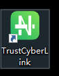

## 测试环境（226）

前端位置

```
/data/apps/webapps/pmo/web-fe
```

run.sh

其中 shaoguan-admin-web 是韶关的业务端

```bash
docker run \
  --net=host \
  -d \
  -m 512m \
  -v /etc/localtime:/etc/localtime \
  -v /data/apps/webapps/pmo/web-fe/nginx/am-admin-fe:/usr/share/nginx/am-admin-fe/html \
  -v /data/apps/webapps/pmo/web-fe/nginx/portal-web:/usr/share/nginx/am-portal-web \
  -v /data/apps/webapps/pmo/web-fe/nginx/admin-web:/usr/share/nginx/admin-web \
  -v /data/apps/webapps/pmo/web-fe/nginx/shaoguan-admin-web:/usr/share/nginx/shaoguan-admin-web \
  -v /data/apps/webapps/pmo/web-fe/nginx/conf/nginx.conf:/etc/nginx/nginx.conf \
  -v /data/apps/webapps/pmo/web-fe/nginx/log:/var/log/nginx \
  -p 90:90 \
  --name pmp-web \
  scr.digitalgd.com.cn/p_a7c3d0e8602047e4b003a6a611183fdc/sg_pmo_web:x86_8
```

nginx配置

```
location /admin-web/ {
    alias /usr/share/nginx/admin-web/;
    index  index.html index.htm;
    try_files $uri $uri/ /admin-web/index.html;
}

location /admin/ {
	proxy_pass http://127.0.0.1:9088/admin/;
}

# 韶关的配置，注意韶关的前端打包时publicPath要改成/shaoguan-admin-web
location /shaoguan-admin-web/ {
    alias /usr/share/nginx/shaoguan-admin-web/;
    index  index.html index.htm;
    try_files $uri $uri/ /shaoguan-admin-web/index.html;
}
```

### 更新步骤

```
cd /data/apps/webapps/pmo/web-fe/nginx/admin-web
ls
rm -rf /data/apps/webapps/pmo/web-fe/nginx/admin-web/*
rz 上传dist.zip
unzip dist.zip && cd /data/apps/webapps/pmo/web-fe && docker rm -f pmp-web && ./run.sh
```


## 生产环境

### 堡垒机

https://10.138.103.3

腾讯身份认证小程序

szgd_pangyue

Lv@M.42024py130

### VPN



FreeOTP小程序

szgd_pangyue

S&^dk8J2dv0py

### 服务器

先用这个登录：

houning henryy szgd1 szgd2 密码都是 lA3;tU2&aV0}

然后用 su root 切换管理员权限：

root
6n+hjfq82@$

### 设备

10.186.41.93

### 前端地址

/data/app/base-pms-web

### 更新生产步骤

```
cd /data/app/rdp/admin-yzy-fe
ls
rm -rf /data/app/rdp/admin-yzy-fe/*
rz 上传dist.zip
unzip dist.zip && cd /data/app/base-pms-web && docker rm -f pmp-web && ./run.sh
```

### run.sh

阳江最终

```
docker run --net=host -d \
  -v /etc/localtime:/etc/localtime \
  -v /data/app/rdp/admin-fe/html:/usr/share/nginx/admin-fe/html \
  -v /data/app/rdp/yj-pmo-web:/usr/share/nginx/yj-pmo-web \
  -v /data/app/rdp/admin-yzy-fe/html:/usr/share/nginx/html-mobile \
  -v /data/app/base-pms-web/nginx/conf/nginx.conf:/etc/nginx/nginx.conf \
  -v /data/app/base-pms-web/nginx/log:/var/log/nginx \
  -v /data/app/base-pms-web/nginx/conf/ssl:/usrl/share/nginx/ssl \
  -p 80:80 \
  --name pmp-web \
  nginx:latest
```

### nginx配置

茂名

```
location /admin-web/ {
    alias /usr/share/nginx/mm-pmo-web/;
    index  index.html index.htm;
    try_files $uri $uri/ /admin-web/index.html;
}

location /pmp-prov-yzy/ {
    alias /usr/share/nginx/html-mobile/;
    index  index.html index.htm;
    # try_files $uri $uri/ /pmo-prov-yzy/index.html;
    try_files $uri $uri/ /usr/share/nginx/html-mobile/index.html;
}


location  /admin/ {
	proxy_pass http://172.26.0.3:9001/admin/;
}

location /pmp-prov-yzy/admin/ {
	proxy_pass http://172.26.0.3:9001/admin/;
}
```

阳江

```
location /admin-web/ {
    alias /usr/share/nginx/yj-pmo-web/;
    index  index.html index.htm;
    try_files $uri $uri/ /admin-web/index.html;
}

location /pmp-prov-yzy/ {
    alias /usr/share/nginx/html-mobile/;
    index  index.html index.htm;
    try_files $uri $uri/ /pmp-prov-yzy/index.html;
}

location  /admin/ {
	proxy_pass http://172.23.41.213:9001/admin/;
}
```

### 页面地址

http://10.186.41.93/admin-web/workbench

http://10.186.41.93/am-admin/


### 页面账密

yangjiang

PMO@2025yangjiang


materialAdmin

PMO@2025123dl

## 入库流程

### XML-0627

```
<?xml version=\"1.0\" encoding=\"UTF-8\"?>\n<definitions xmlns=\"http://www.omg.org/spec/BPMN/20100524/MODEL\" xmlns:xsi=\"http://www.w3.org/2001/XMLSchema-instance\" xmlns:bpmndi=\"http://www.omg.org/spec/BPMN/20100524/DI\" xmlns:omgdc=\"http://www.omg.org/spec/DD/20100524/DC\" xmlns:omgdi=\"http://www.omg.org/spec/DD/20100524/DI\" xmlns:flowable=\"http://flowable.org/bpmn\" xmlns:bioc=\"http://bpmn.io/schema/bpmn/biocolor/1.0\" targetNamespace=\"http://www.flowable.org/processdef\">\n  <process id=\"PROJECT_LIBRARY_DS\" name=\"地市储备库入库流程\" isExecutable=\"true\">\n    <startEvent id=\"StartEvent_1y45yut\" name=\"开始\">\n      <outgoing>Flow_036zkbj</outgoing>\n    </startEvent>\n    <userTask id=\"Activity_0xkdiht\" name=\"入库申请\" flowable:assignee=\"${Activity_0xkdiht_assignee}\">\n      <incoming>Flow_036zkbj</incoming>\n      <incoming>Flow_1fgqnkb</incoming>\n      <outgoing>Flow_12b7ord</outgoing>\n    </userTask>\n    <sequenceFlow id=\"Flow_036zkbj\" sourceRef=\"StartEvent_1y45yut\" targetRef=\"Activity_0xkdiht\" />\n    <sequenceFlow id=\"Flow_12b7ord\" sourceRef=\"Activity_0xkdiht\" targetRef=\"Activity_1gs6p42\" />\n    <userTask id=\"Activity_1gs6p42\" name=\"入库受理\" flowable:assignee=\"${Activity_1gs6p42_assignee}\">\n      <incoming>Flow_12b7ord</incoming>\n      <outgoing>Flow_1yhtzoe</outgoing>\n    </userTask>\n    <userTask id=\"Activity_1g4f93w\" name=\"入库审核\" flowable:assignee=\"${Activity_1g4f93w_assignee}\">\n      <incoming>Flow_1yhtzoe</incoming>\n      <outgoing>Flow_1wxskf9</outgoing>\n    </userTask>\n    <sequenceFlow id=\"Flow_1yhtzoe\" sourceRef=\"Activity_1gs6p42\" targetRef=\"Activity_1g4f93w\" />\n    <endEvent id=\"Event_1h6b9yi\" name=\"结束\">\n      <incoming>Flow_0aiyuoi</incoming>\n      <incoming>Flow_0w6qc17</incoming>\n    </endEvent>\n    <exclusiveGateway id=\"Gateway_1jb2vt3\" name=\"网关1\">\n      <incoming>Flow_1wxskf9</incoming>\n      <outgoing>Flow_0aiyuoi</outgoing>\n      <outgoing>Flow_0au84ec</outgoing>\n    </exclusiveGateway>\n    <sequenceFlow id=\"Flow_1wxskf9\" sourceRef=\"Activity_1g4f93w\" targetRef=\"Gateway_1jb2vt3\" />\n    <sequenceFlow id=\"Flow_0aiyuoi\" name=\"市级项目 或 金额未超过500万\" sourceRef=\"Gateway_1jb2vt3\" targetRef=\"Event_1h6b9yi\">\n      <conditionExpression xsi:type=\"tFormalExpression\"><![CDATA[${needReview==2}]]></conditionExpression>\n    </sequenceFlow>\n    <userTask id=\"Activity_1ev9jdk\" name=\"市政数局备案\" flowable:assignee=\"${Activity_1ev9jdk_assignee}\">\n      <incoming>Flow_0au84ec</incoming>\n      <outgoing>Flow_1hcu25e</outgoing>\n    </userTask>\n    <sequenceFlow id=\"Flow_0au84ec\" name=\"区县项目 且 金额超过500万\" sourceRef=\"Gateway_1jb2vt3\" targetRef=\"Activity_1ev9jdk\">\n      <conditionExpression xsi:type=\"tFormalExpression\"><![CDATA[${needReview==1}]]></conditionExpression>\n    </sequenceFlow>\n    <sequenceFlow id=\"Flow_0w6qc17\" name=\"市政数局备案通过\" sourceRef=\"Gateway_0vfgrcr\" targetRef=\"Event_1h6b9yi\">\n      <conditionExpression xsi:type=\"tFormalExpression\"><![CDATA[${cityPass==1}]]></conditionExpression>\n    </sequenceFlow>\n    <sequenceFlow id=\"Flow_1fgqnkb\" name=\"市政数局备案未通过\" sourceRef=\"Gateway_0vfgrcr\" targetRef=\"Activity_0xkdiht\">\n      <conditionExpression xsi:type=\"tFormalExpression\"><![CDATA[${cityPass==2}]]></conditionExpression>\n    </sequenceFlow>\n    <exclusiveGateway id=\"Gateway_0vfgrcr\" name=\"网关7\">\n      <incoming>Flow_1hcu25e</incoming>\n      <outgoing>Flow_1fgqnkb</outgoing>\n      <outgoing>Flow_0w6qc17</outgoing>\n    </exclusiveGateway>\n    <sequenceFlow id=\"Flow_1hcu25e\" sourceRef=\"Activity_1ev9jdk\" targetRef=\"Gateway_0vfgrcr\" />\n  </process>\n  <bpmndi:BPMNDiagram id=\"BpmnDiagram_1\">\n    <bpmndi:BPMNPlane id=\"BpmnPlane_1\" bpmnElement=\"PROJECT_LIBRARY_DS\">\n      <bpmndi:BPMNEdge id=\"Flow_1hcu25e_di\" bpmnElement=\"Flow_1hcu25e\" bioc:stroke=\"#2A8BFD\">\n        <omgdi:waypoint x=\"760\" y=\"-180\" />\n        <omgdi:waypoint x=\"760\" y=\"-235\" />\n      </bpmndi:BPMNEdge>\n      <bpmndi:BPMNEdge id=\"Flow_1fgqnkb_di\" bpmnElement=\"Flow_1fgqnkb\" bioc:stroke=\"#2A8BFD\">\n        <omgdi:waypoint x=\"735\" y=\"-260\" />\n        <omgdi:waypoint x=\"200\" y=\"-260\" />\n        <omgdi:waypoint x=\"200\" y=\"-12\" />\n        <bpmndi:BPMNLabel>\n          <omgdc:Bounds x=\"430\" y=\"-294\" width=\"78\" height=\"27\" />\n        </bpmndi:BPMNLabel>\n      </bpmndi:BPMNEdge>\n      <bpmndi:BPMNEdge id=\"Flow_0w6qc17_di\" bpmnElement=\"Flow_0w6qc17\" bioc:stroke=\"#2A8BFD\">\n        <omgdi:waypoint x=\"785\" y=\"-260\" />\n        <omgdi:waypoint x=\"970\" y=\"-260\" />\n        <omgdi:waypoint x=\"970\" y=\"10\" />\n        <bpmndi:BPMNLabel>\n          <omgdc:Bounds x=\"834\" y=\"-278\" width=\"89\" height=\"14\" />\n        </bpmndi:BPMNLabel>\n      </bpmndi:BPMNEdge>\n      <bpmndi:BPMNEdge id=\"Flow_0au84ec_di\" bpmnElement=\"Flow_0au84ec\" bioc:stroke=\"#2A8BFD\">\n        <omgdi:waypoint x=\"760\" y=\"3\" />\n        <omgdi:waypoint x=\"760\" y=\"-100\" />\n        <bpmndi:BPMNLabel>\n          <omgdc:Bounds x=\"774\" y=\"-74\" width=\"73\" height=\"27\" />\n        </bpmndi:BPMNLabel>\n      </bpmndi:BPMNEdge>\n      <bpmndi:BPMNEdge id=\"Flow_0aiyuoi_di\" bpmnElement=\"Flow_0aiyuoi\" bioc:stroke=\"#2A8BFD\">\n        <omgdi:waypoint x=\"785\" y=\"28\" />\n        <omgdi:waypoint x=\"952\" y=\"28\" />\n        <bpmndi:BPMNLabel>\n          <omgdc:Bounds x=\"828\" y=\"-10\" width=\"84\" height=\"27\" />\n        </bpmndi:BPMNLabel>\n      </bpmndi:BPMNEdge>\n      <bpmndi:BPMNEdge id=\"Flow_1wxskf9_di\" bpmnElement=\"Flow_1wxskf9\" bioc:stroke=\"#2A8BFD\">\n        <omgdi:waypoint x=\"630\" y=\"28\" />\n        <omgdi:waypoint x=\"735\" y=\"28\" />\n      </bpmndi:BPMNEdge>\n      <bpmndi:BPMNEdge id=\"Flow_1yhtzoe_di\" bpmnElement=\"Flow_1yhtzoe\" bioc:stroke=\"#2A8BFD\">\n        <omgdi:waypoint x=\"440\" y=\"28\" />\n        <omgdi:waypoint x=\"530\" y=\"28\" />\n      </bpmndi:BPMNEdge>\n      <bpmndi:BPMNEdge id=\"Flow_12b7ord_di\" bpmnElement=\"Flow_12b7ord\" bioc:stroke=\"#2A8BFD\">\n        <omgdi:waypoint x=\"250\" y=\"28\" />\n        <omgdi:waypoint x=\"340\" y=\"28\" />\n      </bpmndi:BPMNEdge>\n      <bpmndi:BPMNEdge id=\"Flow_036zkbj_di\" bpmnElement=\"Flow_036zkbj\" bioc:stroke=\"#2A8BFD\">\n        <omgdi:waypoint x=\"46\" y=\"28\" />\n        <omgdi:waypoint x=\"150\" y=\"28\" />\n      </bpmndi:BPMNEdge>\n      <bpmndi:BPMNShape id=\"StartEvent_1y45yut_di\" bpmnElement=\"StartEvent_1y45yut\">\n        <omgdc:Bounds x=\"10\" y=\"10\" width=\"36\" height=\"36\" />\n        <bpmndi:BPMNLabel>\n          <omgdc:Bounds x=\"20\" y=\"50\" width=\"22\" height=\"14\" />\n        </bpmndi:BPMNLabel>\n      </bpmndi:BPMNShape>\n      <bpmndi:BPMNShape id=\"Activity_0xkdiht_di\" bpmnElement=\"Activity_0xkdiht\">\n        <omgdc:Bounds x=\"150\" y=\"-12\" width=\"100\" height=\"80\" />\n      </bpmndi:BPMNShape>\n      <bpmndi:BPMNShape id=\"Activity_1gs6p42_di\" bpmnElement=\"Activity_1gs6p42\">\n        <omgdc:Bounds x=\"340\" y=\"-12\" width=\"100\" height=\"80\" />\n      </bpmndi:BPMNShape>\n      <bpmndi:BPMNShape id=\"Activity_1g4f93w_di\" bpmnElement=\"Activity_1g4f93w\">\n        <omgdc:Bounds x=\"530\" y=\"-12\" width=\"100\" height=\"80\" />\n      </bpmndi:BPMNShape>\n      <bpmndi:BPMNShape id=\"Event_1h6b9yi_di\" bpmnElement=\"Event_1h6b9yi\">\n        <omgdc:Bounds x=\"952\" y=\"10\" width=\"36\" height=\"36\" />\n        <bpmndi:BPMNLabel>\n          <omgdc:Bounds x=\"959\" y=\"53\" width=\"22\" height=\"14\" />\n        </bpmndi:BPMNLabel>\n      </bpmndi:BPMNShape>\n      <bpmndi:BPMNShape id=\"Gateway_1jb2vt3_di\" bpmnElement=\"Gateway_1jb2vt3\" isMarkerVisible=\"true\">\n        <omgdc:Bounds x=\"735\" y=\"3\" width=\"50\" height=\"50\" />\n        <bpmndi:BPMNLabel>\n          <omgdc:Bounds x=\"746\" y=\"60\" width=\"29\" height=\"14\" />\n        </bpmndi:BPMNLabel>\n      </bpmndi:BPMNShape>\n      <bpmndi:BPMNShape id=\"Activity_1ev9jdk_di\" bpmnElement=\"Activity_1ev9jdk\">\n        <omgdc:Bounds x=\"710\" y=\"-180\" width=\"100\" height=\"80\" />\n      </bpmndi:BPMNShape>\n      <bpmndi:BPMNShape id=\"Gateway_0vfgrcr_di\" bpmnElement=\"Gateway_0vfgrcr\" isMarkerVisible=\"true\">\n        <omgdc:Bounds x=\"735\" y=\"-285\" width=\"50\" height=\"50\" />\n        <bpmndi:BPMNLabel>\n          <omgdc:Bounds x=\"745\" y=\"-309\" width=\"29\" height=\"14\" />\n        </bpmndi:BPMNLabel>\n      </bpmndi:BPMNShape>\n    </bpmndi:BPMNPlane>\n  </bpmndi:BPMNDiagram>\n</definitions>\n
```

### KeyList-0627

```
[
"no",
"name",
"applyDepart",
"totalAmount",
"agent",
"link",
"planYearMonth",
"label",
"status",
"submitTime",
"updateTime",
"unitLevel",
"cityPass",
"needReview"
]
```

