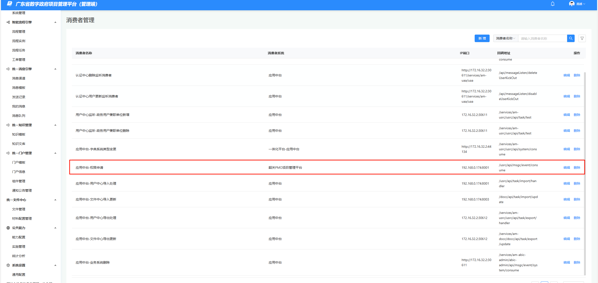

## 生产环境

### VPN

https://vpn.sg.gov.cn

陈丽雯

clw13450337626

Proxy@2024

郑雁长

zhengyanchang

Zyc@19230939495

### 生产环境系统地址

业务系统

https://pmo.sg.gov.cn/admin-web/

应用中台

https://pmo.sg.gov.cn/am-admin/

admin

20231213_bdc@SG


### 生产环境部署

[持续集成 | 研发管理](https://shujian.dg.com/monorepo/app-rdmp/integration/index?projectId=a7c3d0e8602047e4b003a6a611183fdc)

**流水线：PMO前端生产环境打包**


### 粤政易端登录相关配置

1. 业务系统管理添加业务系统


2. 实施管理添加实施


1. 实施管理密钥

实施管理生成的密钥，移动端不需要，因为没有登录页

2. 后端处理

需将uaa服务的SOCIAL_LOGIN_CLIENT_ID参数调整为新增的移动端编码


3. 前端处理

```
mounted() {
    // 检测url是否有token，有的话就将其设置入cookie
    const isYzy = window.location.href.includes('login-source=yzy')
    if (isYzy) {
      const tokenMatch = window.location.href.match(/[&?]token=([^#]+)/)
      const token = tokenMatch ? tokenMatch[1] : null
      if (token) {
        JsCookie.set('TSP-PORTAL-WEB-TOEKN', decodeURIComponent(token))
      }
      if (/[&?]token=/.test(window.location.href)) {
        window.location.href = window.location.href.replace(/[&?]token=.*$/, '')
      }
    }
    this.getUser();
  },
```


### 粤政易端登录流程

4. 粤政易移动端H5检测到接口返回401状态（未登录），就打开粤政易Oauth验证页面，并且带上一个指向后端的回调地址A（如：https://pmp.sg.gov.cn/pmp/uaa/social/yzy/callback）
5. 粤政易Oauth验证页面通过单点登录通过后，定向到回调地址A，并且带上授权码Code
6. 位于回调地址A的后端，根据Code获取AccessToken，然后返回302请求，让浏览器重定向到前端H5的首页地址B（该地址配置在应用中台的业务系统管理和实施管理里），同时将AccessToken设置到浏览器Cookie，保持登录状态

## 测试环境

### 测试环境部署

10.2.161.226

前端位置

```
/data/apps/webapps/pmo/web-fe
```

run.sh

```
docker run \
  --net=host \
  -d \
  -m 512m \
  -v /etc/localtime:/etc/localtime \
  -v /data/apps/webapps/pmo/web-fe/nginx/am-admin-fe:/usr/share/nginx/am-admin-fe/html \
  -v /data/apps/webapps/pmo/web-fe/nginx/portal-web:/usr/share/nginx/am-portal-web \
  -v /data/apps/webapps/pmo/web-fe/nginx/admin-web:/usr/share/nginx/admin-web \
  -v /data/apps/webapps/pmo/web-fe/nginx/shaoguan-admin-web:/usr/share/nginx/shaoguan-admin-web \
  -v /data/apps/webapps/pmo/web-fe/nginx/conf/nginx.conf:/etc/nginx/nginx.conf \
  -v /data/apps/webapps/pmo/web-fe/nginx/log:/var/log/nginx \
  -p 90:90 \
  --name pmp-web \
  scr.digitalgd.com.cn/p_a7c3d0e8602047e4b003a6a611183fdc/sg_pmo_web:x86_8
```

更新业务端

```
cd /data/apps/webapps/pmo/web-fe/nginx/shaoguan-admin-web
ls
rm -rf /data/apps/webapps/pmo/web-fe/nginx/shaoguan-admin-web/*
rz 上传dist.zip
unzip dist.zip && cd /data/apps/webapps/pmo/web-fe && docker rm -f pmp-web && ./run.sh
```

更新中台

```
cd /data/apps/webapps/pmo/web-fe/nginx/am-admin-fe
ls
rm -rf /data/apps/webapps/pmo/web-fe/nginx/am-admin-fe/*
rz 上传dist.zip
unzip dist.zip && cd /data/apps/webapps/pmo/web-fe && docker rm -f pmp-web && ./run.sh
```


## 应用中台

（关键：替换TSP-Page的es文件夹）

7. 切换分支

拉取项目https://gitlab.dg.com/dsywb/ds_develop/hangyeyewuxian/ds_pmo/yewuzhongtai/am-admin-web

切换v26分支

8. 替换tsp-pages依赖

package.json里找到@digitalgd/tsp-pages或者@digitalgd/tsp-pages-alpha

如果是@digitalgd/tsp-pages，只需要将对应的url改成某个具体版本号（原本是指向gitlab仓库，但是咱们没有权限啊），如果是digitalgd/tsp-pages-alpha，需要将代码里的tsp-pages-alpha先替换成tsp-pages，然后再执行上述步骤，例如：

 ```
"@digitalgd/tsp-pages-alpha": "git+ssh://git@gitlab.dg.com:10086/zlywsyb/gdrs/am/v3/am-web-comps.git#develop",

=>

"@digitalgd/tsp-pages": "^2.0.5",
 ```

9. 安装依赖

nvs use v14

npm install （yarn会报错，npm就可以）

10. 替换tsp-pages的es文件夹：

位置如下：

```
am-admin-web\node_modules\@digitalgd\tsp-pages\es
```

就是将编译后的tsp-pages代码更新过来：

11. 修改

简单的修改，只需要修改.project.pm或者.project.pm-prod里的配置即可

复杂的需要修改tsp-pages并重新打包es用于替换

[地市服务事业部 / 地市开发群组 / 行业业务线 / 地市版PMO / 业务中台 / am-web-comps · GitLab](https://gitlab.dg.com/dsywb/ds_develop/hangyeyewuxian/ds_pmo/yewuzhongtai/am-web-comps)

12. 启动

yarn serve:pm

13. 打包

yarn build:pm-prod --env=test

要用yarn不用npm，因为npm参数会多一个，vue.config.js写死了读取的--env是第几个参数

然后--env后面的test、prod、dev不影响。

## 工单申请

14. 启动流程：PERMISSION_APPLY（权限申请）

15. 字典配置：permission_template_role_category（权限模板使用的角色类别），确保存在字典值：BUSINESS_SYSTEM（业务系统管理员）

16. 角色配置：角色管理-平台角色 添加一个角色为 业务系统管理员 的角色，然后将需要处理权限申请工单的人（例如超管）绑定改角色

17. 消息队列配置：

   1. 消息队列-消费者管理：添加一个权限申请的消费者

      | 消费者名称        | 消费者系统          | IP端口             | 回调地址                     |
      | ----------------- | ------------------- | ------------------ | ---------------------------- |
      | 应用中台-权限申请 | 韶关PMO项目管理平台 | 192.168.0.174:8001 | /usrc/api/msgc/event/consume |

      

   2. 消息队列：新增一个消费队列，消息主题类型为【用户授权】（这是字典msg_queue_type里的一个字典项），消费者为刚刚添加的【应用中台-权限申请】

      