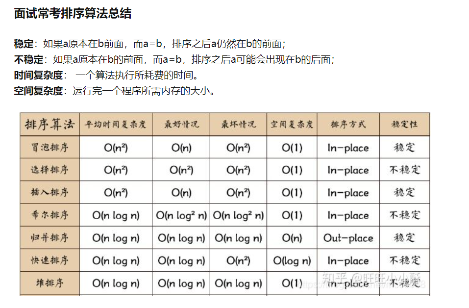

## 数组
### [912. 排序数组](https://leetcode.cn/problems/sort-an-array/)
#### 选择排序
```java
class Solution {
	public int[] sortArray(int[] nums) {
		// 循环不变量：[0, i) 有序，且该区间里所有元素就是最终排定的样子
		for(int i = 0; i < nums.length - 1; ++i) {
			// 选择区间 [i, len - 1] 里最小的元素的索引，交换到下标 i
			int minIndex = i;
			for(int j = i+1; j <= nums.length - 1; j++) {
				if(nums[j] < nums[minIndex]) {
					minIndex = j;
				}
			}
			swap(nums, i, minIndex);
		}
		return nums;
	}
}
```
#### 插入排序*
1. [Loading Question... - 力扣（LeetCode）](https://leetcode.cn/problems/sort-an-array/solution/fu-xi-ji-chu-pai-xu-suan-fa-java-by-liweiwei1419/)
```java
class Solution {
	public int[] sortArray(int[] nums) {
		// 循环不变量，[0, i)区间的数组始终有序，将num[i]插入其中，使得[0,i]有序
		for(int i = 1; i < nums.length; i++) {
			// 暂存这个元素，将它前面的元素逐个后移
			int temp = nums[i];
			int j;
			// 注意不应该从前开始移动元素，应该从后往前移动元素
			// 循环不变量：
			// 1. （j, i]的值都大于temp
			// 2. nums[j-1]是[0, j-1)的最大值。如果这个nums[j-1]都小于等于temp了，说明j就是最合适的位置
			for(j = i; j > 0 && nums[j-1] > temp; --j) {
				nums[j] = nums[j-1];
			}
			nums[j] = temp;
		}
		return nums;
	}
}
```
#### 冒泡排序
```java
// 冒泡排序
// 每轮循环，两个指针，外层i从大到小，内层j从小到大（直到外层指针）。
// 内层指针前后两两比较，大的放到后面去，循环不变量：每次循环完毕，i处的都是前面的数组中最大的，同时是i后面的最小的。所以i取到1就行，不用到0
class Solution {
    public int[] sortArray(int[] nums) {
        for(int i = nums.length - 1; i > 0; --i) {
            boolean sorted = true;
            for(int j = 0; j < i; ++j) {
                if(nums[j] > nums[j+1]) {
                    swap(nums, j, j+1);
                    sorted = false;
                }
            }
            if(sorted == true) {
                break;
            }
        }
        return nums;
    }
    public void swap(int[] nums, int i, int j) {
        int temp = nums[i];
        nums[i] = nums[j];
        nums[j] = temp;
    }
}
```
#### 快速排序
```java
class Solution {
	public int[] sortArray(int[] nums) {
        int left = 0, right = nums.length - 1;
        quickSort(nums, left, right);
        return nums;
    }
    public void quickSort(int[] nums, int left, int right) {
        if(left < right) {
            swap(nums, right, new Random().nextInt(right - left + 1) + left); 
            int p = partition(nums, left, right);
            quickSort(nums, left, p - 1);
            quickSort(nums, p + 1, right);
        }
    }
    public int partition(int[] nums, int left, int right) {
    	int pivot = nums[right];
        int i = left - 1;
        for(int j = left; j <= right - 1; ++j) {
            if(nums[j] <= pivot) {
                i++;
                swap(nums, i, j);
            }
        }
        swap(nums, i+1, right);
        return i + 1;
    }
    public void swap(int[] nums, int a, int b) {
        int temp = nums[a];
        nums[a] = nums[b];
        nums[b] = temp;
    }
}
```
#### 堆排序
### [704. 二分查找](https://leetcode.cn/problems/binary-search/)
```java
class Solution {
    public int search(int[] nums, int target) {
        int left = 0, right = nums.length - 1;
        int middle;
        while(left <= right) {
            middle = left + (right - left) / 2;
            if(nums[middle] == target) {
                return middle;
            } else if(nums[middle] > target) {
                right = middle - 1;
            } else {
                left = middle + 1;
            }
        }
        return -1;
    }
}
```
### [27. 移除元素](https://leetcode.cn/problems/remove-element/)
```java
// 快慢指针
// i和j，j每次循环都++，所谓快指针；i的话，看j指向的值是不是要移除的元素，如果是，则j++；如果不是，则i替换成j的元素，同时i++。这样可以保证：
// 1. j能遍历到所有元素，并通过判断，得知是否是非移除元素
// 2. i能获取到最新的非移除元素
// 3. 由于每次获取到非移除元素后，都会++，所以能保证不会覆盖掉已经有的非移除元素
class Solution {
    public int removeElement(int[] nums, int val) {
        int i = 0;
        for(int j = 0;j < nums.length; j++) { // 快指针遍历元素
            if(nums[j] != val) { // 通过判断，获取最新的非移除元素的位置
                nums[i] = nums[j];
                i++;
            }
        }
        return i;
    }
}
```