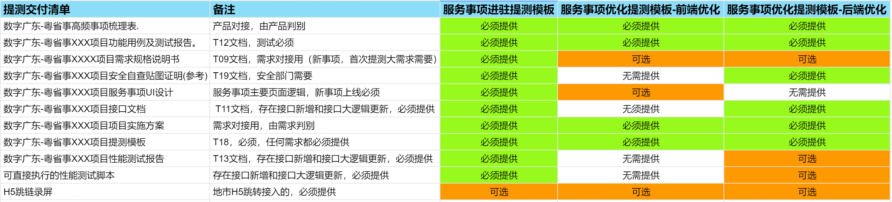
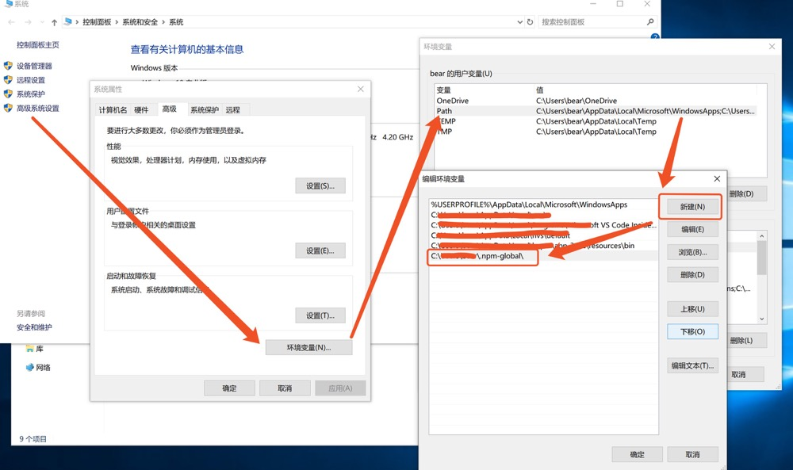
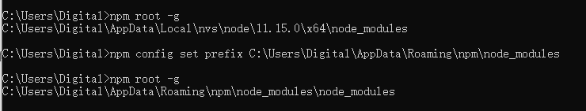
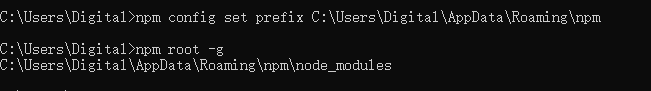
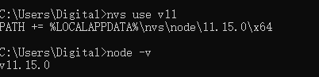
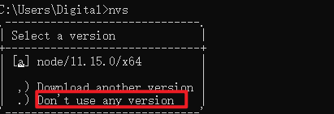
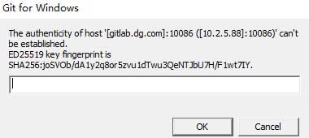
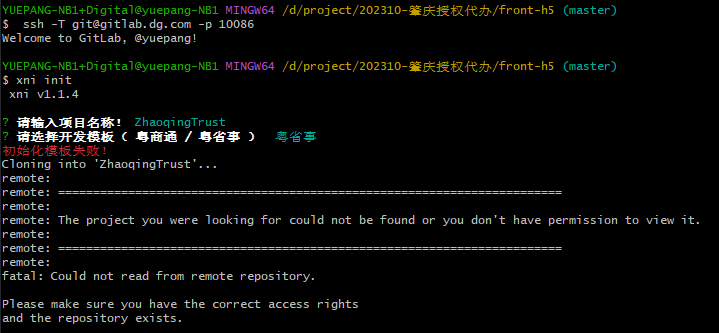

## 参考文档

粤省事前端h5文档（代码托管方式） [前端开发（H5） | 粤省事 - 开发文档](https://yss-dev.digitalgd.com.cn/yss/docs/mini-program/%E6%B5%81%E7%A8%8B%E6%8C%87%E5%BC%95/%E5%8A%9F%E8%83%BD%E5%BC%80%E5%8F%91/%E5%89%8D%E7%AB%AF%E5%BC%80%E5%8F%91%EF%BC%88H5%EF%BC%89.html)

粤省事开放平台 [粤省事 - 开发文档](http://yss-dev.digitalgd.com.cn/yss/docs/)

Taro框架2.x版本（粤省事h5需要用到） [Taro 文档](https://taro-docs.jd.com/docs/2.x/)

微信小程序开放文档 [web-view | 微信开放文档](https://developers.weixin.qq.com/miniprogram/dev/component/web-view.html)

数广gitlab [https://gitlab.dg.com/](https://gitlab.dg.com/)

数舰 [https://shujian.dg.com/sso/?service=http%3A%2F%2Fshujian.dg.com%2F](https://shujian.dg.com/sso/?service=http%3A%2F%2Fshujian.dg.com%2F)

---

阅读完粤省事的组件文档，梳理出目前需要学习的内容：

1. 粤省事的开发流程（参考前端h5文档）
2. 粤省事接入申请
3. Taro的语法和项目脚手架

---

## [跳转接入模式](https://yss-dev.digitalgd.com.cn/yss/docs/mini-program/%E6%B5%81%E7%A8%8B%E6%8C%87%E5%BC%95/%E8%B7%B3%E8%BD%AC%E6%8E%A5%E5%85%A5%E6%A8%A1%E5%BC%8F/%E6%8E%A5%E5%85%A5%E5%87%86%E5%A4%87/%E6%8E%A5%E5%85%A5%E8%A6%81%E6%B1%82.html)

阅读一下跳转接入模式的文档，了解一下我们要使用代码托管还是跳转接入模式。

---

[接入要求 | 粤省事 - 开发文档](https://yss-dev.digitalgd.com.cn/yss/docs/mini-program/%E6%B5%81%E7%A8%8B%E6%8C%87%E5%BC%95/%E8%B7%B3%E8%BD%AC%E6%8E%A5%E5%85%A5%E6%A8%A1%E5%BC%8F/%E6%8E%A5%E5%85%A5%E5%87%86%E5%A4%87/%E6%8E%A5%E5%85%A5%E8%A6%81%E6%B1%82.html)

风险点：如果使用跳转接入模式，需要以下准备：

- 所接入的政务服务事项需提前在省事项目录系统录入相关信息，做好事项同源工作后再启动与粤省事平台对接
- 所接入的政务服务事项入口跳链，域名需经过ICP备案、使用https，且域名格式只支持英文大小写字母、数字及“-”，不支持IP地址，新备案域名需24小时候才可进行对接配置。

---

[进驻流程 | 粤省事 - 开发文档](https://yss-dev.digitalgd.com.cn/yss/docs/mini-program/%E6%B5%81%E7%A8%8B%E6%8C%87%E5%BC%95/%E8%B7%B3%E8%BD%AC%E6%8E%A5%E5%85%A5%E6%A8%A1%E5%BC%8F/%E6%8E%A5%E5%85%A5%E5%87%86%E5%A4%87/%E8%BF%9B%E9%A9%BB%E6%B5%81%E7%A8%8B.html)

- 省级政务服务进驻粤省事平台，由省业务主管部门向省政务服务数据管理部门提出申请和报备。
- **各地级以上市政务服务数据管理部门**统筹本地区服务事项进驻，**报省政务服务数据管理部门备案**。根据需要可就事项开发、接入的技术问题与省数字政府建设运营中心提前交流。
- **粤省事项目组**将依据入驻单位提供的**服务事项进驻清单**、**实施方案**、**服务事项操作指引**等材料开展需求调研和上线服务事项评估，梳理入驻服务的**目标用户群体**、**功能业务逻辑**和**使用场景**，评估上线服务事项清单技术可行性，入驻单位开发厂商依据**服务进驻事项清单**和**确认后的实施方案**进行项目实施。
- **业务进驻单位**以H5跳转的方式进行入驻的情形，**入驻单位开发厂商**需按规范完成**登录互认开发**、**界面与流程改造**、**数据埋点**、**平台通用能力对接**等改造工作。
- 在选用**H5开发的方式**进行入驻的情形下，开发厂商需按指引**开通业务系统到粤省事平台的网络策略**，以便调用平台开放能力接口。另入驻事项开发过程中，使用**平台开放能力**，开发厂商需要**规范申请订阅相应的开放能力接口**，待申请通过后方可使用。
- 开发厂商完成入驻服务事项的开发/改造后，需在相应的测试环境完成自测，包括**功能测试、性能测试、安全自查、并形成服务进驻自检报告**，自检报告需同时提交至入驻单位及粤省事项目组备案，并向粤省事项目组发起**验收测试申请**。
- 粤省事项目组收到入驻单位开发厂商的验收测试申请后，需对入驻服务事项进行**验收测试，包括UI设计检测、功能测试、性能测试、、埋点测试安全测试**等，并按照项目模板整理提测文档。

---

[事项进驻 | 粤省事 - 开发文档](https://yss-dev.digitalgd.com.cn/yss/docs/mini-program/%E6%B5%81%E7%A8%8B%E6%8C%87%E5%BC%95/%E8%B7%B3%E8%BD%AC%E6%8E%A5%E5%85%A5%E6%A8%A1%E5%BC%8F/%E4%BA%8B%E9%A1%B9%E8%BF%9B%E9%A9%BB/%E4%BA%8B%E9%A1%B9%E8%BF%9B%E9%A9%BB.html) 需要事项梳理提交和实施方案编制。

---

[项目管理 | 粤省事 - 开发文档](https://yss-dev.digitalgd.com.cn/yss/docs/mini-program/%E6%B5%81%E7%A8%8B%E6%8C%87%E5%BC%95/%E8%B7%B3%E8%BD%AC%E6%8E%A5%E5%85%A5%E6%A8%A1%E5%BC%8F/%E4%BA%8B%E9%A1%B9%E8%BF%9B%E9%A9%BB/%E9%A1%B9%E7%9B%AE%E7%AE%A1%E7%90%86.html) 项目管理

1. 需要开通TAPD账号——**申请表**
2. 项目推进计划——**填表**
3. 缺陷管理——测试验收阶段，粤省事项目组测试人员将会把测试发现的缺陷录入到TAPD中，并指定到相应人员进行处理
4. 项目验收材料上传



---

[设计指南 | 粤省事 - 开发文档](https://yss-dev.digitalgd.com.cn/yss/docs/mini-program/%E6%B5%81%E7%A8%8B%E6%8C%87%E5%BC%95/%E8%B7%B3%E8%BD%AC%E6%8E%A5%E5%85%A5%E6%A8%A1%E5%BC%8F/%E4%BA%A7%E5%93%81%E8%AE%BE%E8%AE%A1/%E8%AE%BE%E8%AE%A1%E6%8C%87%E5%8D%97.html)

根据业务类型选择流程模板

[办理流程](https://yss-dev.digitalgd.com.cn/yss/docs/mini-program/design/%E6%A0%87%E5%87%86%E6%B5%81%E7%A8%8B%E6%A8%A1%E6%9D%BF/%E5%8A%9E%E7%90%86%E6%B5%81%E7%A8%8B.html) [预约流程](https://yss-dev.digitalgd.com.cn/yss/docs/mini-program/design/%E6%A0%87%E5%87%86%E6%B5%81%E7%A8%8B%E6%A8%A1%E6%9D%BF/%E9%A2%84%E7%BA%A6%E6%B5%81%E7%A8%8B.html) [查询流程](https://yss-dev.digitalgd.com.cn/yss/docs/mini-program/design/%E6%A0%87%E5%87%86%E6%B5%81%E7%A8%8B%E6%A8%A1%E6%9D%BF/%E6%9F%A5%E8%AF%A2%E6%B5%81%E7%A8%8B.html)

要求尽量使用粤省事的组件，实在无法满足的可以用自定义的组件，但是要通过原型评审和视觉评审方可使用

[组件使用规范](https://yss-dev.digitalgd.com.cn/yss/docs/mini-program/design/%E6%A0%87%E5%87%86%E8%A7%86%E8%A7%89%E8%A7%84%E8%8C%83/%E5%9F%BA%E7%A1%80%E8%A7%86%E8%A7%89%E8%A7%84%E8%8C%83/%E5%9F%BA%E7%A1%80%E8%A7%86%E8%A7%89%E8%A7%84%E8%8C%83.html) [组件源文件下载](https://fingertip-static.gdbs.gov.cn/static/pingtai/second-file/UIguifang0331.zip)

**粤省事-个人中心-办事记录（消息通知可能用得上）**

[**粤省事办事记录**](https://yss-dev.digitalgd.com.cn/yss/docs/mini-program/%E7%B2%A4%E7%9C%81%E4%BA%8B%E5%8A%9E%E4%BA%8B%E8%AE%B0%E5%BD%95/%E7%B2%A4%E7%9C%81%E4%BA%8B%E5%8A%9E%E4%BA%8B%E8%AE%B0%E5%BD%95.html)

---

[验收标准 | 粤省事 - 开发文档](https://yss-dev.digitalgd.com.cn/yss/docs/mini-program/%E6%B5%81%E7%A8%8B%E6%8C%87%E5%BC%95/%E8%B7%B3%E8%BD%AC%E6%8E%A5%E5%85%A5%E6%A8%A1%E5%BC%8F/%E4%BA%A7%E5%93%81%E8%AE%BE%E8%AE%A1/%E9%AA%8C%E6%94%B6%E6%A0%87%E5%87%86.html)

接入事项确定后，技术厂商产品经理需要调研清楚**接入事项原有的办理流程**、**填写的表单信息**、**提交的材料**、**事项审批状态流等信息**，并对照事项优化方案进行调整后，按照粤省事设计规范输出原型图，获得业务单位认可后，启动研发工作。

检测标准

1、提交评审的材料需满足要求，详见《提交评审规范》。

2、原型图的办理流程、填写信息、上传材料等必须与事项优化方案保持一致。

3、业务流程清晰、合理。具体可参考[《标准流程模板》](https://yss-dev.digitalgd.com.cn/yss/docs/mini-program/design/%E6%A0%87%E5%87%86%E6%B5%81%E7%A8%8B%E6%A8%A1%E6%9D%BF/%E5%8A%9E%E7%90%86%E6%B5%81%E7%A8%8B.html)。

4、页面设计简洁明了，表单字段按类型进行分模块整合。

5、**非即办即得类服务**（即市民提交办理后不能即时查看办理结果的），**均需要对接消息通知及粤省事个人中心的办事记录**，便于市民**及时获取最新的办理进度及快捷查询办事记录**。具体可参考[《开放能力-消息通知》](https://yss-dev.digitalgd.com.cn/yss/docs/mini-program/%E8%83%BD%E5%8A%9B%E4%BB%8B%E7%BB%8D/%E6%B6%88%E6%81%AF%E6%8E%A8%E9%80%81%E6%9C%8D%E5%8A%A1.html)、[《开放能力-办事记录》](https://yss-dev.digitalgd.com.cn/yss/docs/mini-program/%E8%83%BD%E5%8A%9B%E4%BB%8B%E7%BB%8D/%E5%8A%9E%E4%BA%8B%E8%AE%B0%E5%BD%95.html)。

6、需要把办理过程各类异常情况标注出来，并简单描述异常情况类型。

7、所有服务均需要进行**数据埋点操作**，以便于后续统计业务办理量相关数据。**需要在原型中标注出埋点的位置**。具体可参考[《开放能力-数据埋点》](https://yss-dev.digitalgd.com.cn/yss/docs/mini-program/%E8%83%BD%E5%8A%9B%E4%BB%8B%E7%BB%8D/%E6%95%B0%E6%8D%AE%E5%9F%8B%E7%82%B9.html)（**这个也要看一下，但是优先级没有开发的高**）

数据埋点，简单看了一下，需要在进入服务和完成服务（分为成功和失败）两种情况下进行。

提交评审规范

请按如下图例对办理页面进行排版，上传文件至项目TAPD对应文件夹：


---

[智能网关 | 粤省事 - 开发文档](https://yss-dev.digitalgd.com.cn/yss/docs/mini-program/%E6%B5%81%E7%A8%8B%E6%8C%87%E5%BC%95/%E8%B7%B3%E8%BD%AC%E6%8E%A5%E5%85%A5%E6%A8%A1%E5%BC%8F/%E5%8A%9F%E8%83%BD%E5%BC%80%E5%8F%91/%E8%83%BD%E5%8A%9B%E8%AE%A2%E9%98%85.html)

**这一块看不太懂，前端是否需要结合到这一块？**

---

[功能开发 | 粤省事 - 开发文档](https://yss-dev.digitalgd.com.cn/yss/docs/mini-program/%E6%B5%81%E7%A8%8B%E6%8C%87%E5%BC%95/%E8%B7%B3%E8%BD%AC%E6%8E%A5%E5%85%A5%E6%A8%A1%E5%BC%8F/%E5%8A%9F%E8%83%BD%E5%BC%80%E5%8F%91/%E5%8A%9F%E8%83%BD%E5%BC%80%E5%8F%91.html)

**1. 数据埋点**

粤省事服务事项分为查询、办理两类。服务事项埋点服务于“用户进入该服务事项，并最终提交相应办事请求”这一事件，提供“用户开始服务流程”以及“用户办结流程”这两个关键动作的上报工作。系统按要求调用粤省事提供的服务事项埋点能力，集成至指定的业务逻辑内，以准确上报“该服务事项的 PV 数和办件数（含提交成功数、提交失败数）”。

开发对接详情请查阅[《开放平台-开放能力-数据埋点》](https://yss-dev.digitalgd.com.cn/yss/docs/mini-program/ability.html)

**2. 访问外部应用单点登录**

业务进驻单位向**广东省政务服务数据管理局发函申请同意接入**后，可开始实施对接工作。该项能力可帮助从粤省事小程序跳转到指定的的外部H5应用服务，**并传递用户实名身份信息和登录态至外部应用服务**，用于后续的业务处理。

开发对接详情请查阅[《开放平台-开放能力-访问外部应用单点登录》](https://yss-dev.digitalgd.com.cn/yss/docs/mini-program/ability.html)

3. 办事记录

支持业务系统将办件参数、办件状态、办件结果等信息回传至粤省事，用户可通过粤省事办件记录直接查询办件情况，无须重复录入办件信息。同时，该能力也融合了好差评能力，合作厂商无须单独对接好差评系统，减少重复开发。

开发对接详详情查阅[《开放平台-开放能力-办事记录》](https://yss-dev.digitalgd.com.cn/yss/docs/mini-program/ability.html)

**4.消息推送**

供需要发送消息通知提醒的业务使用，在粤省事上办理过服务的用户，系统可调用粤省事提供的消息推送能力通过“粤省事”公众号或微信服务通知为市民发送微信消息通知或提醒。

开发对接详详情查阅[《开放平台-开放能力-消息推送服务》](https://yss-dev.digitalgd.com.cn/yss/docs/mini-program/ability.html)

注意事项

厂商调用过程中需要先申请Pssid和Passtoken，并与粤省事需求对接人沟通在网关应用下订阅对应的能力接口，开发过程可以使用工具自测接口，参考[工具调用接口指引](https://yss-dev.digitalgd.com.cn/yss/docs/mini-program/%E5%BC%80%E5%8F%91%E6%96%87%E6%A1%A3/%E5%90%8E%E7%AB%AF%E5%BC%80%E5%8F%91/%E6%8E%A5%E5%8F%A3%E8%B0%83%E7%94%A8/%E5%B7%A5%E5%85%B7%E8%B0%83%E7%94%A8.html)；代码部署过程调用智能网关接口，可以参考[代码调用接口指引。](https://yss-dev.digitalgd.com.cn/yss/docs/mini-program/%E5%BC%80%E5%8F%91%E6%96%87%E6%A1%A3/%E5%90%8E%E7%AB%AF%E5%BC%80%E5%8F%91/%E6%8E%A5%E5%8F%A3%E8%B0%83%E7%94%A8/%E4%BB%A3%E7%A0%81%E8%B0%83%E7%94%A8.html)

---

[第三方应用单点登录对接 | 粤省事 - 开发文档](https://yss-dev.digitalgd.com.cn/yss/docs/mini-program/%E8%83%BD%E5%8A%9B%E4%BB%8B%E7%BB%8D/%E7%AC%AC%E4%B8%89%E6%96%B9%E5%BA%94%E7%94%A8%E5%8D%95%E7%82%B9%E7%99%BB%E5%BD%95%E5%AF%B9%E6%8E%A5.html)

外部应用主管单位**向广东省政务服务数据管理局发函申请同意接入**后，可开始实施对接工作。该项能力可帮助从粤省事小程序跳转到指定的的外部应用服务，并传递用户实名身份信息和登录态至外部应用服务，用于后续的业务处理。

以**第三方H5跳转接入**或小程序跳转接入模式进驻粤省事平台的所有服务事项均可对接使用本能力。

开发文档

粤省事小程序在跳转至第三方H5应用页面前，产生1个跟该用户相关联的token，并将之以**URL参数**的形式传递给第三方H5应用

第三方H5应用根据该token**调用粤省事平台提供的“通过token获取实名信息接口**”获取用户的**身份信息与登录态**。该方式适用于**第三方H5应用的前后端都部署在自己的服务器并拥有自己域名的场景**，即以跳转接入模式进驻粤省事的服务事项。

详情看文档。

需要注意的是，需要填写问卷开通单点登录能力。（需要提交《T01.粤省事_XX单位XX业务事项需求详情梳理表》，并且需要为业主单位申请粤省事平台的Paas ID和Paas Token（申请过的话不需要再申请））

---

考虑到，如果集成到肇庆现有的政务服务系统里，可能登录步骤可以简化？暂时先不研究那么细。

## [代码托管模式](https://yss-dev.digitalgd.com.cn/yss/docs/mini-program/%E6%B5%81%E7%A8%8B%E6%8C%87%E5%BC%95/%E6%8E%A5%E5%85%A5%E5%87%86%E5%A4%87/%E6%8E%A5%E5%85%A5%E8%A6%81%E6%B1%82.html)

**该模式现在已经 不开放 了，xni 也 不开放了**

这一部分里面的前端开发模块，包含了粤省事h5要用到的xni-cli、taro工具以及粤省事公共组件CUI的介绍和注意事项。但是很奇怪的是，在跳转接入模式里，似乎没有提到上述两个工具。

所以需要分析，这两个工具，以及CUI，是否适用于跳转接入模式里。

---

[权限开通 | 粤省事 - 开发文档](https://yss-dev.digitalgd.com.cn/yss/docs/mini-program/%E6%B5%81%E7%A8%8B%E6%8C%87%E5%BC%95/%E6%8E%A5%E5%85%A5%E5%87%86%E5%A4%87/%E6%9D%83%E9%99%90%E5%BC%80%E9%80%9A.html)

需要申请粤省事平台VPN和粤省事小程序权限。暂时不清楚跳转h5的方式是否需要申请这两个权限，大概率是需要的。

---

[事项进驻 | 粤省事 - 开发文档](https://yss-dev.digitalgd.com.cn/yss/docs/mini-program/%E6%B5%81%E7%A8%8B%E6%8C%87%E5%BC%95/%E9%9C%80%E6%B1%82%E6%A2%B3%E7%90%86/%E4%BA%8B%E9%A1%B9%E8%BF%9B%E9%A9%BB.html)、[项目管理 | 粤省事 - 开发文档](https://yss-dev.digitalgd.com.cn/yss/docs/mini-program/%E6%B5%81%E7%A8%8B%E6%8C%87%E5%BC%95/%E9%9C%80%E6%B1%82%E6%A2%B3%E7%90%86/%E9%A1%B9%E7%9B%AE%E7%AE%A1%E7%90%86.html)、[原型与设计指南 | 粤省事 - 开发文档](https://yss-dev.digitalgd.com.cn/yss/docs/mini-program/%E6%B5%81%E7%A8%8B%E6%8C%87%E5%BC%95/%E4%BA%A7%E5%93%81%E8%AE%BE%E8%AE%A1/%E5%8E%9F%E5%9E%8B%E4%B8%8E%E8%AE%BE%E8%AE%A1%E6%8C%87%E5%8D%97.html)这几个部分和跳转接入模式基本一样。

---

[开发必读 | 粤省事 - 开发文档](https://yss-dev.digitalgd.com.cn/yss/docs/mini-program/%E6%B5%81%E7%A8%8B%E6%8C%87%E5%BC%95/%E5%8A%9F%E8%83%BD%E5%BC%80%E5%8F%91/%E5%BC%80%E5%8F%91%E5%BF%85%E8%AF%BB.html) 这一块和跳转接入模式不太一样。需要注意一下。

粤省事平台部署在广东“数字政府”政务云平台，为广大用户提供高性能、高可用、易扩展、安全性高的服务。

通过**公共支撑平台**提供的智能网关服务，面向上层提供接口集成能力，向第三方应用开放民生服务能力，通过不同的参数进行多元化、多场景的服务集成。

[整体架构](https://yss-dev.digitalgd.com.cn/yss/docs/mini-program/%E5%BC%80%E5%8F%91%E6%96%87%E6%A1%A3/%E5%BC%80%E5%8F%91%E5%BF%85%E8%AF%BB/%E6%95%B4%E4%BD%93%E6%9E%B6%E6%9E%84/%E6%95%B4%E4%BD%93%E6%9E%B6%E6%9E%84.html)

[小程序开发背景](https://yss-dev.digitalgd.com.cn/yss/docs/mini-program/%E5%BC%80%E5%8F%91%E6%96%87%E6%A1%A3/%E5%BC%80%E5%8F%91%E5%BF%85%E8%AF%BB/%E5%B0%8F%E7%A8%8B%E5%BA%8F%E8%83%8C%E6%99%AF/%E5%B0%8F%E7%A8%8B%E5%BA%8F%E8%83%8C%E6%99%AF.html)：需要分包，使用weshop

[粤省事 H5 部署](https://yss-dev.digitalgd.com.cn/yss/docs/mini-program/%E5%BC%80%E5%8F%91%E6%96%87%E6%A1%A3/%E5%BC%80%E5%8F%91%E5%BF%85%E8%AF%BB/H5%E5%BC%80%E5%8F%91%E9%83%A8%E7%BD%B2%E6%A6%82%E8%A6%81/H5%E5%BC%80%E5%8F%91%E9%83%A8%E7%BD%B2%E6%A6%82%E8%A6%81.html)：如果是代码托管的话，直接合并到develop分支，就会自动部署

---

[前端开发（H5） | 粤省事 - 开发文档](https://yss-dev.digitalgd.com.cn/yss/docs/mini-program/%E6%B5%81%E7%A8%8B%E6%8C%87%E5%BC%95/%E5%8A%9F%E8%83%BD%E5%BC%80%E5%8F%91/%E5%89%8D%E7%AB%AF%E5%BC%80%E5%8F%91%EF%BC%88H5%EF%BC%89.html)

---

注意，粤省事的Taro似乎使用的是2.x版本 [粤省事 H5 项目 | 粤省事 - 开发文档](https://yss-dev.digitalgd.com.cn/yss/docs/mini-program/%E5%BC%80%E5%8F%91%E6%96%87%E6%A1%A3/%E5%89%8D%E7%AB%AF%E5%BC%80%E5%8F%91%EF%BC%88H5%EF%BC%89/%E5%89%8D%E6%9C%9F%E5%87%86%E5%A4%87/%E7%B2%A4%E7%9C%81%E4%BA%8BH5%E9%A1%B9%E7%9B%AE.html)

最新的Taro是3.x版本，使用时要注意区别版本

---

[前端开发（H5） | 粤省事 - 开发文档](https://yss-dev.digitalgd.com.cn/yss/docs/mini-program/%E6%B5%81%E7%A8%8B%E6%8C%87%E5%BC%95/%E5%8A%9F%E8%83%BD%E5%BC%80%E5%8F%91/%E5%89%8D%E7%AB%AF%E5%BC%80%E5%8F%91%EF%BC%88H5%EF%BC%89.html) 这个文档是代码托管模式的方式，但是代码托管需要什么申请，还不知道。

---

[前端开发（H5） | 粤省事 - 开发文档](https://yss-dev.digitalgd.com.cn/yss/docs/mini-program/%E6%B5%81%E7%A8%8B%E6%8C%87%E5%BC%95/%E5%8A%9F%E8%83%BD%E5%BC%80%E5%8F%91/%E5%89%8D%E7%AB%AF%E5%BC%80%E5%8F%91%EF%BC%88H5%EF%BC%89.html) 里使用了nvs对node进行管理，使用了dnpm和xni-cli工具（应该是用于包管理的）使用了这两个工具，不知道是不是可以使用粤省事的库？**建议参考文档里的内容进行尝试**。

---

[前端开发（H5） | 粤省事 - 开发文档](https://yss-dev.digitalgd.com.cn/yss/docs/mini-program/%E6%B5%81%E7%A8%8B%E6%8C%87%E5%BC%95/%E5%8A%9F%E8%83%BD%E5%BC%80%E5%8F%91/%E5%89%8D%E7%AB%AF%E5%BC%80%E5%8F%91%EF%BC%88H5%EF%BC%89.html) 对数据埋点有要求：

各服务事项接入数据埋点功能后，为了尽可能不影响原业务流程的性能，建议将埋点上报设置成异步处理，或对埋点上报设置一个合理的超时时间。

关于数据埋点，应该是一个什么功能，可以上报数据的。**之后可以看一下文档里的埋点部分**。

---

[前端开发（H5） | 粤省事 - 开发文档](https://yss-dev.digitalgd.com.cn/yss/docs/mini-program/%E6%B5%81%E7%A8%8B%E6%8C%87%E5%BC%95/%E5%8A%9F%E8%83%BD%E5%BC%80%E5%8F%91/%E5%89%8D%E7%AB%AF%E5%BC%80%E5%8F%91%EF%BC%88H5%EF%BC%89.html) 建议开发前务必先看

Taro-文档

Taro-组件库

Taro-API

这些在Taro文档里要看一下。不过可以看出来，这一块有一定的学习成本，所需要的时间要把控好，我觉得可以先简单过一遍即可，直接看粤省事的代码。

---

[开发规范(必看) | 粤省事 - 开发文档](https://yss-dev.digitalgd.com.cn/yss/docs/mini-program/%E5%BC%80%E5%8F%91%E6%96%87%E6%A1%A3/%E5%89%8D%E7%AB%AF%E5%BC%80%E5%8F%91%EF%BC%88H5%EF%BC%89/%E5%89%8D%E6%9C%9F%E5%87%86%E5%A4%87/develop/dev-standard.html) 告诉我们`xni init`可以生成一个项目。**回头一定要试一下**。

---

[代码规范 | 粤省事 - 开发文档](https://yss-dev.digitalgd.com.cn/yss/docs/mini-program/%E5%BC%80%E5%8F%91%E6%96%87%E6%A1%A3/%E5%89%8D%E7%AB%AF%E5%BC%80%E5%8F%91%EF%BC%88H5%EF%BC%89/%E5%89%8D%E6%9C%9F%E5%87%86%E5%A4%87/develop/coding-guidelines.html) **有大量代码规范**，如果是跳转接入的话，不知道是否要遵循。全部遵循，需要花费大量时间！

---

[注意事项 | 粤省事 - 开发文档](https://yss-dev.digitalgd.com.cn/yss/docs/mini-program/%E5%BC%80%E5%8F%91%E6%96%87%E6%A1%A3/%E5%89%8D%E7%AB%AF%E5%BC%80%E5%8F%91%EF%BC%88H5%EF%BC%89/%E5%89%8D%E6%9C%9F%E5%87%86%E5%A4%87/develop/note.html) 此外，使用Taro还有一些注意事项，**开发前应该看一下**。和global数据相关、 JSX 数组操作相关、测试和生产环境、图片使用、导包（esm，而不是commonjs）、文件、解构props、state、调试。

---

[常见问题 | 粤省事 - 开发文档](https://yss-dev.digitalgd.com.cn/yss/docs/mini-program/%E5%BC%80%E5%8F%91%E6%96%87%E6%A1%A3/%E5%89%8D%E7%AB%AF%E5%BC%80%E5%8F%91%EF%BC%88H5%EF%BC%89/%E5%89%8D%E6%9C%9F%E5%87%86%E5%A4%87/develop/faq.html) 背景色设置、端口设置、报错（打开登录页）、执行 xni -V 报错（可能是node相关）、dnpm install 失败、没有线上调试控制台、unable to verify the first certificate

---

[语法差异及比较(参考) | 粤省事 - 开发文档](https://yss-dev.digitalgd.com.cn/yss/docs/mini-program/%E5%BC%80%E5%8F%91%E6%96%87%E6%A1%A3/%E5%89%8D%E7%AB%AF%E5%BC%80%E5%8F%91%EF%BC%88H5%EF%BC%89/%E5%89%8D%E6%9C%9F%E5%87%86%E5%A4%87/develop/difference-between-taro-weapp-react-vue.html) 语法对比

|   |   |   |   |
|---|---|---|---|
|Taro|React|Vue|小程序|
|componentWillMount|componentWillMount|beforeMount|onLoad|
|componentDidMount|componentDidMount|mounted|onReady|
|componentWillReceiveProps|componentWillReceiveProps|-|-|
|shouldComponentUpdate|shouldComponentUpdate|-|-|
|componentWillUpdate|componentWillUpdate|beforeUpdate|-|
|componentDidUpdate|componentDidUpdate|updated|-|
|componentWillUnmount|componentWillUnmount|destroyed|onUnload|
|componentDidShow|-|-|onShow|
|componentDidHide|-|-|onHide|

数据绑定上vue和小程序一致，Taro和react一致。

状态更新上，vue、小程序、taro都不同，taro和react一致。

taro和react使用布尔运算进行条件渲染，与vue、小程序不同

taro和react使用map进行列表渲染，与vue、小程序不同

---

[本地调试 | 粤省事 - 开发文档](https://yss-dev.digitalgd.com.cn/yss/docs/mini-program/%E5%BC%80%E5%8F%91%E6%96%87%E6%A1%A3/%E5%89%8D%E7%AB%AF%E5%BC%80%E5%8F%91%EF%BC%88H5%EF%BC%89/%E5%89%8D%E6%9C%9F%E5%87%86%E5%A4%87/develop/debug.html) 本地测试，测试网关域名 [https://sg.digitalgd.com.cn/](https://sg.digitalgd.com.cn/) 鉴权方式是通过http头的`x-tif-sid`（好像是sessionId）和 `x-tif-did`头。粤省事小程序通过`sdk.goToH5Page`给h5传递这两个头，h5通过sdk获取这两个参数，之后通过`sdk.request`自动给请求带上这两个头。**回头了解一下这两个头**...

直接通过浏览器或postman无法调试（会显示未登录）。

可以用下面的方法快速测试接口：

手动传递登录态（登录态需要在url中，通过类似get请求那样的参数方式传递，即?sid=xxx&&did=xxx，而且要求url要有hash，即带#。[粤省事 H5 项目 | 粤省事 - 开发文档](https://yss-dev.digitalgd.com.cn/yss/docs/mini-program/%E5%BC%80%E5%8F%91%E6%96%87%E6%A1%A3/%E5%89%8D%E7%AB%AF%E5%BC%80%E5%8F%91%EF%BC%88H5%EF%BC%89/%E5%89%8D%E6%9C%9F%E5%87%86%E5%A4%87/%E7%B2%A4%E7%9C%81%E4%BA%8BH5%E9%A1%B9%E7%9B%AE.html)）

测试环境获取sid和did...**回头可以看看**？

本地开发（跨域问题处理）

使用 webpack 自带的 dev-server 功能，代理到测试域名。

---

部署联调、抓包调试等之后再看了。

---

[关于H5链接 | 粤省事 - 开发文档](https://yss-dev.digitalgd.com.cn/yss/docs/mini-program/%E5%BC%80%E5%8F%91%E6%96%87%E6%A1%A3/%E5%89%8D%E7%AB%AF%E5%BC%80%E5%8F%91%EF%BC%88H5%EF%BC%89/%E5%89%8D%E6%9C%9F%E5%87%86%E5%A4%87/develop/link.html) 有三个环境

|   |   |
|---|---|
|环境名称|域名|
|开发版|https://yss-dev.digitalgd.com.cn/yss/|
|预发布|https://yss-stage-test.digitalgd.com.cn/yss-stage/|
|正式版|https://yss.gdzwfw.gov.cn/yss/|

对应的最终路径如下，其中project是仓库名

[环境对应的域名][project]/#[页面路由]?参数

所以问题来了，如果这样看的话，那就是代码托管的方式咯？**代码托管的方式是否需要更为严格的审核条件**，如果**不用代码托管的方式，是否不能使用粤省事的公共组件CUI**？这些问题有待自行阅读文档研究，如果找不到就去群里问相关大佬。

---

[粤省事 H5 项目 | 粤省事 - 开发文档](https://yss-dev.digitalgd.com.cn/yss/docs/mini-program/%E5%BC%80%E5%8F%91%E6%96%87%E6%A1%A3/%E5%89%8D%E7%AB%AF%E5%BC%80%E5%8F%91%EF%BC%88H5%EF%BC%89/%E5%89%8D%E6%9C%9F%E5%87%86%E5%A4%87/%E7%B2%A4%E7%9C%81%E4%BA%8BH5%E9%A1%B9%E7%9B%AE.html)

- url一定要带hash
- taro中部分小程序能力不可用
- 前端使用taro2.x框架
- 开发并部署一个h5后，会自动生成一个url，对应[关于H5链接 | 粤省事 - 开发文档](https://yss-dev.digitalgd.com.cn/yss/docs/mini-program/%E5%BC%80%E5%8F%91%E6%96%87%E6%A1%A3/%E5%89%8D%E7%AB%AF%E5%BC%80%E5%8F%91%EF%BC%88H5%EF%BC%89/%E5%89%8D%E6%9C%9F%E5%87%86%E5%A4%87/develop/link.html) 中的，例如 `[https://yss-dev.digitalgd.com.cn/yss/default/](https://yss-dev.digitalgd.com.cn/yss/default/)`，然后在粤省事小程序打开这个页面时，需要先跳到专用页面 `/pages/gsd-ui/g-yss-H5-page/g-H5-page`，然后再打开自己的h5。该页面会处理一下逻辑：

- 传入登录态
- 身份等级校验authLevel（有实名（支付密码）realname、实人（刷脸）face两种）

- 可以通过sdk.goToH5Page 或者 wx.navigateTo 打开。

---

**JSSDK** [开始 | 粤省事 - 开发文档](https://yss-dev.digitalgd.com.cn/yss/docs/mini-program/%E5%BC%80%E5%8F%91%E6%96%87%E6%A1%A3/%E5%89%8D%E7%AB%AF%E5%BC%80%E5%8F%91%EF%BC%88H5%EF%BC%89/sdk/start.html)

|   |   |
|---|---|
|运行环境|备注|
|微信小程序 H5|在粤省事小程序打开的 H5|
|App H5|在粤省事App内打开的 H5|
|普通浏览器|使用场景一般是在本地开发调试时使用|
|*第三方 H5 接入|部分 API 在第三方 H5 接入方式下被屏蔽，比如路由功能、登录功能。|

代码托管h5确定可以使用xni和cui，外部h5能否使用，有待验证。

---

路由跳转 [路由跳转 | 粤省事 - 开发文档](https://yss-dev.digitalgd.com.cn/yss/docs/mini-program/%E5%BC%80%E5%8F%91%E6%96%87%E6%A1%A3/%E5%89%8D%E7%AB%AF%E5%BC%80%E5%8F%91%EF%BC%88H5%EF%BC%89/sdk/port/navigate-to.html)

|   |   |   |
|---|---|---|
|运行环境|是否可用|备注|
|微信小程序H5|✅||
|App|✅||
|普通浏览器|✅||
|*第三方H5接入可用|❌|[兼容性说明](http://yss-dev.digitalgd.com.cn/yss/docs/mini-program/%E5%BC%80%E5%8F%91%E6%96%87%E6%A1%A3/%E5%89%8D%E7%AB%AF%E5%BC%80%E5%8F%91%EF%BC%88H5%EF%BC%89/sdk/start.html)|

可以跨页面、跨项目跳转

---

[通用跳转页面方法 | 粤省事 - 开发文档](https://yss-dev.digitalgd.com.cn/yss/docs/mini-program/%E5%BC%80%E5%8F%91%E6%96%87%E6%A1%A3/%E5%89%8D%E7%AB%AF%E5%BC%80%E5%8F%91%EF%BC%88H5%EF%BC%89/sdk/navigate.html)

|   |   |   |
|---|---|---|
|运行环境|是否可用|备注|
|微信小程序H5|✅||
|App|✅||
|普通浏览器|❌||
|*第三方H5接入可用|✅|[兼容性说明](http://yss-dev.digitalgd.com.cn/yss/docs/mini-program/%E5%BC%80%E5%8F%91%E6%96%87%E6%A1%A3/%E5%89%8D%E7%AB%AF%E5%BC%80%E5%8F%91%EF%BC%88H5%EF%BC%89/sdk/start.html)|

能回到首页、待办列表、粤省事码

---

[跳转到小程序 | 粤省事 - 开发文档](https://yss-dev.digitalgd.com.cn/yss/docs/mini-program/%E5%BC%80%E5%8F%91%E6%96%87%E6%A1%A3/%E5%89%8D%E7%AB%AF%E5%BC%80%E5%8F%91%EF%BC%88H5%EF%BC%89/sdk/navigate-to-mini-program.html)

|   |   |   |
|---|---|---|
|运行环境|是否可用|备注|
|微信小程序H5|✅||
|App|✅||
|普通浏览器|❌||
|*第三方H5接入可用|✅|[兼容性说明](http://yss-dev.digitalgd.com.cn/yss/docs/mini-program/%E5%BC%80%E5%8F%91%E6%96%87%E6%A1%A3/%E5%89%8D%E7%AB%AF%E5%BC%80%E5%8F%91%EF%BC%88H5%EF%BC%89/sdk/start.html)|

提供appId和path即可

---

此外，jssdk还有运行环境判断、sdk.api（Taro原生api）、图片预览、数据缓存等可以使用。

## 环境准备

[环境安装 | 粤省事 - 开发文档](https://yss-dev.digitalgd.com.cn/yss/docs/mini-program/%E5%BC%80%E5%8F%91%E6%96%87%E6%A1%A3/%E5%89%8D%E7%AB%AF%E5%BC%80%E5%8F%91%EF%BC%88H5%EF%BC%89/%E5%89%8D%E6%9C%9F%E5%87%86%E5%A4%87/guide/front-end-environment.html)

Node版本管理

粤省事推荐使用node v10.x版本，所以需要使用版本管理工具，粤省事推荐nvs[Node安装指引 | 粤省事 - 开发文档](https://yss-dev.digitalgd.com.cn/yss/docs/mini-program/%E5%BC%80%E5%8F%91%E6%96%87%E6%A1%A3/%E5%89%8D%E7%AB%AF%E5%BC%80%E5%8F%91%EF%BC%88H5%EF%BC%89/%E5%89%8D%E6%9C%9F%E5%87%86%E5%A4%87/develop/node.html)

nvs下载：[Releases · jasongin/nvs](https://github.com/jasongin/nvs/releases)

安装node版本

```
nvs add v11
```

配置为默认版本

```
nvs link v11
```

如需安装其他版本

```
nvs add v...
```

在当前bash环境切换版本

```
nvs use v8
```

---

**全局 npm 包共享**

切换 node 版本之后，之前版本安装的全局npm模块包会失效导致需重新安装，非常不方便。  
为了解决这个问题。我们只需做两步处理（如果之前安装过node，又不想删除的话，可以看我下面的方法）

1. prefix 指定到某个路径文件夹位置

```
# windows系统 用git bash、hyper
mkdir -p ~/.npm_global
npm config set prefix ~/.npm_global
```

2. 配置环境变量



如果已经安装过node（例如我安装的是v18.x的），并且已经有过全局安装的包。

先用`npm root -g`，查看全局安装路径，然后根据prefix，去设置不同版本的prefix（注意设置prefix时不要带上node_modules这一层路径，否则会变成如下的两层node_modules的样子）



正确做法是只取原来版本下npm root -g 的 node_modules前面的部分，设置为新版本下的npm config set prefix（实践证明，这种设置似乎在不同版本间是通用的，应该改动的都是同一个文件）



由于之前全局安装的时候，一般都已经配过环境变量了，所以这种方法不需要再配环境变量了

使用新版本的node：



如果想要恢复原来的node版本，只要直接输入nvs，然后选择`Don't use any version`，即可恢复



---

**安装 xni-cli 工具**

要求使用最新的node版本（至少要>v10），然而weshop [wehsop 工具 | 粤省事 - 开发文档](https://yss-dev.digitalgd.com.cn/yss/docs/mini-program/develop/mp/weshop/) 要求`v9.0 < node版本 <= v10.x.0`，不知道这两者是否冲突。总之先按照要求安装xni-cli

先恢复到原来的node版本

- 用数广源安装（亲测这种方法应该就够了）

```
npm install -g @digitalgd/xni --registry=http://npm.mirrors.dg.com
```

- dnpm直接安装（可选）

（如果没安装过dnpm先安装一下：

```
# 安装 dnpm
npm install -g @digitalgd/dnpm --registry=http://npm.mirrors.dg.com

# 配置dnpm共享全局包目录，这里换成自己的，C:\Users\Digital\AppData\Roaming\npm
dnpm config set prefix ~/.npm_global

# 用 dnpm 安装数字广东内部私有包 xni
dnpm i -g @digitalgd/xni
```

解决 unable to verify the first certificate 错误

遇到如下错误

```
npm ERR! code UNABLE_TO_VERIFY_LEAF_SIGNATURE
npm ERR! errno UNABLE_TO_VERIFY_LEAF_SIGNATURE
npm ERR! request to http://npm.mirrors.dg.com/@digitalgd%2fweshop failed, reason: unable to verify the first certificate
```

请配置[证书](https://support.qq.com/products/341869/faqs/100856)

```
// 执行
 npm config set strict-ssl false
```

）

```
dnpm install -g @digitalgd/xni
```

  

---

**dnpm - 数字广东公司内部npm包管理工具**

## 分包

[小程序开发背景 | 粤省事 - 开发文档](https://yss-dev.digitalgd.com.cn/yss/docs/mini-program/%E5%BC%80%E5%8F%91%E6%96%87%E6%A1%A3/%E5%BC%80%E5%8F%91%E5%BF%85%E8%AF%BB/%E5%B0%8F%E7%A8%8B%E5%BA%8F%E8%83%8C%E6%99%AF/%E5%B0%8F%E7%A8%8B%E5%BA%8F%E8%83%8C%E6%99%AF.html)

[分包加载 | 微信开放文档](https://developers.weixin.qq.com/miniprogram/dev/framework/subpackages.html)

前端组开发了weshop工具用于合包，具体用途等实践后才知道。

`v9.0 < node版本 <= v10.x.0`

优先级可能不高，之后再考虑

## 创建项目

安装完xni-cli之后，开始创建项目

不知道为什么在快速开始的文档里，没有讲怎么创建xni项目，但是在粤省事开放平台里搜索xni，可以找到相关文档：[xni 文档 | 粤省事 - 开发文档](https://yss-dev.digitalgd.com.cn/yss/docs/mini-program/%E5%BC%80%E5%8F%91%E6%96%87%E6%A1%A3/%E5%89%8D%E7%AB%AF%E5%BC%80%E5%8F%91%EF%BC%88H5%EF%BC%89/%E5%89%8D%E6%9C%9F%E5%87%86%E5%A4%87/develop/xni.html?from=faq)

```
xni init
```

xni选择开发模板为粤省事后，报错如下



尝试配置ssh

[https://yss-dev.digitalgd.com.cn/yss/docs/mini-program/develop/other/git.html](https://yss-dev.digitalgd.com.cn/yss/docs/mini-program/develop/other/git.html)

git配置：

```
git config --global user.name "@yuepang"
 
git config --global user.email "yuepang@digitalgd.com.cn"

ssh-keygen -t rsa -C "yuepang@digitalgd.com.cn"

ssh -T git@gitlab.dg.com -p 10086
```



仍然无法解决问题