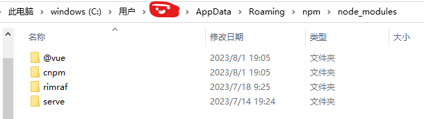
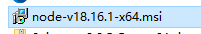
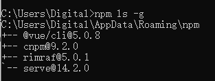

### Node重装（同版本）

背景

有一天发现node不小心装错位置，本来应该在d:\dev\nodejs下，结果装到d:\dev下了

此时，我已经全局安装了@vue/cli、cnpm等包

我就想着重新装，用的还是原来的msi。

---

操作

网上很多文章的步骤如下：

1. 在控制面板卸载nodejs
2. 删除安装目录下的残余文件
3. 还要删掉全局安装的包和缓存文件，位置好像默认在C:\Users\[用户名]\AppData\Roaming\npm和C:\Users\[用户名]\AppData\Roaming\npm-cache

我的操作如下：

1. 在控制面板卸载nodejs
2. 安装目录下没找到残余文件
3. **没有**删掉全局安装的包

之所以没有删掉全局安装的包，有两个原因，一个是我懒，一个是我重装的是同一个版本的nodejs，估摸着问题不大。

---

安装

之后再次安装，安装完发现，之前的全局的包好像都能用

似乎没有问题，美滋滋。有问题我再回来更新。

