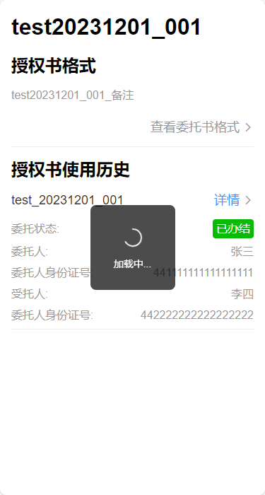

### Vite中的Vant的Toast样式错乱问题及解决

[环境]

vant+vue3+vite

[问题]

我在vue拦截器,使用了vant的showLoadingToast函数(用于展示加载提示)

```
// 请求拦截器
request.interceptors.request.use(config => {
  const token = Cookies.get('token')
  
  // 测试用
  showLoadingToast({
    message: '加载中...',
    forbidClick: true,
    duration: 0
  })
  
  return config
}, errorHandler)
```

结果在大多数页面都能正常显示



但是在某些页面却会突然变成其他的样式(width会变小):


后来发现,只有在存在van-popup组件的页面,会发生这种问题.

[原因]

可能是vite的bug

[[Bug Report\] 通过 Vite3 生产环境构建的产出 Toast 组件部分样式被 Popup 组件样式覆盖 · Issue #11049 · youzan/vant · GitHub](https://github.com/youzan/vant/issues/11049)

[解决办法]

Toast等函数式组件,需要在入口处(main.ts)增加一个样式的引入:

```
import 'vant/es/toast/style';
```

参考链接: [Vue3框架Vite引用vant组件方法及相关问题解决方法_vite使用vant-CSDN博客](https://blog.csdn.net/qq_39111074/article/details/129592211)

[解决效果]

可以让showLoadingToast和van-popup并存啦

