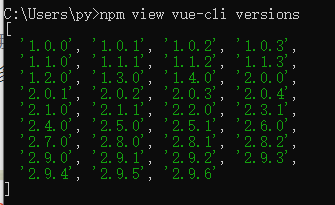
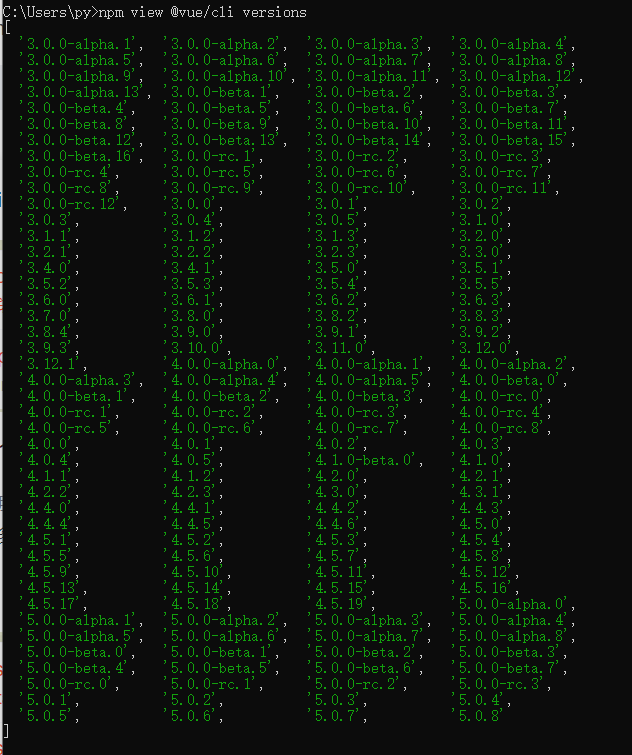
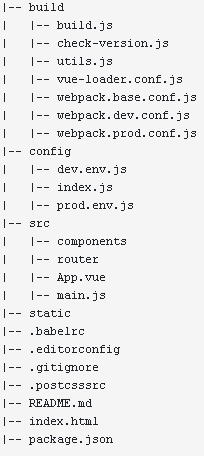
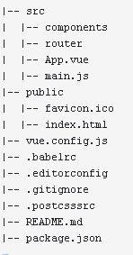
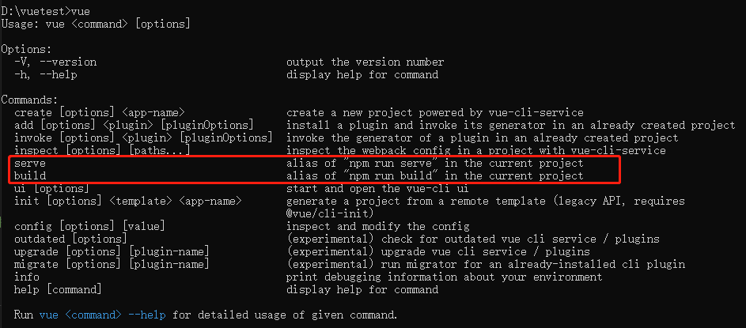

## 可用版本（2022.8）





## vue-cli 和 @vue/cli 区别

|          |                                  |                                   |
| -------- | -------------------------------- | --------------------------------- |
| 操作     | vue-cli （版本号为1/2）          | @vue/cli （版本号为3/4/5）        |
| 下载     | npm install vue-cli@[版本号] -g  | npm install @vue/cli@[版本号] -g  |
| 创建项目 | vue init webpack 2.0project      | vue create 3.0project             |
| 启动项目 | npm run dev（可配置）            | npm run serve（可配置）           |
| 项目结构 |  |  |

## @vue/cli组成

参考链接：[Vue CLI 中文教程_w3cschool](https://www.w3cschool.cn/vue3course/)

Vue CLI 是一个基于 Vue.js 进行快速开发的完整系统，提供：

- 通过 `@vue/cli` 实现的交互式的项目脚手架。

- 通过 `@vue/cli` + `@vue/cli-service-global` 实现的零配置原型开发。

- 一个运行时依赖 ( `@vue/cli-service` )，该依赖：

- 可升级；

- 基于 webpack 构建，并带有合理的默认配置；

- 可以通过项目内的配置文件进行配置；

- **可以通过插件进行扩展**。

- 一个丰富的官方插件集合，集成了前端生态中最好的工具。

- 一套完全图形化的创建和管理 Vue.js 项目的用户界面。

### 组件

Vue CLI 有几个独立的部分——多个单独发布的包

#### 1. CLI

CLI (`@vue/cli`) 是一个全局安装的 npm 包，提供了终端里的 `vue` 命令。它可以通过 `vue create` 快速搭建一个新项目，或者直接通过 `vue serve` 构建新想法的原型。你也可以通过 `vue ui` 通过一套图形化界面管理你的所有项目

#### 2. CLI 服务

CLI 服务 (`@vue/cli-service`) 是一个开发环境依赖。它是一个 npm 包，局部安装在**每个** `@vue/cli` 创建的项目中。

CLI 服务是构建于 [webpack](http://webpack.js.org/) 和 [webpack-dev-server](https://github.com/webpack/webpack-dev-server) 之上的。它包含了：

- **加载其它 CLI 插件**的核心服务；

- 一个针对绝大部分应用优化过的内部的 webpack 配置；

- 项目内部的 `vue-cli-service` 命令，提供 `serve`、`build` 和 `inspect` 命令。

#### 3. CLI 插件

CLI 插件是向你的 Vue 项目提供可选功能的 npm 包，例如 Babel/TypeScript 转译、ESLint 集成、单元测试和 end-to-end 测试等。Vue CLI 插件的名字以 `@vue/cli-plugin-` (内建插件) 或 `vue-cli-plugin-` (社区插件) 开头，非常容易使用。

当在项目内部运行 `vue-cli-service` 命令时，**它会自动解析并加载** `package.json` 中列出的所有 CLI 插件。

## 全局安装vs局部安装

如果全局安装npm包，会在全局安装目录下出现脚本（和node_modules同级），一般都会配置全局安装目录到系统Path变量里

所以直接使用vue命令即可

```
[root@DESKTOP-MSD7I5A vue]# vue -V 
@vue/cli 5.0.3
```

但是如果局部安装，只会在node_modules/.bin目录下出现脚本

如果是**局部**安装@vue/cli的话，需要使用**npx**来调用vue等命令

npx 是调用项目内部安装的模块，运行的时候会到`node_modules/.bin`路径和环境变量`$PATH`里面，检查命令是否存在（详细可见[npx 使用教程 - 阮一峰的网络日志 (ruanyifeng.com)](https://www.ruanyifeng.com/blog/2019/02/npx.html)）

```
[root@DESKTOP-MSD7I5A vue]# npx vue -V 
@vue/cli 5.0.3
```

## @vue/cli（v5.0.3）创建项目

`vue create [项目名]`

## 项目结构


## pacakge.json

```
{
  "name": "hello-world",
  "version": "0.1.0",
  "private": true,
  "scripts": {
    "serve": "vue-cli-service serve",
    "build": "vue-cli-service build",
    "lint": "vue-cli-service lint"
  },
  "dependencies": {
    "core-js": "^3.8.3",
    "vue": "^3.2.13"
  },
  "devDependencies": {
    "@babel/core": "^7.12.16",
    "@babel/eslint-parser": "^7.12.16",
    "@vue/cli-plugin-babel": "~5.0.0",	// 插件
    "@vue/cli-plugin-eslint": "~5.0.0",	// 插件
    "@vue/cli-service": "~5.0.0",  		// 重要的组件
    "eslint": "^7.32.0",
    "eslint-plugin-vue": "^8.0.3"
  },
  "eslintConfig": {
    "root": true,
    "env": {
      "node": true
    },
    "extends": [
      "plugin:vue/vue3-essential",
      "eslint:recommended"
    ],
    "parserOptions": {
      "parser": "@babel/eslint-parser"
    },
    "rules": {}
  },
  "browserslist": [
    "> 1%",
    "last 2 versions",
    "not dead",
    "not ie 11"
  ]
}
```

## 使用@vue/cli-service-global快速原型开发

可以使用 vue serve 和 vue build 命令对单个 *.vue 文件进行快速原型开发

不过这需要先额外安装一个全局的扩展

```
npm install -g @vue/cli-service-global
```

vue serve 的缺点就是它需要安装全局依赖，这使得它在不同机器上的一致性不能得到保证

1. 创建一个文件

2. 在这个文件所在的目录运行vue serve [-o -c -h] [文件名]，如果未指定文件名，则默认查找 main.js、index.js、App.vue 或 app.vue 中的一个。vue serve 使用了和 vue create 创建的项目相同的默认设置 (webpack、Babel、PostCSS 和 ESLint)

参考：[Migrate from v4 | Vue CLI (vuejs.org)](https://cli.vuejs.org/migrations/migrate-from-v4.html#for-all-packages)

The [instant prototyping functionalities](https://v4.cli.vuejs.org/guide/prototyping.html) are removed. Now the `vue serve` / `vue build` commands are aliases to `npm run serve` / `npm run build`, which in turn execute the scripts specified in the project `package.json`.

If you need a minimum setup for developing standalone `.vue` components, please use [https://sfc.vuejs.org/](https://sfc.vuejs.org/) or [https://vite.new/vue](https://vite.new/vue) instead.

**即时原型功能被删除**。现在 **vue serve / vue build** 命令是 **npm run serve / npm run build 的别名**，它们依次执行项目 package.json 中指定的脚本。 如果您需要最低限度的设置来开发独立的 .vue 组件，请改用 [https://sfc.vuejs.org/](https://sfc.vuejs.org/) 或 https://vite.new/vue。第二个相当于一个在线的vue-cli项目



## Vue-cli vs Vite

vue-cli（@vue/cli）是vue 2最好的前端构建工具，

但是vue 3，还可以使用Vite

参考：[https://kalacloud.com/blog/vite-vs-vue-cli](https://kalacloud.com/blog/vite-vs-vue-cli)

Vue 开发者应该无人不知 Vue CLI，他是 Vue 2 最棒的前端构建工具，Vue CLI 基于 Webpack 之上，是 Webpack 的超集。

- Vue CLI 基于 Webpack 构建，配置好了打包规则

- 内置热模块重载的开发服务器

- 有丰富的官方插件合集，站在 webpack 庞大的社区资源上

- 友好的图形化创建和管理 Vue 项目界面

Vue cli 在服务启动之前，要把所有代码打包成 Bundle 再启动服务。这就是为什么启动一些大型项目时，特别慢的原因。这一点上 Vite 做了大幅改善。

Vite 是 Vue 团队开发的新一代前端开发与构建工具，Vite 不是基于 Webpack 开发的，他为了解决服务启动慢的问题，Vite 通过一开始将应用中的模块区分为依赖和源码两类，改进了开发服务器启动时间。

- 依赖：大多为在开发时不会变动的纯 JavaScript。一些较大的依赖（例如有上百个模块的组件库）处理的代价也很高。依赖也通常会存在多种模块化格式。Vite 会使用 esbuild 预构建依赖。esbuild 使用 Go 编写，并且比以 JavaScript 编写的打包器预构建依赖快 10-100 倍。

- 源码：通常包含一些并非直接是 JavaScript 的文件，需要转换，时常会被编辑。同时，并不是所有的源码都需要同时被加载（例如基于路由拆分的代码模块）。

综上，这就是为什么 Vite 启动快的原因。

有空可以学一下vite：[开始 | Vite 官方中文文档 (vitejs.dev)](https://cn.vitejs.dev/guide/#trying-vite-online)