### vue2加载图片失败

```

```

成功加载

```

```

加载图片失败

```

```

也失败

如果有判断，则不会正常加载

解决办法？

### path.resolve报错

使用path.resolve时,出现ReferenceError: process is not defined问题

应该是path-browserify这个库的问题，但是原因未知

import path from "path-browserify";

path.resolve(...)

就会报错

我不用resolve，就没事了

### Router获取所有路由信息

router.options.routes

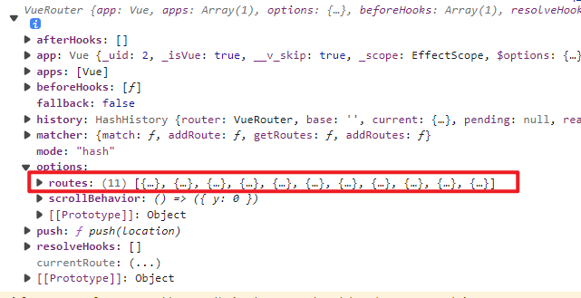

### 全局解析守卫

[导航守卫 | Vue Router](https://v3.router.vuejs.org/zh/guide/advanced/navigation-guards.html#%E5%85%A8%E5%B1%80%E5%89%8D%E7%BD%AE%E5%AE%88%E5%8D%AB)

2.5.0 新增

在 2.5.0+ 你可以用 router.beforeResolve 注册一个全局守卫。这和 router.beforeEach 类似，区别是在导航被确认之前，**同时在所有组件内守卫和异步路由组件被解析之后**，解析守卫就被调用。

文心一言：

**beforeEach和beforeResolve的区别**

beforeEach和beforeResolve都是Vue Router中的导航守卫，它们在执行时机和顺序上存在一些区别。

首先，执行时机不同。beforeEach是在路由被解析之前执行的，而beforeResolve是在路由被解析之后执行的。这意味着在执行顺序上，beforeEach会比beforeResolve更早执行。

其次，执行顺序不同。全局守卫、组件守卫和独享守卫在执行顺序上也是有区别的。全局守卫写在router/index.js中，组件守卫写在组件里，独享守卫写在路由规则里。具体执行的顺序是：

1. beforeEach 前置守卫
2. beforeEnter 独享守卫
3. beforeRouteEnter 组件守卫（之一）
4. beforeResolve 解析守卫
5. afterEach 路由后置守卫

在这里，全局守卫、组件守卫和独享守卫都是在路由跳转前执行的，但执行的顺序不同。

最后，参数不同。beforeEach和beforeResolve的参数都是to、from和next，但是它们两个的区别在于执行的时机不一样。

**其中，3，组件守卫其实有三个**

**来自官网：**[导航守卫 | Vue Router](https://v3.router.vuejs.org/zh/guide/advanced/navigation-guards.html#%E7%BB%84%E4%BB%B6%E5%86%85%E7%9A%84%E5%AE%88%E5%8D%AB)

最后，你可以在路由组件内直接定义以下路由导航守卫：

- beforeRouteEnter
- beforeRouteUpdate (2.2 新增)
- beforeRouteLeave

```
const Foo = {
  template: `...`,
  beforeRouteEnter(to, from, next) {
    // 在渲染该组件的对应路由被 confirm 前调用
    // 不！能！获取组件实例 `this`
    // 因为当守卫执行前，组件实例还没被创建
  },
  beforeRouteUpdate(to, from, next) {
    // 在当前路由改变，但是该组件被复用时调用
    // 举例来说，对于一个带有动态参数的路径 /foo/:id，在 /foo/1 和 /foo/2 之间跳转的时候，
    // 由于会渲染同样的 Foo 组件，因此组件实例会被复用。而这个钩子就会在这个情况下被调用。
    // 可以访问组件实例 `this`
  },
  beforeRouteLeave(to, from, next) {
    // 导航离开该组件的对应路由时调用
    // 可以访问组件实例 `this`
  }
}
```

### 完整的导航解析流程

1. 导航被触发。
2. 在失活的组件里调用 beforeRouteLeave 守卫。
3. 调用全局的 beforeEach 守卫。
4. 在重用的组件里调用 beforeRouteUpdate 守卫 (2.2+)。
5. 在路由配置里调用 beforeEnter。
6. 解析异步路由组件。
7. 在被激活的组件里调用 beforeRouteEnter。
8. 调用全局的 beforeResolve 守卫 (2.5+)。
9. 导航被确认。
10. 调用全局的 afterEach 钩子。
11. 触发 DOM 更新。
12. 调用 beforeRouteEnter 守卫中传给 next 的回调函数，创建好的组件实例会作为回调函数的参数传入。

### 面包屑滚动

```
.header {
  display: flex;
  justify-content: right;
  background: #ffff;
  box-shadow: 0 8px 16px 0 rgb(237, 236, 236);
  width: 100%;
}
.header-left {
  flex: 1;
  display: flex;
  margin-right: 20px;
  align-items: flex-end;
  overflow-x: auto;
}
.header-left::-webkit-scrollbar { 
   display: none; // 隐藏滚动条
}
.page {
  display: flex;
  width: 0; // 重点，设置容器width为0，不然元素会超出去
}
.bread {
  display: flex;
  padding: 0 20px 0 20px;
  margin-left: 8px;
  height: 44px;
  line-height: 44px;
  font-size: 16px;
  text-align: center;
  cursor: pointer;
  box-shadow: 0 0 7px 0 rgba(63, 90, 144, 0.4);
}

.bread div {
  white-space: nowrap; // 设置内容超出不换行，不然标签会被压缩
}
```

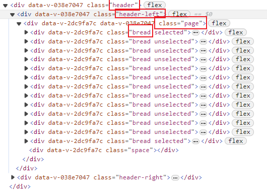

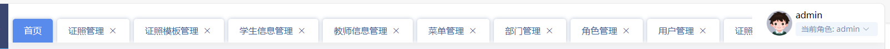

（shift+鼠标滚动即可滚动）

其他方法：

[【滚动条】div隐藏滚动条仍保留滚动效果，兼容IE，FF，Webkit 和 O_div影藏,单div的滚动条还显示-CSDN博客](https://blog.csdn.net/wjx_jasin/article/details/80651964?spm=1001.2101.3001.6650.1&utm_medium=distribute.pc_relevant.none-task-blog-2%7Edefault%7ECTRLIST%7ERate-1-80651964-blog-70238829.235%5Ev38%5Epc_relevant_anti_vip_base&depth_1-utm_source=distribute.pc_relevant.none-task-blog-2%7Edefault%7ECTRLIST%7ERate-1-80651964-blog-70238829.235%5Ev38%5Epc_relevant_anti_vip_base&utm_relevant_index=2)

### 可选链运算符报错

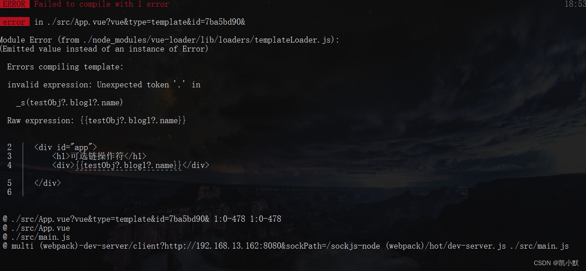

方法一：

这个问题主要是 vue 2.6.11 template 不支持可选链操作符

升级vue版本：可以升级 vue 版本的情况下，我们可以升级到 2.7.0 版本

（应该可以将package.json里的vue版本改为~2.7.0）

如果不行，再升级node版本

~: 如果写入的是 〜0.13.0，则只更新补丁版本：即 0.13.1 可以，但 0.14.0 不可以。

^: 如果写入的是 ^0.13.0，则要更新补丁版本和次版本：即 0.13.1、0.14.0、依此类推。

*: 如果写入的是 *，则表示接受所有的更新，包括主版本升级。

>: 接受高于指定版本的任何版本。

>=: 接受等于或高于指定版本的任何版本。

<=: 接受等于或低于指定版本的任何版本。

<: 接受低于指定版本的任何版本。

————————————————

版权声明：本文为CSDN博主「向着光芒的女孩」的原创文章，遵循CC 4.0 BY-SA版权协议，转载请附上原文出处链接及本声明。

原文链接：[https://blog.csdn.net/ann295258232/article/details/119247413](https://blog.csdn.net/ann295258232/article/details/119247413)

### el-switch绑定元素（对象数组）

这样是ok的：

```
<el-switch
  v-model="certificateTemplateData[index].status"
  active-value="NORMAL"
  inactive-value="STOP"
  active-color="#5ad793"
  inactive-color="#e8e8e8"
  @change="handleChangeStatus(item)"
>
</el-switch>
```

这样不ok：

```
<el-switch
  v-model="enumerationDict[certificateTemplateData[index].status]"
  active-color="#5ad793"
  inactive-color="#e8e8e8"
  @change="handleChangeStatus(item)"
>
</el-switch>

enumerationDict: {
  "STOP": false,
  "NORMAL": true,
},
```

会绑定到enumerationDict上。

导致所有false的都会一起变动，所有true的都会一起变动

### vue弹窗距离顶部位置获取

单纯用this.$refs.dialogUpload，无法获取offsetTop等属性，要加一层$el

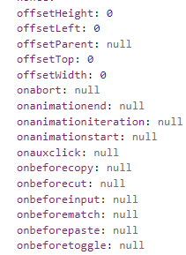

具体详情，可以console.log(this.$refs.dialogUpload)以及console.log(this.$refs.dialogUpload.$el)来查看

```
<el-dialog ref="dialogUpload"></el-dialog>

...             
// 此处记录全局this，否则在window.onresize函数里，this会指向别的。
let that = this;
window.onresize = function() {
  console.log(that.$refs.dialogUpload.$el.offsetTop);
}
```

offsetHeight: 高度

### vue文件夹、文件命名规范

|   |   |   |   |
|---|---|---|---|
|**参考**|**公共components**|**views下的文件夹**|**views下的文件**|
|[Vue项目中的文件/文件夹命名规范-阿里云开发者社区](https://developer.aliyun.com/article/645697)|PascalCase|PascalCase|除index.vue外，用PascalCase|
|ruoyi|PascalCase|小写单个单词|camelCase、PascalCase、小写单个单词混用|
|[vue命名规范 - 掘金](https://juejin.cn/post/6946452909588480007)|未规定|小写单个单词|camelCase|
|[史上最全的Vue开发规范 - 掘金](https://juejin.cn/post/6844903652096770055#heading-11)|未规定|camelCase|camelCase|

到底用什么规范呢？

我自己规定一套自己用的

**公共components：PascalCase做文件夹名，里面放index**

**views下的文件夹：PascalCase，至少两个单词，文件夹下一般都有index.vue（也有例外，比如该文件夹只是用于将多个组件整理在一起，之后由路由来导向），每个文件夹代表一个组件**

**尽量每个组件，都有一个文件夹，然后里面有一个index。需要用到子组件时，可以轻松得添加到文件夹下。**

**views下的文件：除了index.vue外，都是PascalCase，除了index.vue，都是该组件的子组件**

**示例如下：**

```
-[src]
  -[components]
      -[Breadcrumb]
        -index.vue
      -[Hamburger]
        -index.vue
      -[SvgIcon]
        -index.vue
  -[views]
		-[MyMain]
      -index.vue
    	-StepForm
      	-index.vue
    -[MyHeader]
    	-index.vue
  	-[MyAside]
    	-index.vue
```

**这样，同级目录下的** **非index.vue文件/文件夹** **之间，就是同级的关系（共同服务于一个index.vue或者最顶层的话，就是views）。**

**而同级目录下的** **index.vue** **和** **非index.vue文件/文件夹** **，就是父子组件的关系。**

**例如上面的示例代码中，line10、14、16，这三个文件夹代表的组件，就是同级关系，共同服务于views。**

**line12的StepForm，则是line11的index.vue的子组件。**

改进后的文件目录：

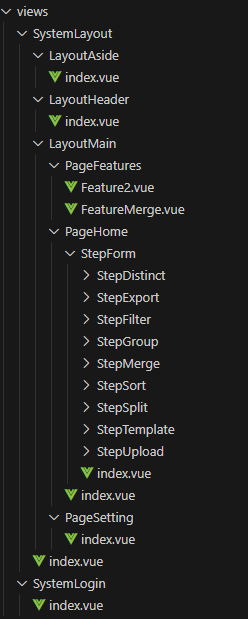

原来的长这样：

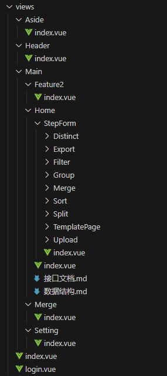

至于里面每个文件的代码风格，参考官方的即可，我也做了笔记：

[vue官方风格指南](https://www.yuque.com/u33336635/bbknrr/gatwh0fx5q0uutdq "vue官方风格指南")

---

参考1

[Vue项目中的文件/文件夹命名规范-阿里云开发者社区](https://developer.aliyun.com/article/645697)

- 建议用component来装子组件，每个component里，要么是组件，要么是文件夹，文件夹是组件名且里面有一个index.vue。
- views下的第一层，用小写，如layout。但是component里，用PascalCase
- 组件名，统一用2个以上单词组成。

```
-[src]
  -[views]
    -[layout]
      -[components]
      	-[MyMain]
        	-index.vue
        	-[components]
          	MyAside.vue
      	-MyHeader.vue
      	-MyFoot.vue
```

公共全局组件，/src/components

```
- [src]
  - [components]
      - [Breadcrumb]
        - index.vue
      - [Hamburger]
        - index.vue
      - [SvgIcon]
        - index.vue
```

---

参考2

ruoyi

公共的全局组件，和参考1一样

但是views下，文件夹命名采用了小写单个单词，文件名采用了camelCase，除index.vue外大多数至少有两个单词

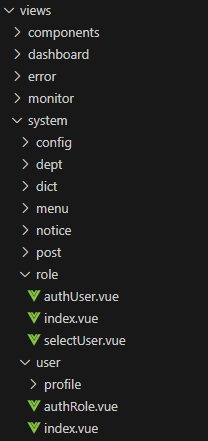

然而，也有混用PascalCase

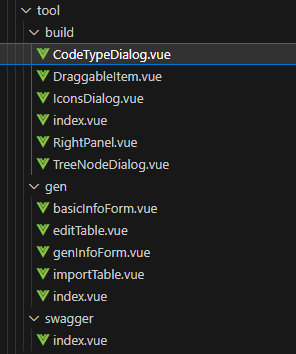

也有一些文件名只有单个单词

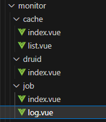

总之，写法不是很统一。

---

参考3

[vue命名规范 - 掘金](https://juejin.cn/post/6946452909588480007)

这里建议文件夹用小写的单个单词，和ruoyi的一样

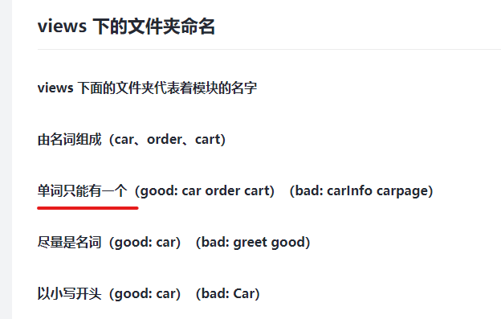

而文件建议用PascalCase

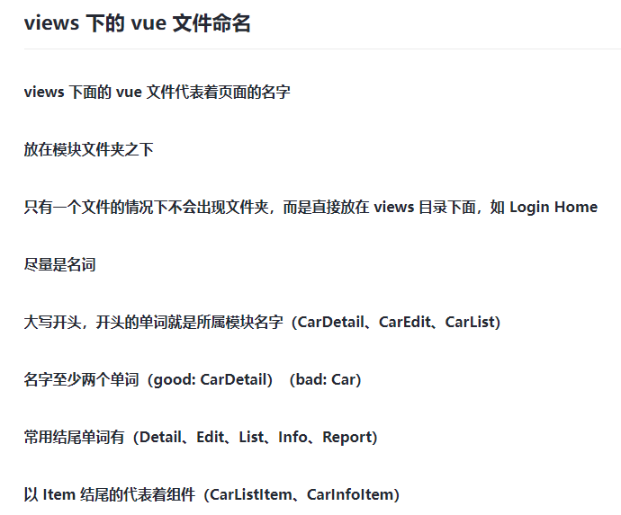

---

参考4

[史上最全的Vue开发规范 - 掘金](https://juejin.cn/post/6844903652096770055#heading-11)

这里建议views下的文件夹用camelCase，

文件也用camelCase

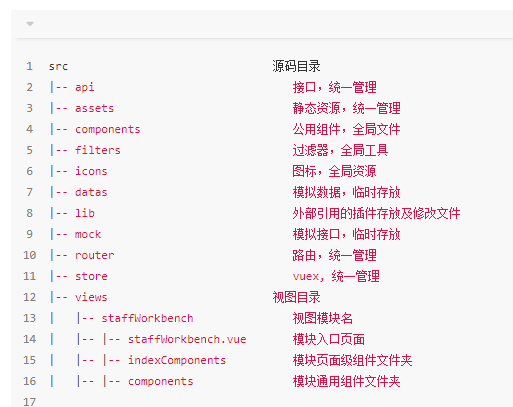

### vue代码规范

首先参考官方文档

官方风格指南

[风格指南 — Vue.js](https://v2.cn.vuejs.org/v2/style-guide/)

- 单文件组件，要么是PascalCase，要么是kebab-case
- 基础组件名前，加上Base、APP、V等
- 单例组件名前，加上The
- 和父组件紧密耦合的，要加上父组件名如TodoList、TodoListItem、TodoListItemButton
- 组件名要以一般化的描述开头
- 单文件组件、字符串模板中没有内容的组件是自闭合的。但是dom模板中自定义组件不允许自闭合，而且必须使用kebab-case
- 单文件组件、字符串模板中的组件，应该是PascalCase的；dom模板不区分大小写，应该设为kebab-case的。
- 组件名尽量别缩写，要用全称
- 声明props时用camelCase，在模板中用kebab-case

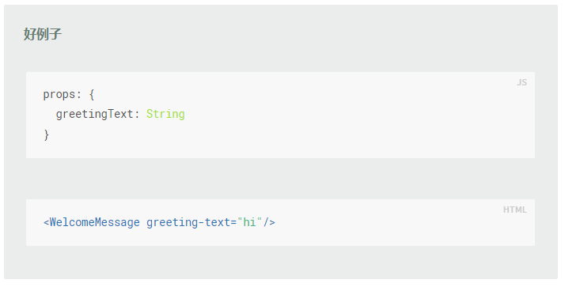

- 多个attribute的元素应该分行撰写，每个attribute一行

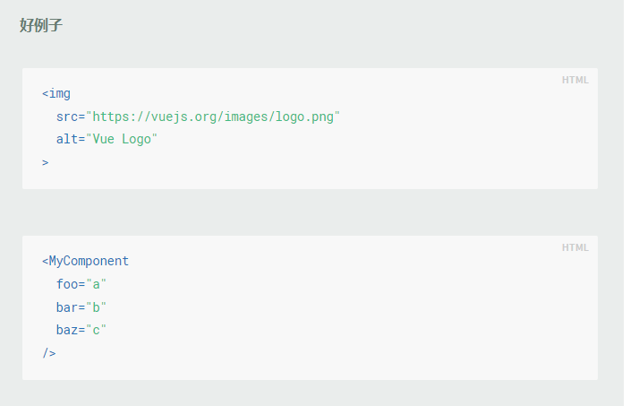

（vscode设置如下，用右键-format document的时候可以一键实现该效果）

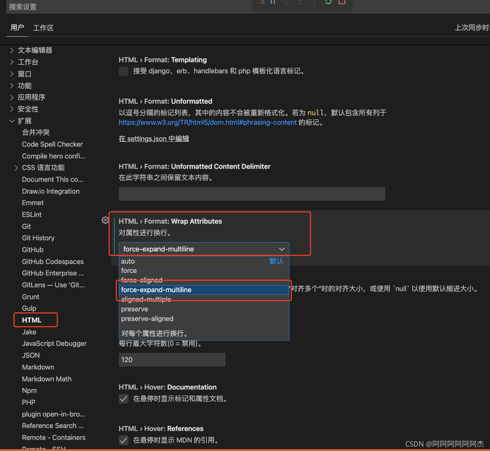

- 指令简写，用 : 表示 v-bind:、用 @ 表示 v-on: 和用 # 表示 v-slot:，要么全用，要么不用

---

补充一个文章

其他的，例如函数命名、css写法等，可以参考这个文章，很详细：[史上最全的Vue开发规范 - 掘金](https://juejin.cn/post/6844903652096770055#comment)

但是文件夹、文件命名这个，众口不一，所以没有参考这个文章。而是整合了多篇文章。

**（注：文件夹、文件命名规范参考之前的笔记：**[vue文件夹、文件命名规范](https://www.yuque.com/u33336635/bbknrr/yteabc1k8czd8uge "vue文件夹、文件命名规范")**）**

### proxy前缀匹配和重写

假设我们将baseURL设置为"/dev-api"，则axios请求会加入"/dev-api"这个前缀：

转发给后端前一般我们会匹配路径（line9），以及路径重写（line 14），去掉前缀：

```
module.exports = defineConfig({
  transpileDependencies: true,
  publicPath: './',
  assetsDir: '',
  devServer: {
    port: 8888,
    // 配置代理
    proxy: {
      [process.env.VUE_APP_BASE_API]: {
        // 以 [process.env.VUE_APP_BASE_API] 开头的请求 代理到 下边的 target 属性 的值 中
        target: 'http://192.168.8.31:9999/',
        changeOrigin: true, // 是否改变域名：在本地会创建一个虚拟服务端，然后发送请求的数据，并同时接收请求的数据，这样服务端和服务端进行数据的交互就不会有跨域问题
        ws: true, // 是否启用websockets
        pathRewrite: {
        	// 路径重写，去掉前缀
           // '^ + process.env.VUE_APP_BASE_API'是一个正则表达式，表示要匹配请求的url中，全部'[target]/api' 转接为 [target]/，
          // 例如'http://192.168.8.31:9999/dev-api'转化为'http://192.168.8.31:9999/'
           ['^' + process.env.VUE_APP_BASE_API]: '',
        }
      }
    }
  },
  ...
})
```

### vscode创建vue骨架


```
{    
	"Print to console": {
		"prefix": "vue",
		"body": [
				"<template>",
				"  <div class=\"\">\n",
				"  </div>",
				"</template>\n",
				"<script>",
				"export default {",
				"  name: '',",
				"  props: {},",
				"  data () {",
				"    return {}",
				"  },",
				"  components: {",
	"    ",	
	"  },",
				"  computed: {",
	"    ",	
	"  },",
				"  watch: {",
	"    ",
	"  },",
				"  created () {",
	"    ",
	"  },",
				"  mounted () {",
	"    ",	
	"  },",
				"  methods: {",
	"    ",	
	"  },",
				"}",
				"</script>\n",
				"<style lang=\"scss\" scoped>",
	"  ",
				"</style>",
				"$2"
		],
		"description": "Log output to console"
	}
}
```

空白文件，输入vue，选择模板

效果：


```
<template>
  <div class="">

  </div>
</template>

<script>
export default {
  name: '',
  props: {},
  data () {
    return {}
  },
  components: {
    
  },
  computed: {
    
  },
  watch: {
    
  },
  created () {
    
  },
  mounted () {
    
  },
  methods: {
    
  },
}
</script>

<style lang="scss" scoped>
  
</style>
```