## 移动端小屏

### 选项卡切换

动态面板里不能套动态面板，所以如果要两层选项卡，不能使用两层动态面板，要怎么办：

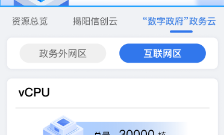

PC端的一种做法是，将要展示的不同组件叠在一起，然后对其中一个进行隐藏，然后在选项卡上设置一个自定义事件，对着几个组件进行显隐切换。

但**移动端不允许组件叠加**，所以选项卡切换隐藏显示的办法不管用。

如果有两层选项，建议外层动态面板，内层用**联动**

[https://fuxi.haizhi.com/tutorial/preview?tutorialId=e878920a-3c0d-4180-8b89-7598a8cad8b8&showMode=doc](https://fuxi.haizhi.com/tutorial/preview?tutorialId=e878920a-3c0d-4180-8b89-7598a8cad8b8&showMode=doc)

当然，有的时候不适合用联动，这种情况要怎么办？

### 图片和文字如何组合

移动端**不允许堆叠组件**，所以要实现下面组件的效果：

可以用一个**长横幅指标卡**，然后去掉左图片，然后设置背景为想要的图片即可。

### 位置和大小设置注意事项

**X、W、H**

移动端，位置大小设置中的**X、W、H（不包括Y）**，**不是像素值**。实测，大约是每个单位代表14-15像素。

例如下面图片

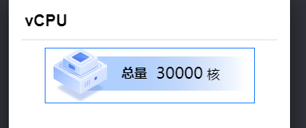

实际测量是261px

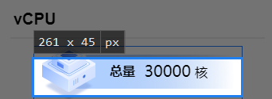

但是右边的粤治慧面板中，显示的W却是18

而261/18=14.5，可以看到是这个比例的关系

X、H也是同理。

---

**Y**

位置大小设置中的Y，比较特殊。由于粤治慧移动端，每个组件会默认在顶部依序堆叠，所以设置了距离顶部的距离Y，并不会按照这个Y来实际与顶部拉开距离。例如下图中的选项卡组件，如果页面中只有它一个组件，设置Y为0和100，结果都是一样的，都是会自动跑到顶部去。

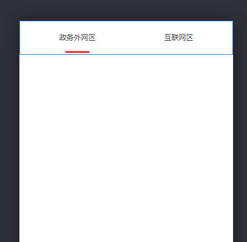

那Y的作用是什么，那就是：**Y越大的组件，就越靠下**。所以如果用Y=1、2、3，来标识不同组件的位置，如下图4个组件，我给他们的Y设置是1-4，这样顺序就是从上往下依次排列。

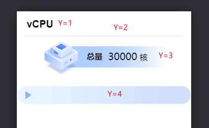

此时，如果把第二个组件换成Y=5，它就会跑到最下面，而3、4就会上来一点，顶替掉缺失的空间。

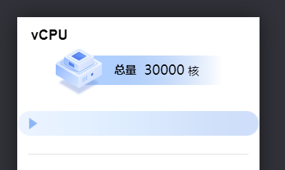

不过，更常用的方法是，直接拖动组件到合适的位置，Y就会自动变成合适的值，不需要自己设置。

### 让图片不占据完整行宽

一个图片组件，默认是占据完整行宽的。如果想要不占据完整行宽，有两种方法：

1. 设置W：将图片的W设为一个合适的值。按照上一节里说的，14-15倍的换算关系，整个页面的W大约是24（把图片拉到最宽后，W处也会显示出当前宽度）所以要实现上图的一个不占据完整行宽的方式，可以设置W为18左右。
2. 直接拉动：拉动图片右下角即可

### 让图片居中

上一节让图片不占据完整行宽后，想要让图片居中。

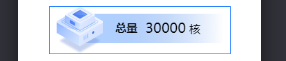

可以先用直接拖动的方式，拖到大概的位置（拖动的方式，最小间隔为1个单位的W，大约是14-15px）

**然后手动设置X微调**，让图片达到一个近似居中的效果。

以下面蓝色标题栏为例：

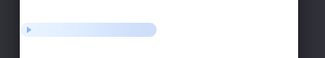

这个长标题栏，设置宽度后，因为X为0，所以默认居左。我们想要让它居中

首先拖动它，到大致中间的位置，此时X为5（拖动的方式，X都是整数）

我们微调一下，设置X为5.8

这样就相对更居中了。

### 进度条

众所周知，粤治慧的进度条组件比较难受，它和内容共用一个参数value。

如果内容的格式不是百分比，而是例如14000/30000这样的不规则文本，进度条就用不了了。

所以一般的方式，就是设置一个文本框（或者长横幅指标卡等）和一个进度条，然后把进度条的标题、文本、内容全部隐藏，全部字号设为0（很重要，否则进度条无法居上显示）

然后 把文本框放到进度条上方，即可：

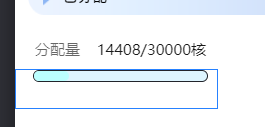

### 实现带圆角的动态面板内容

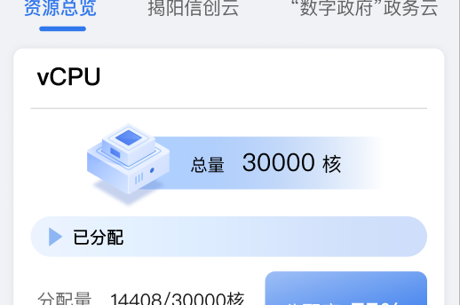

上图中的vCPU是一个动态面板，但是想让其内容变成圆角

动态面板是不能设为圆角的

但是我们可以进入其中，将所有内容选中，**分组**

对这个**分组是可以设置为圆角的**。

此时注意，要将动态面板的背景色设为和外部的颜色一致（本图中是灰色），而分组的颜色变为白色，否则看不出来圆角了。

动态面板中的设置样例：如下，将背景色设为红色（便于此处演示），而所有组件组成的分组的背景设为白色。

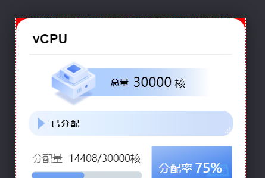