## SSL详情页面（flex布局）

- 修改el-table的单元格，官方文档提供的是调用 :cell-style 回调方法，返回一个object，注意键不用双引号，但是值要双引号。检查元素后，发现这个回调方法改变的是\<td\>标签的内联样式（element.style）：

- 
- 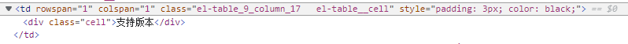
- 而我想要改.cell元素的line-height属性。
- 这种情况，目前想到的方法就是直接用/deep/改.cell元素的属性。
- 此外，经过测试，:row-style 改变的是行的样式，也就是\<tr\>标签，也无法直接改变里面的div元素。
- 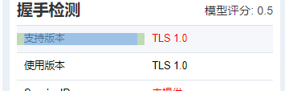
- div的line-height，el-table默认的是23px，但是如果字体较大，可能会导致字体超过行高：
- 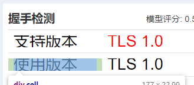
- 解决的办法，是设置为一个百分比：我
- 设置的是130%，无论字体多大，都可以自动适配
- 同时，选择字体的时候就只会选择和字体基本同高度的范围
- 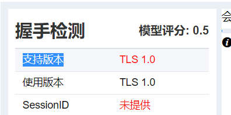
- 避免这种“虚胖”的尴尬情况：
- 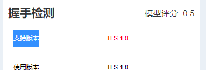
- 设置tooltip最大宽度：
- .el-tooltip__popper {  
  max-width: 400px;  
  line-height: 150%;  
  }
- el-table 内容过长就隐藏：

- 给el-table-column加上show-overflow-tooltip属性，给el-table设置tooltip-effect（dark/light），适用于单元格
- 利用插槽+el-tooltip思路，适用于标题，单元格内的未实践。

```
<el-table-column align="center" prop="cipherSuiteIn0A" >  
    <template slot="header">  
    套件代码异常  
    <el-tooltip  
    content="S端选择的套件代码在0000~000a之间"  
    effect="dark"  
    placement="top"  
    >  
    <i class="el-icon-info"></i>  
    </el-tooltip>  
    </template>  
    </el-table-column>
```

- flex-warp属性，很重要，见以下几个例子。内容很少的话，nowrap和wrap都可以。但是内容太多的话，还是尽量用wrap，防止元素被挤出屏幕：
- 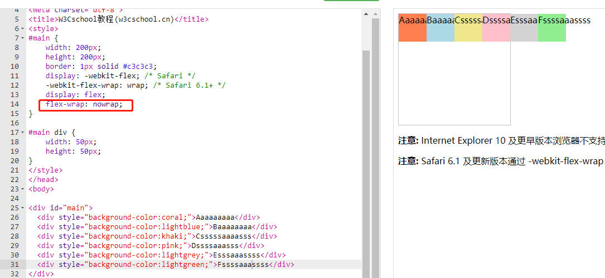

- 两个横向flex元素的布局，如果用下面这种缩放的，会导致缩放页面之后，产生布局问题：
- 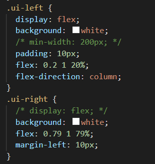
- 最简单的就这样，用百分比width就好：
- 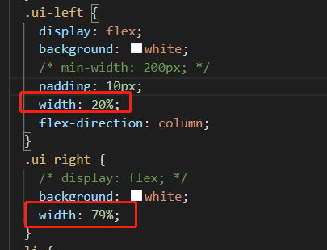
- 能不用固定长度就不用，包括min-height等
- 在用百分比设置宽度、长度时，中间的缝隙的实际像素值是不固定的，而且如果设置不好的话，会导致不好看。
- 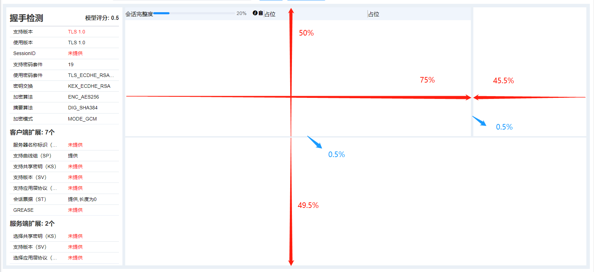
- 有没有办法设置中间的缝隙为固定值呢？我的思路是设置一个固定的margin，只要marigin大于两个元素中间的间隙，就可以撑开了，如下图，设置了margin-top为100px，这样就可以保证是固定的值了。虽然有点凭运气）
- 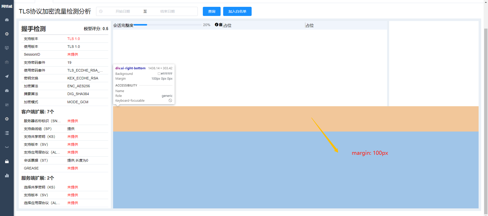
- 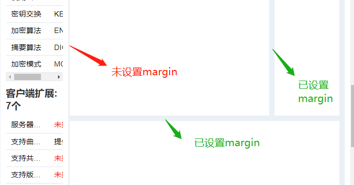
- 以后也可以这样，把ui-main外面的颜色和内部的颜色一样，注意margin和padding的使用
- 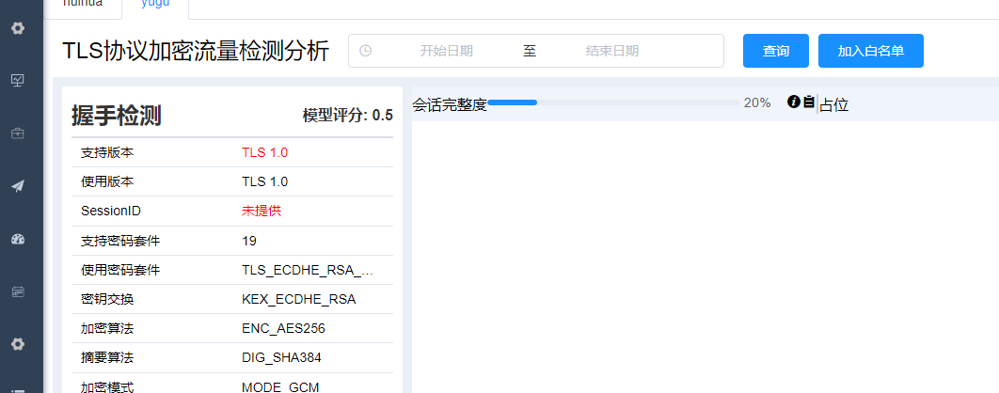
- 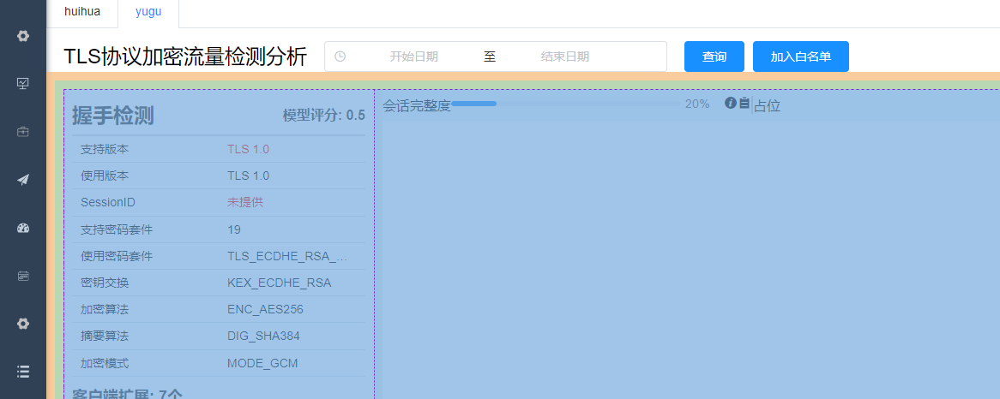
- 想将文本超出的部分用省略号代替，并且加上tooltip。目前只能用
- .t {  
  overflow: hidden;  
  white-space: nowrap;  
  text-overflow: ellipsis  
  }
- 来设置省略号，但是没有气泡。还没找到比较优雅的解决方式，有待学习。

- [(40条消息) 封装el-tooltip组件，只有文本溢出时才显示_qq_43765727的博客-CSDN博客_el-tooltip组件](https://blog.csdn.net/qq_43765727/article/details/107967908)
- [(40条消息) Tooltip 组件：根据内容是否溢出判断是否显示 Tooltip_June·D的博客-CSDN博客_tooltip组件](https://blog.csdn.net/dark_cy/article/details/124327055?spm=1001.2101.3001.6650.7&utm_medium=distribute.pc_relevant.none-task-blog-2~default~BlogCommendFromBaidu~default-7.pc_relevant_aa&depth_1-utm_source=distribute.pc_relevant.none-task-blog-2~default~BlogCommendFromBaidu~default-7.pc_relevant_aa&utm_relevant_index=12)
- 找到了html的title属性，目前先用title属性好了......

- 自适应还做得很不好，放大以后会变得很奇怪，以后慢慢修炼吧，现在只想把页面给做好了，拖了好久了...：
- 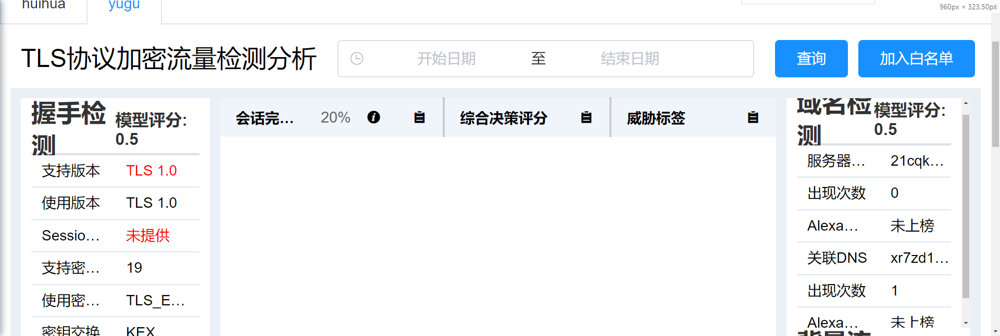
- 将ul放在一个div里，注意设置width为100%，align-items为center：
- 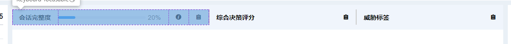
- 设置动态的title属性，注意vue中**v-bind**中的字符、变量的拼接：`${变量}`

```
<div class="title-score" :title="`${titleOption.scoreName}: ${titleOption.score}`" v-if="titleOption.showScore">  
    <span>{{titleOption.scoreName}}: </span>  
    <span >{{titleOption.score}}</span>  
    </div>
- v-bind绑定style，里面写一个对象：
- <span :style="{color: scope.row.isAbnormal ? 'red' : 'black'}">{{scope.row.valueName}}</span>

- 总结，文字过长省略+气泡，最简单的方式就是：设置overflow、white-space、text-overflow，还有title属性
- <div class="title-score" :title="`${titleOption.scoreName}: ${titleOption.score}`" v-if="titleOption.showScore">  
    <span>{{titleOption.scoreName}}: </span>  
    <span >{{titleOption.score}}</span>  
    </div>  
      
    <style>  
    .title-score {  
    overflow: hidden;  
    white-space: nowrap;  
    text-overflow: ellipsis  
    }  
    </style>  
```

    注意，style尽量设置最内部的标签，若是隔了一层，可能不起作用。
- 颜色这种还是用变量吧
- 发现div的width可以设为百分比，但是height如果设为百分比，就无效。而echart的宽高设置更加不灵活，为echart的准备的DOM，设置width和height都必须是实实在在的px，而不能是百分比。甚至你设置百分比，它的画布外层是变成百分比的宽度了，但是内层还会把百分比的数字转为px，就很离谱
- 
- 怎么办呢，找到一个思路，用window.getComputedStyle属性
- 想做鱼骨图，不如用这个折线版本的：[Examples - Apache ECharts](https://echarts.apache.org/examples/zh/editor.html?c=grid-multiple)
- 为什么引入组件的时候，和实际写的组件名称不一样？如何解决？——用components:{"新的名字": 引入的文件}
- 想将日期组件也做成一个组件，但是v-model不知道怎么绑定（自定义组件的v-model如何实现）*——[参考](https://cn.vuejs.org/v2/guide/components-custom-events.html#自定义组件的-v-model)

- 为什么不能这样，提示找不到tlsTime？*
- 

- 鱼骨图高度改变，则整个页面（包括其父元素）的高度也跟着改变了，不想这样。于是将整个main容器改成了
- min-width: 1000px  
    height: 500px  
    overflow-x:auto
- 遇到一个问题，如下图的flex布局，外围的蓝色容器固定宽度，里面有两个item，左边的left-box固定宽度，右边的right-box用flex填充宽度（右边的right-box似乎有个默认的宽度，被里面的内容撑开了的）。缩放页面之后，会导致right-box溢出容器。
- 
- 
- 如上图，right-box本来就有一个默认宽度。
- 如果用flex-grow，会导致其溢出到容器外面去。
- 探索出的解决办法：将right-box的**width设置为0**，取消其原有的默认宽度！
- flex-grow: 1;  
    width: 0;
- 成功解决！！！
- 
- 成果：
- 

## IPSEC详情页面（grid布局）

- grid：

- 针对容器：

- grid-template-columns/rows，单位px/fr/auto/%，可选：repeat(n/autofill/autofit, 长度/minmax)、minmax(最小,最大)
- grid-column/row-gap、grid-gap
- justify/align-items
- grid-template-areas: "a b c" "a a b" "b b c"（用.代表没用到的单元格）

- 针对元素：

- grid-column/row：n/n
- justify/align-self: stretch、center、start、end
- grid-area: a （配合grid-template-areas），或者 3/1/4/4，分别代表水平起/垂直起/水平终/垂直终（也就是grid-column/row的简写）
- 注意要在容器里进行过**网格划分**（使用grid-template-columns/rows/areas），元素**设置网格大小**（grid-column/row/area）才有效

- 配合媒体查询 @media (min-width:300px) {}，修改grid-template-area，也是很不错的选择。
- 嵌套网格

## SSL详情页面前后端联通

- 先设计使用getlist来接受数据，然后显示
- ssl小知识

- 在SSL更新到3.0时，IETF对SSL3.0进行了标准化，并添加了少数机制，标准化后的IETF更名为TLS1.0(Transport Layer Security 安全传输层协议)，可以说TLS就是SSL的新版本3.1。**也可以将TLS看作SSL的升级版**。目前TLS主要版本有1.0-1.3

- client Hello的记录层协议里面有个 version字段，详见 [rfc8446 (rfc-editor.org)](https://www.rfc-editor.org/rfc/inline-errata/rfc8446.html) 的ProtocolVersion legacy_record_version;
- 这个字段似乎已经废弃

- 
- 应该看握手层协议的version，也就是。这个代表客户端建议的版本。
- 其中第一个字节0x03代表主要版本，第二个字节代表次要版本。
- 0x0100: ssl 1.0  
    0x0200: ssl 2.0  
    0x0300: ssl 3.0  
    0x0301: tls 1.0  
    0x0302: tls 1.1  
    0x0303: tls 1.2  
    0x0304: tls 1.3
- client Hello中的extention: support version字段，显示的客户端支持的版本
- server Hello中的握手层协议的version，代表服务端选择的版本，服务端是否也有支持的版本则未知。

- session id在session恢复（session resume）中的作用：[TLS v1: How does the SSL Session ID mechanism work?](https://community.microfocus.com/cobol/visibroker/w/wikiid-137/23386/tls-v1-how-does-the-ssl-session-id-mechanism-work) 如果服务端想要保持连接，可以在server hello中发送一个新的session id给客户端，并且保存在服务端的cache中。后续客户端的client hello中，如果带上了这个session id，然后服务端查验这个id和cache中的id相同，就可以直接省略握手阶段的一部分协商过程，减少开销。如果服务端查验这个id和cache中的不同就可以重新返回新的session id（或者如果想结束session 恢复，也可以返回一个空的session id来表示断开保持）——所以，无论怎样，都以server hello 中的session id为主。
```

```
<div class="title-score" :title="`${titleOption.scoreName}: ${titleOption.score}`" v-if="titleOption.showScore">  
    <span>{{titleOption.scoreName}}: </span>  
    <span >{{titleOption.score}}</span>  
    </div>
- v-bind绑定style，里面写一个对象：
- <span :style="{color: scope.row.isAbnormal ? 'red' : 'black'}">{{scope.row.valueName}}</span>

- 总结，文字过长省略+气泡，最简单的方式就是：设置overflow、white-space、text-overflow，还有title属性
- <div class="title-score" :title="`${titleOption.scoreName}: ${titleOption.score}`" v-if="titleOption.showScore">  
    <span>{{titleOption.scoreName}}: </span>  
    <span >{{titleOption.score}}</span>  
    </div>  
      
    <style>  
    .title-score {  
    overflow: hidden;  
    white-space: nowrap;  
    text-overflow: ellipsis  
    }  
    </style>  
      ``
    注意，style尽量设置最内部的标签，若是隔了一层，可能不起作用。
- 颜色这种还是用变量吧
- 发现div的width可以设为百分比，但是height如果设为百分比，就无效。而echart的宽高设置更加不灵活，为echart的准备的DOM，设置width和height都必须是实实在在的px，而不能是百分比。甚至你设置百分比，它的画布外层是变成百分比的宽度了，但是内层还会把百分比的数字转为px，就很离谱
- 
- 怎么办呢，找到一个思路，用window.getComputedStyle属性
- 想做鱼骨图，不如用这个折线版本的：[Examples - Apache ECharts](https://echarts.apache.org/examples/zh/editor.html?c=grid-multiple)
- 为什么引入组件的时候，和实际写的组件名称不一样？如何解决？——用components:{"新的名字": 引入的文件}
- 想将日期组件也做成一个组件，但是v-model不知道怎么绑定（自定义组件的v-model如何实现）*——[参考](https://cn.vuejs.org/v2/guide/components-custom-events.html#自定义组件的-v-model)

- 为什么不能这样，提示找不到tlsTime？*
- 

- 鱼骨图高度改变，则整个页面（包括其父元素）的高度也跟着改变了，不想这样。于是将整个main容器改成了
- min-width: 1000px  
    height: 500px  
    overflow-x:auto
- 遇到一个问题，如下图的flex布局，外围的蓝色容器固定宽度，里面有两个item，左边的left-box固定宽度，右边的right-box用flex填充宽度（右边的right-box似乎有个默认的宽度，被里面的内容撑开了的）。缩放页面之后，会导致right-box溢出容器。
- 
- 
- 如上图，right-box本来就有一个默认宽度。
- 如果用flex-grow，会导致其溢出到容器外面去。
- 探索出的解决办法：将right-box的**width设置为0**，取消其原有的默认宽度！
- flex-grow: 1;  
    width: 0;
- 成功解决！！！
- 
- 成果：
- 

## IPSEC详情页面（grid布局）

- grid：

- 针对容器：

- grid-template-columns/rows，单位px/fr/auto/%，可选：repeat(n/autofill/autofit, 长度/minmax)、minmax(最小,最大)
- grid-column/row-gap、grid-gap
- justify/align-items
- grid-template-areas: "a b c" "a a b" "b b c"（用.代表没用到的单元格）

- 针对元素：

- grid-column/row：n/n
- justify/align-self: stretch、center、start、end
- grid-area: a （配合grid-template-areas），或者 3/1/4/4，分别代表水平起/垂直起/水平终/垂直终（也就是grid-column/row的简写）
- 注意要在容器里进行过**网格划分**（使用grid-template-columns/rows/areas），元素**设置网格大小**（grid-column/row/area）才有效

- 配合媒体查询 @media (min-width:300px) {}，修改grid-template-area，也是很不错的选择。
- 嵌套网格

## SSL详情页面前后端联通

- 先设计使用getlist来接受数据，然后显示
- ssl小知识

- 在SSL更新到3.0时，IETF对SSL3.0进行了标准化，并添加了少数机制，标准化后的IETF更名为TLS1.0(Transport Layer Security 安全传输层协议)，可以说TLS就是SSL的新版本3.1。**也可以将TLS看作SSL的升级版**。目前TLS主要版本有1.0-1.3

- client Hello的记录层协议里面有个 version字段，详见 [rfc8446 (rfc-editor.org)](https://www.rfc-editor.org/rfc/inline-errata/rfc8446.html) 的ProtocolVersion legacy_record_version;
- 这个字段似乎已经废弃

- 
- 应该看握手层协议的version，也就是。这个代表客户端建议的版本。
- 其中第一个字节0x03代表主要版本，第二个字节代表次要版本。
- 0x0100: ssl 1.0  
    0x0200: ssl 2.0  
    0x0300: ssl 3.0  
    0x0301: tls 1.0  
    0x0302: tls 1.1  
    0x0303: tls 1.2  
    0x0304: tls 1.3
- client Hello中的extention: support version字段，显示的客户端支持的版本
- server Hello中的握手层协议的version，代表服务端选择的版本，服务端是否也有支持的版本则未知。

- session id在session恢复（session resume）中的作用：[TLS v1: How does the SSL Session ID mechanism work?](https://community.microfocus.com/cobol/visibroker/w/wikiid-137/23386/tls-v1-how-does-the-ssl-session-id-mechanism-work) 如果服务端想要保持连接，可以在server hello中发送一个新的session id给客户端，并且保存在服务端的cache中。后续客户端的client hello中，如果带上了这个session id，然后服务端查验这个id和cache中的id相同，就可以直接省略握手阶段的一部分协商过程，减少开销。如果服务端查验这个id和cache中的不同就可以重新返回新的session id（或者如果想结束session 恢复，也可以返回一个空的session id来表示断开保持）——所以，无论怎样，都以server hello 中的session id为主。
```

```
<div class="title-score" :title="`${titleOption.scoreName}: ${titleOption.score}`" v-if="titleOption.showScore">  
    <span>{{titleOption.scoreName}}: </span>  
    <span >{{titleOption.score}}</span>  
    </div>
- v-bind绑定style，里面写一个对象：
- <span :style="{color: scope.row.isAbnormal ? 'red' : 'black'}">{{scope.row.valueName}}</span>

- 总结，文字过长省略+气泡，最简单的方式就是：设置overflow、white-space、text-overflow，还有title属性
- <div class="title-score" :title="`${titleOption.scoreName}: ${titleOption.score}`" v-if="titleOption.showScore">  
    <span>{{titleOption.scoreName}}: </span>  
    <span >{{titleOption.score}}</span>  
    </div>  
      
    <style>  
    .title-score {  
    overflow: hidden;  
    white-space: nowrap;  
    text-overflow: ellipsis  
    }  
    </style>  
      ``
    注意，style尽量设置最内部的标签，若是隔了一层，可能不起作用。
- 颜色这种还是用变量吧
- 发现div的width可以设为百分比，但是height如果设为百分比，就无效。而echart的宽高设置更加不灵活，为echart的准备的DOM，设置width和height都必须是实实在在的px，而不能是百分比。甚至你设置百分比，它的画布外层是变成百分比的宽度了，但是内层还会把百分比的数字转为px，就很离谱
- 
- 怎么办呢，找到一个思路，用window.getComputedStyle属性
- 想做鱼骨图，不如用这个折线版本的：[Examples - Apache ECharts](https://echarts.apache.org/examples/zh/editor.html?c=grid-multiple)
- 为什么引入组件的时候，和实际写的组件名称不一样？如何解决？——用components:{"新的名字": 引入的文件}
- 想将日期组件也做成一个组件，但是v-model不知道怎么绑定（自定义组件的v-model如何实现）*——[参考](https://cn.vuejs.org/v2/guide/components-custom-events.html#自定义组件的-v-model)

- 为什么不能这样，提示找不到tlsTime？*
- 

- 鱼骨图高度改变，则整个页面（包括其父元素）的高度也跟着改变了，不想这样。于是将整个main容器改成了
- min-width: 1000px  
    height: 500px  
    overflow-x:auto
- 遇到一个问题，如下图的flex布局，外围的蓝色容器固定宽度，里面有两个item，左边的left-box固定宽度，右边的right-box用flex填充宽度（右边的right-box似乎有个默认的宽度，被里面的内容撑开了的）。缩放页面之后，会导致right-box溢出容器。
- 
- 
- 如上图，right-box本来就有一个默认宽度。
- 如果用flex-grow，会导致其溢出到容器外面去。
- 探索出的解决办法：将right-box的**width设置为0**，取消其原有的默认宽度！
- flex-grow: 1;  
    width: 0;
- 成功解决！！！
- 
- 成果：
- 

## IPSEC详情页面（grid布局）

- grid：

- 针对容器：

- grid-template-columns/rows，单位px/fr/auto/%，可选：repeat(n/autofill/autofit, 长度/minmax)、minmax(最小,最大)
- grid-column/row-gap、grid-gap
- justify/align-items
- grid-template-areas: "a b c" "a a b" "b b c"（用.代表没用到的单元格）

- 针对元素：

- grid-column/row：n/n
- justify/align-self: stretch、center、start、end
- grid-area: a （配合grid-template-areas），或者 3/1/4/4，分别代表水平起/垂直起/水平终/垂直终（也就是grid-column/row的简写）
- 注意要在容器里进行过**网格划分**（使用grid-template-columns/rows/areas），元素**设置网格大小**（grid-column/row/area）才有效

- 配合媒体查询 @media (min-width:300px) {}，修改grid-template-area，也是很不错的选择。
- 嵌套网格

## SSL详情页面前后端联通

- 先设计使用getlist来接受数据，然后显示
- ssl小知识

- 在SSL更新到3.0时，IETF对SSL3.0进行了标准化，并添加了少数机制，标准化后的IETF更名为TLS1.0(Transport Layer Security 安全传输层协议)，可以说TLS就是SSL的新版本3.1。**也可以将TLS看作SSL的升级版**。目前TLS主要版本有1.0-1.3

- client Hello的记录层协议里面有个 version字段，详见 [rfc8446 (rfc-editor.org)](https://www.rfc-editor.org/rfc/inline-errata/rfc8446.html) 的ProtocolVersion legacy_record_version;
- 这个字段似乎已经废弃

- 
- 应该看握手层协议的version，也就是。这个代表客户端建议的版本。
- 其中第一个字节0x03代表主要版本，第二个字节代表次要版本。
- 0x0100: ssl 1.0  
    0x0200: ssl 2.0  
    0x0300: ssl 3.0  
    0x0301: tls 1.0  
    0x0302: tls 1.1  
    0x0303: tls 1.2  
    0x0304: tls 1.3
- client Hello中的extention: support version字段，显示的客户端支持的版本
- server Hello中的握手层协议的version，代表服务端选择的版本，服务端是否也有支持的版本则未知。

- session id在session恢复（session resume）中的作用：[TLS v1: How does the SSL Session ID mechanism work?](https://community.microfocus.com/cobol/visibroker/w/wikiid-137/23386/tls-v1-how-does-the-ssl-session-id-mechanism-work) 如果服务端想要保持连接，可以在server hello中发送一个新的session id给客户端，并且保存在服务端的cache中。后续客户端的client hello中，如果带上了这个session id，然后服务端查验这个id和cache中的id相同，就可以直接省略握手阶段的一部分协商过程，减少开销。如果服务端查验这个id和cache中的不同就可以重新返回新的session id（或者如果想结束session 恢复，也可以返回一个空的session id来表示断开保持）——所以，无论怎样，都以server hello 中的session id为主。