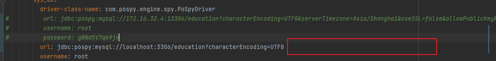
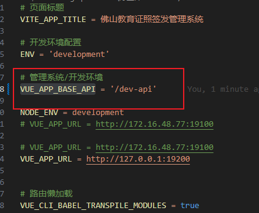
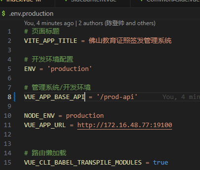
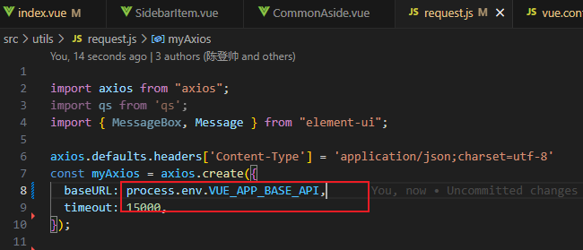
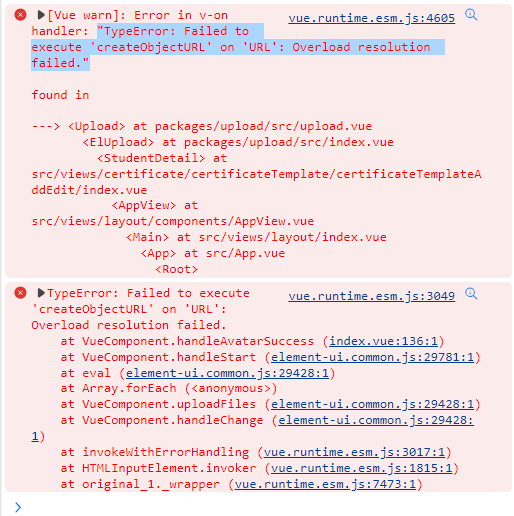
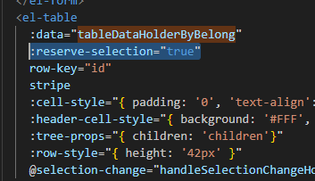
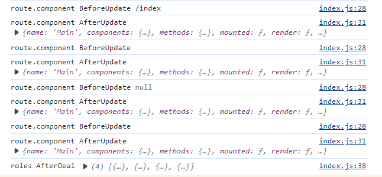
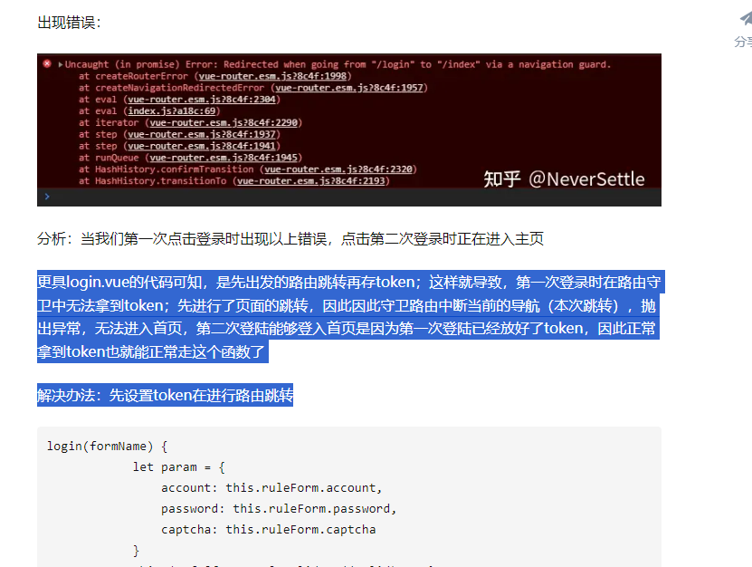
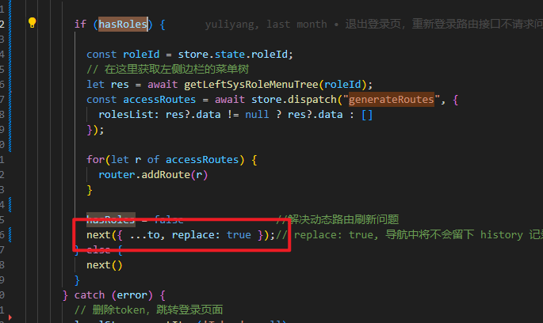

## mysql配置

mysql建库 要使用utf-8编码

使用了mysql 5.7版本

但是系统原定的是 mysql 8

所以要修改后端：

yml配置 删掉编码格式后面的部分



## base_url配置

.env.development



.env.production



注意，变量要有VUE_APP开头，不能随便起，之前起的VUE_BASE_API就没有被识别

request.js



```
devServer: {
    open: true, // 是否自动打开浏览器
    port: 8081, // 端口号
    proxy: {
      [process.env.VUE_APP_BASE_API]: {
        target: process.env.VUE_APP_URL,
        changeOrigin: true,
        secure: false,
        ws: false, // 是否启用
        pathRewrite: {
          // 路径重写，去掉前缀
           // '^/api'是一个正则表达式，表示要匹配请求的url中，全部'http://[target]/api' 转接为 http://[target]/
           ['^' + process.env.VUE_APP_BASE_API]: '',
        }
      }
    },
  },
```

## mock

注意，mock拦截请求的话，开发者工具的网络里是看不到请求的

## URL



```
handleAvatarSuccess(res, file) {
  console.log(this.imageUrl)
  this.imageUrl = URL.createObjectURL(file.raw);
},
```

## el-table设置:reserve-selection失效



## 图片

```
<el-image
  class="certificate-image"
  :src="pageData.idPhoto"
  :preview-src-list="[pageData.idPhoto]"
  alt="证照图片"
  fit="contain"
>
  <div slot="error" class="image-slot">
    <el-image src="../../../assets/xxx.jpg"></el-image>
  </div>
</el-image>


.certificate-image {
  width: 313px;
  height: 199px;
}
```

## 代码中的问题

store/index.js中的

```
const actions = {
  generateRoutes({ commit }, roles) {
    let { role, rolesList } = roles    //rolesList为后端返回的权限列表 为实现修改权限 故不能简单根据role判断
    return new Promise((resolve) => {
      let accessedRoutes;
      accessedRoutes = filterAsyncRoutes(asyncRoutes, rolesList); //根据权限列表对动态路由进行过滤
      commit("SET_ROUTES", accessedRoutes); //仓库保存
      resolve(accessedRoutes);
    });
  },
};

const recursion = (list) => {
  if (list.component == '') {
    list.component = LayoutRouterView
  } else {
    list.component = loadView(list.component)
  }
  if (Array.isArray(list.children) && list.children.length > 0) {
    list.children.forEach(item => {
      recursion(item)
    })
  }
  return list
}

export function filterAsyncRoutes(routes, roles) {
  // console.log("roles BeforeDeal", roles)
  if (Array.isArray(roles) && roles.length > 0) {
    roles?.forEach((route) => {
      // console.log("route.component BeforeUpdate", route.component)
      // 在这一步，将routes的第一层的
      route.component = Layout
      // console.log("route.component AfterUpdate", route.component)
      route.children.forEach((i) => {
        // console.log("i", i)
        recursion(i)
      })
    });
  }
  console.log("roles AfterDeal", roles)
  roles.push({ path: '*', redirect: '/404', hidden: true })
  return roles;
}
```

这一段代码，其中，第6行的asyncRoutes根本没用上

而且rolesList在函数filterAsyncRoutes中，更像是routes。

通过打印，可以知道，所谓的roles，就是数据库中获得的路由的信息，第一层的路由，认为是目录，因此用33行的route.component=Layout，将所有的第一层标签，都与整体的布局绑定



然后，对”目录“下的”菜单“，也就是目录的children，需要各自绑定组件。然后渲染在视图里。

具体绑定什么组件，可以参考recursion和loadView函数

```
const recursion = (list) => {
  if (list.component == '') {
    list.component = LayoutRouterView
  } else {
    list.component = loadView(list.component)
  }
  if (Array.isArray(list.children) && list.children.length > 0) {
    list.children.forEach(item => {
      recursion(item)
    })
  }
  return list
}
```

```
export const loadView = (view) => {
  if (process.env.NODE_ENV === 'development') {
    return resolve => require([`@/views${view}.vue`], resolve)
  } else {
    // 使用 import 实现生产环境的路由懒加载
    return () => import(`@/views${view}.vue`)
  }
}
```

由loadView函数的第3、6行可以看到，就是在@/views路径后拼接component路径，和我们的配置方法对上了！

## 需要第二次登录才能成功的原因：  



总之，如果写成next()的话，第一次登录需要两次点击



## 侧边栏


## nextTick  


```
getEduTemplateById(dataParam.templateId).then(res => {
        if(res && res.code == 200) {
          this.templateImageUrl = res.data.photo;
          this.certName = res.data.certName;
          this.groupName = res.data.groupName;
          this.holderType = res.data.holderType;
          this.$refs.HolderType.holderType = res.data.holderType;
          this.submitParam = {
            name: dataParam.name,
            issueDate: dataParam.issueDate,
            issueAgency: dataParam.issueAgency,
            issueAgencyCode: dataParam.issueAgencyCode,
            issueAgencyAreaCode: dataParam.issueAgencyAreaCode
          }
          // 更新子元素的ids
          this.$nextTick(() => {
            this.$refs.HolderType.$refs[this.holderType].ids = new Set(dataParam.stuIds);
            // 查询持证主体信息
            this.$refs.HolderType.$refs[this.holderType].initHolder()
          })
        }
      }).catch( err => {
        this.getEduTemplateByIdError(err);
      })
```

这段代码，必须要用nextTick，否则无法获取最新的this.$refs.HolderType.$refs[this.holderType]