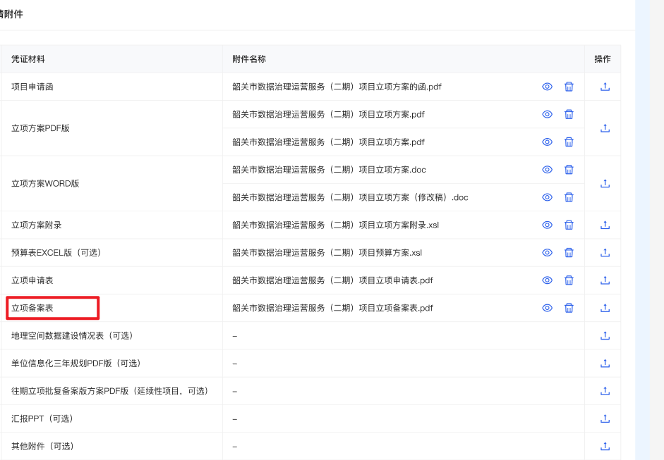

### 流程要点（主要函数、接口逻辑）

#### 启动
workflow组件，mounted时，会先调用usrc/api/user/sm-list，通过角色、部门id、姓名、启用状态等，查询本单位下其他的用户（用于后续审批人的选择）。
在edit组件里（以add状态）点击暂存，通过main-sheet组件里的save函数，调用admin/project/apply/saveOrSubmitApply接口，获取id。然后拿着这个id，去创建流程实例（startApplyFlow函数-flowc/proc-inst/start接口）、更新流程参数（updateProcVars函数-flowc/api/proc-task/variable接口）。再调用admin/project/apply/saveOrSubmitApply接口更新表单（根据流程状态）。
然后，就重新跳回本页面（以edit状态），并且开始走workflow的load函数，根据taskId获取任务状态。然后调用flowc/api/proc-task/listNodes接口查询下一步（审核-002）、上一步（退回-003）节点有哪些，更新candTasks数组里的对象（作为一个候选的审批节点），它包括了nodeList（下一步节点的信息，包括用户选中的审批人userList）、operationType（下一步节点的类型，002审核/003退回/008终止），variables（传递给下一个节点的变量，一般可以用于选择下一个节点之后的走向），misc（让用户选择的候选人列表，但是这个提交时要删掉的）。注意，审批节点名称，由flowc/api/proc-task/listNodes确定，虽然listNodes里包含了流程设置的用户列表，但是审批人列表，却由usrc/api/user/sm-list确定！这一个很坑的地方。


#### 审批
workflow组件，每次加载页面，先在mounted里调用usrc/api/user/sm-list，获取了审批人列表。然后，由于有了taskId，所以直接调用load，后续操作和暂存的一样了。

#### 更新流程业务数据
通过edit和workflow组件的updateProcVars函数，调用`flowc/api/proc-task/variable`接口来更新。表现为每次立项列表里待办/已办的数据里的各个列的内容，也就是vars对象里的内容。

启动时：暂存时通过edit组件的handleSave函数进行更新。每次新增时暂存，由于没有taskId，需要在edit组件里获取procInstId，并调用`flowc/api/proc-task/variable`；而每次编辑时暂存，只需要调用workflow组件里的`flowc/api/proc-task/variable`即可。而每次提交时，是在workflow组件里触发的handleOk，只有在提交成功时，才emit到edit里，利用onCommit函数去调用`flowc/api/proc-task/variable`。总之，暂存、提交都会调用该函数。

#### 退回修改
退回修改时，main-sheet会在reload函数中，根据this.form.flowLabelDesc判断当前步骤是不是退回修改（）

#### 编辑
流程的taskName和flowLabelDesc不一样的。这两者共同决定，首页里的按钮是什么。
```js
label: record.taskName === this.firstStepName ? (record.flowLabelDesc === '内部审核' ? '重新申报' : '编辑') : (record.flowLabelDesc === '方案初审退回修改' ? '重新申报' : '审核'),
handler: (text, record) => this.handler(record, record.taskName === '提交申请' ? 'edit' : 'verify'),
```
所以taskName就是当前流程的状态，而flowLabelDesc，是在mainsheet里设置的（业务表单里有，流程里也有，不过流程里的那个其实就是通过variable接口，将业务表单里的这个字段提交上去的，所以应该是一样的）。
flowLabelDesc第一次只有两种状态：内部审核、草稿
什么时候会修改flowLabelDesc为“方案初审退回修改”呢？


关注一下，什么时候submit参数是false？
目前来看，只有每次暂存的时候会修改，第一次的两次save暂存，submit=false
后续暂存，submit=true，导致后续都是内部审核

回头看看有没有例外情况。

这两个变量，既存在业务表单里，也存在流程表单里。应该是一致的。

流程表单：

业务表单：


新增角色、用户
- 韶关政数局 单位（部门下的）
	- 角色：
		- 韶关PMO单位责任科室方案申报人——（责任科室方案申报人方案新增）——YW00003
		- 韶关PMO单位立项分办人——（单位（部门）立项分办人分办）——YW00004
		- 韶关PMO单位立项经办人——（提交方案论证、专家评审/内部论证、方案论证派工、【几种论证的节点】、方案论证汇总意见、资金审核）——YW00005
		- 韶关PMO韶关政数局政数局立项分办人——（立项分办）——YW00006
		- 韶关PMO韶关政数局政数局立项经办人——（立项初审派工、立项初审、立项初审汇总意见、政府审核、立项批复、填写反馈意见）——YW00007
		- 
	- 用户：
		- 韶关PMO项目管理员（角色为：韶关PMO单位责任科室方案申报人、韶关PMO单位立项分办人、韶关PMO单位立项经办人）
		- 韶关PMO单位立项分办人小A——账号：sgA
		- 韶关PMO单位立项经办人小B——账号：sgB
		- 韶关PMO韶关政数局政数局立项分办人小A——账号：sgzsA
		- 韶关PMO韶关政数局政数局立项经办人小B——账号：sgzsB
目前先设置到方案论证派工之前的部分吧


项目方案论证的5种指标
造价审核 isCostReview
密码应用审核
信创适配
等保备案定级
地理空间审核


这种，多个变量的
要求一定要传够变量。

listNodes和deal的时候，都只是发送**一次**
**nodeList里要把所有节点都放上**，才可以,variables里也要把**所有**变量都传上

尽量，在makeCands的时候，就按照最后要传递的格式去制造
nodeList就放好所有要的内容
然后variables里也是
而不是分开放。


而下面这种，虽然只有一个变量。

但是变量有不同的值，所以**ListNodes要传多次**！不过deal只有一次就行。
而且nodeList、variables里都是有一个就可以了。

boolean查询下，有三个要注意顺序的地方

根据当前任务的varName的顺序来重新排列一下！


boolean查询下，cands、label、nodeList都有所变化
cands从一个数组变成了二位数组
label从一个字符串变成了字符串数组
nodeList也从单个数据的数组，变成了多个数据的数组


申报金额是否大于等于100w：isGovernment
对应也要有字典 shaoguan_project_government


main-sheet获取页面信息逻辑
首先，如果有id，那created的时候就会调用reload函数
这个函数用于进行大部分的逻辑

例如获取form表单


根据label，更新里程碑

这里，是根据flowLabelDesc，去做一些判断——这里需要保证form的flowLabelDesc正确，好好修改一下form的逻辑吧。
看一下form.status是什么


立项首页列表全部tab页里的状态，会优先根据form的flowLabel设定。如果没有，才会去根据status字段去判断。
这个是statuts字段的字典

让人好奇，这个status在哪里设置的。
应该是这里：每次提交之后，在edit组件里，会发送一个这个。


这里是更新业务表单的status字段的。似乎默认是1。代表待批
然后，如果是最终节点，就设为2之类的。应该是旧的流程独有的。
暂时删除。

这一块，看edit里的this.$refs.main.save。在onCommit的时候，审核的时候不更新。edit才更新。
在handleSave的时候更新为草稿。


如何保证业务表单的form.flowLabel是正确的？这个关乎到
1. 立项列表展示的内容（全部tab页）下的状态，
2. main-sheet页里的部分内容展示（先通过reload，获取一些信息，然后页面里出现东西）


3. 里程碑
如何保证流程表单的form.flowLabel(Desc)是正确的，这个关乎到
1. 立项列表页面展示的内容（待办、已办）下的状态、操作栏
3. 内部可能不需要根据这个判断。不过也最好正确。


main-sheet的reload函数里，通过下面的接口获取填写的表单
并且，当没有内容时，默认传一个id为0

然后，main-sheet的save函数里，将用户填写的内容传入这个接口。
但是，我们什么时候会调用save函数呢？
只有在以下几种情况：
1. add状态下，暂存的话就会调用
2. commit完成并且状态是edit的时候（也就是从草稿状态提交的时候才是，而之后的审核都不会是edit了，而是verify）


然后，审核意见里面呢？有没有用这个接口？去看看
果然是有的
那我可以仿照这样的用法，
在workFlow那里，去增加弹窗。先在workflow的load函数里，获取一下这个弹窗的信息。getApplySheetList
然后赋值到对应的变量。
然后在workflow的handleOk函数里(或者外面的onCommit)里，调用下面的接口。saveApplySheet
然后，审批的时候，就可以填写表单什么的。
先从一个文本输入框开始。

opinionForm


1. 资金审核的涉及系统（只允许查看）还没有加上
2. 字典配置
3. 首页字段调整

后续补
2. 立项初审派工-会签
3. 方案论证意见反馈
5. 立项初审意见汇总（目前没有做会签，也没有自动关联各个人的立项初审意见）
6. 立项初审意见反馈
7. 文件格式校验


1. 涉及系统
2. 里程碑，先设定为完成 ok
3. 审核记录：备案完成改一下
4. 去掉console.log
5. 字典配置


待修改：
1. 立项附件，缺少立项备案表、其他附件


必须要有涉及系统


单位，默认是只看自己本级的吗，还是包括自己下属单位？
政数局：默认是只看政数局的吗，还是看整个市的？
其他页面是否需要做限制？


如果立项初审不通过，就让用户手动选择，退回到这个节点


### 流程参数：

这个接口，看到的就是所有的流程参数，这里的参数就是可以展示在首页的参数（但是不一定要全部展示，而是按需展示，例如opinionType这个参数就不需要展示，它只是流程运行过程中，通过deal接口添加的用于流程运行的参数！不过它和其他通过variable添加的用于展示参数，都放在vars变量里了）：


而在流程配置这里，可以看到，类似isGovernment这样的参数，虽然流程图里有用到，但是在流程配置的业务字段里没有配置，所以在上图中bizPage返回的vars里就没有看到。也就是说，流程配置这里的字段，没有影响到流程运行，**只是影响到了页面的展示**。
因此，其实，为了区分业务字段（如projectName）和流程功能的字段（如opinionType、isGovernment），在下图的配置中，还是只配置业务字段即可，流程功能字段就放在流程图里配置就好了。


### 流程状态


每次提交，都查询一下。目前的思路就是：除了结束节点，其他节点都是查询待办（下一步）处于什么状态

有一个对象，用于确定下一步的关系：


然后将计算出来的flowStatus，赋给立项的业务表单和流程表单的flowLabel和flowLabelDesc字段

注意，如果刚刚到最后一步立项批复，就要叫立项批复进行中，其他的就叫原来的名字就好了。
本来应该都叫进行中的，但是为了方便直接和里程碑对应，就没有改其他的部分。

如果完成了立项批复，才叫立项批复。
本来我想改成立项批复完成的。但是后端会在完成立项批复后，默认设置flowLabel为立项批复，所以我也跟着写成立项批复了，这样就和后端设置的flowLabel统一了。否则我把flowLabel和flowLabelDesc改成立项批复完成，后端还会把flowLabel改成立项批复。全部里状态用的是flowLabelDesc，待办、已办里状态用的是flowLabel，这两个还是统一点好。

还是onCommit：可以看到最后一步完成后，才会设置status为2（然后采购就可以看到了），然后再setApplyState里，flowLabel就会被后端设置为立项批复。 


### 立项状态、合同状态？

立项状态：project_apply_status，当立项批复后，设置为2，此时采购管理里就可以显示对应于此项目的一条记录。然后在立项里面，再创建合同。


合同的实施状态，则是contract_record_status。我的猜测：立项结束后置为1，处于实施阶段。在实施阶段里，可以看到该项目在采购阶段新增的合同。然后，使用admin/implManagement/saveImpleSchedule接口，可以设置合同的实施状态impleStatus（注意和项目的实施状态区分，合同的实施状态的传参是在impleContractScheduleSaveVoList对象里的）


### 验收和立项的编辑页面

验收的编辑页面叫src\\pages\\acceptance\\project\\add.vue，立项的编辑页面叫 src\\pages\\project\\apply\\edit.vue

验收加载验收数据的接口，是写在add.vue里的；而立项加载立项数据，则是写在其子组件main-sheet.vue里的。

同样，验收的文件相关函数，也是在add.vue里；立项的文件相关，也是在main-sheet里。


### 类型
项目立项的时候有项目类型，以及对应的金额（这几种：）


采购的时候，新建一个合同，每个合同对应多个项目里的多个类型：
下图是单个项目的，但是采购项目类型里只能选一种

添加这个合同时，会将采购项目类型，添加到这个合同的projectType字段里：


但是如果是多个项目，则projectType里的各个类型用#分开：


但是如果是选择了两个项目的话，add之后的batchProjectAssociateContract（批量操作立项项目关联-取消关联合同）这个接口里面，会有两个id相同的数据

这可能也导致了获取合同列表时，得到了两个相同的id的数据


### 立项和验收保存的区别
立项的时候，保存、和提交，都是saveOrSubmit接口，只是根据id来确实是否更新
验收的时候，则是分开了两个接口，一个add，一个update接口。

### 验收-生产要素
element对象，来自验收详情的接口返回，用于填入element组件用于页面展示和编辑
elementData，来自save和commit的时候，由element组件返回的，用于保存到接口里。
其实elementData，似乎不用传回element组件里把？数据流向来看，就是从element组件里出来的。。。
但是里面确实用到了，很奇怪。

### 技巧

用这种方式，既可以获取到填写的值，又可以传入其他值


### 要素说明

element：从接口中读取到的内容，最新轮次的表单内容
elementData：所有轮次的内容


### 验收前符合性审查

created时，只关心add。add是从别的页面跳过来的，需要从route.query中获取合同id、项目id，用这两个去获取信息，然后保存。

保存时，不传id，只传taskId，然后通过taskId的onTaskLoad事件，获取businessId，也就是id。

然后再reload

然后每次跳进这个页面，都是通过workFlow组件的load，来触发onTaskLoad，再获取id，然后调用reload。

handleSave的时候，会先save一下主表的内容
然后会开启流程，有一个taskId
然后回重新回到本页面，并进入edit状态
然后调用workflow的reload函数。此时，会再获取一次geoFlag，并决定要不要展示地理空间tab（showGeo）


http://localhost:9200/admin-web/adm-acceptance/review/edit?id=0&action=add&contractId=19&projectId=5&projectType=1

## 合同实施状态


采购新增合同时，可以设置合同实施状态

实施管理时，应该也可以设置合同实施状态？

局内验收时，根据实施状态为2（验收阶段）来查找合同，即impleStatus == 2

实施管理跳转到验收审查的话，按理说应该也有一定的筛选。

了解一下？或者，先不着急，先做别的。

例如，先把备案的流程做了。

嗯嗯，先把备案的做了吧。
如果用户想要备案，就直接选择备案就可以了。

## 实施跳转验收前符合性审查

根据合同的符合性审查的类型，和项目类型，来共同判断
而且，似乎只有impleStatus为2的才能查出来？（可以看一下后端）

## 每次验收
【应该】都会往验收表里的 preauditProjectTypes 字段加上一点内容
然后，findContractTypesList 这个接口，会对比 purchaseProjectTypes 和 preauditProjectTypes，找一下这个合同没有被验收的类型——实际上，只要这个合同被验收了，我们现在就强制要求整个合同都被验收！

所以，只要一个合同的合同被暂存后，就不能再发起验收了。除非删除这条记录。终止都不可以....终止之后，记录还是在的...

## 实施模块的逻辑
admin/preaudit/apply/findContractTypesList/{id} —— 查询可用于符合性审查的合同接口
其中的id，就是 project_id
t_imple_schedule_info 的 id，就是 t_imple_contract_schedule 里的 task_id
每次进入实施管理详情页，会传入 t_imple_schedule_info 的 projectId
根据这个 projectId，去看 t_imple_schedule_info 里的 id 是多少，然后根据这个 id 去 t_imple_contract_schedule 表里找对应的 task_id
再根据这个 task_id，找对应的 contract_id。然后筛选一下，这就是这个项目（或者说实施）对应的合同了。
例如下图，project_id 为 191，然后task_id 为 15，对应的合同有5个，我们把它叫做 **contract_id 列表** （一会还要用到）


然后，根据这几个合同id，去 t_project_contract_info 表，找对应的 id，然后拿着这个 id 去 t_project_contract_type 表，去匹配 project_contract_id，可能找到多个记录，这些都是该合同的采购项目类型。


以合同23为例，它对应的id为22，然后在 t_project_contract_type 可以看到 22 对应了2个项目类型，说明这个合同有两个采购项目类型

作为admin/preaudit/apply/findContractTypesList/{id}接口返回的 purchaseProjectTypes 的依据：（下图和上图没有对应关系，仅作参考）：


至于这个接口的 preauditProjectTypes ，即符合性审查项目类型，则需要查另外的表。
首先，根据一开始的项目id，去 t_project_apply 表，去找到它的项目编号


然后根据这个 project_no，去 t_preaudit_apply 表里找到 对应的记录（字段名为 target_project_no），然后，拿着之前找到的 **contract_id列表***（刚刚找purchaseProjectTypes的时候已经用过这个了，现在还要用），在下面的contract_id里筛选一下，只找到和本项目、实施关联的合同（按理说，如果一个项目一个实施的话，这里查出来的，就都是本项目的合同，不需要再筛选了的）

然后，这个表里的 project_type_codes， 就是我们要返回的preauditProjectTypes 啦


## 项目类型逻辑

立项里的项目类型：上面的项目包含类型，写死在前端，没用字典，只存1-5这几个值。，并且和下面的类型关联起来；
下面的各类型，按照各类型英文名存，也没用字典。


合同里的采购类型和对应的金额：采购项目类型用了字典contract_project_type，服务对应金额的上限通过一个写死在前端的映射关系（和contract_project_type的相同），取项目表单的具体金额（见下图2）


验收前符合性审查：下图的项目包含类型，其实应该指采购类型，这一部分应该由合同的信息决定。
而下方的各类金额，应该是采购的金额。所以，应该采用合同信息+contract_project_type映射关系来决定。

